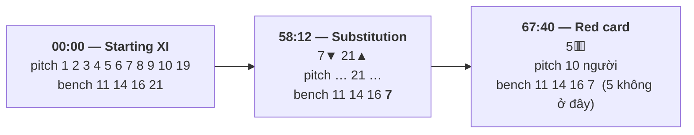

# Shirt-number Gate — Detailed Design

**Ô `Enter event` chỉ nhận những số áo mà đội đang chọn *thật sự có trên bảng* tại đúng thời
điểm đó. Một số áo lạ ⇒ báo lỗi, **không ghi một dòng nào**, con trỏ nhảy về đúng con số sai
để Analyst sửa ngay trong ô nhập.**

Trạng thái: **đã triển khai** (2026-08-15). Nối tiếp
[`submit-lineup-design.md`](submit-lineup-design.md) (Submit home / Submit away đưa đội hình
sang Tagger) — tính năng này là **luật chơi sau khi đã Submit**.

Đã chốt (2026-08-15): **Q1 → A** (tầng 2 là lỗi cứng, y như tầng 1) · **Q2 → A** (`alert()`) ·
**Q3 đã bỏ** (không làm cảnh báo sống khi gõ).

> **Hai bên hoàn toàn tách rời.** Đang chọn Home thì cổng **chỉ** đọc bảng của Home; số áo mà
> chỉ Away có vẫn bị báo sai, và thông báo **không** nhắc gì tới Away. Muốn ghi số đó thì bấm
> `Tab` sang Away rồi gõ lại. Đây là quyết định của bạn (2026-08-15) và nó làm cổng **chặt hơn**
> chứ không yếu đi — xem bất biến **I11** ở §9.

> **Chưa Submit thì không tag được.** Trận đã mở mà một đội chưa được `⇪ Submit`: Tagger
> **không vẽ đội hình** của đội đó, và mọi entry cho đội đó **bị từ chối** kèm câu nhắc đi
> Submit. Không có chế độ "tag trước, nhập đội hình sau" nữa. Đây là quyết định của bạn
> (2026-08-15) — toàn bộ §5.1.

Phạm vi đã làm: **`index.html`** (toàn bộ logic mới), `tests/entry-numbers.test.js` (mới, 28
test), `tests/harness.js` (chỉ *thêm* tên hàm vào `FUNCS`/`CONSTS`), và **2 test cũ được cập
nhật** vì chúng khoá đúng hành vi bị đảo ngược ở §5.1 (§11).
`shared.js` = 0 dòng, `cloud-sync.js` = 0 dòng, `Player-Lists/*` = 0 dòng, `Stats/*` = 0 dòng,
`client/*` = 0 dòng. Không đổi schema, không migration, **không cache-bust** (`index.html`
không có `?v=`, và CSS của nó nằm trong `<style>` nội tuyến — nó không đọc `shared.css`).
Không thêm một dòng CSS nào: nhánh mới dùng lại class `.fm-sub-empty` sẵn có.

Test: `node tests/run.js` → **885/885 passed**. Trong đó **855 test cũ pass mà không sửa một
dòng nào**, 2 test cũ được cập nhật theo luật mới, cộng 28 test mới.

> **Ràng buộc ngôn ngữ:** `tests/auth-gate.test.js:406-414` khoá `index.html` **không được có
> tiếng Việt**, kể cả trong comment. Mọi thông báo lỗi và chú thích code trong tài liệu này
> đều viết bằng tiếng Anh. Tài liệu này nằm trong `docs/` nên không thuộc danh sách đó.

---

## 1. Mục tiêu và ranh giới

| Yêu cầu của bạn | Thiết kế đáp ứng ở |
|---|---|
| Sau `Submit home` / `Submit away`, Line Up + Formation hiện và được lưu ở Tagger | **đã có sẵn** — [`submit-lineup-design.md`](submit-lineup-design.md) §4.4. Tính năng này *dựa trên* nó, không làm lại |
| Analyst không được nhập số áo ngoài Formation | §4.2 — **Tầng 1**: số áo phải thuộc `XI(t) ∪ Bench(t)` của đội đang chọn |
| …và không được tag hành động cho người không có mặt trên sân | §4.3 — **Tầng 2**: số áo phải nằm trong `XI(t)` |
| Áp dụng cho **cả home và away**, nhưng **mỗi bên tự soi bảng của mình** | §4.1 — luật chạy trên `state.team` và **chỉ** đọc `state.lineups[state.team]`; bảng của bên kia không bao giờ được hỏi tới |
| Đội chưa Submit: **không hiện** Line Up / Formation ở Tagger | §6.4 — panel formation nói thẳng đội nào còn thiếu, thay vì vẽ một sân trống trông như đội hình |
| Đội chưa Submit: **báo cần Submit trước** và **không cho lưu** | §5.1 — cổng từ chối cả entry, kiểu lỗi `no-lineup`, kèm đúng tên nút phải bấm |
| Hệ thống ra thông báo sai số | §6 — nội dung, chỗ hiện, và cảnh báo sống khi đang gõ |
| **Không được phép lưu trữ số bị sai** | §5.2 — cổng đặt trước *mọi* nhánh ghi; §9 bảng bất biến I1–I3 chứng minh 0 byte được ghi |
| Bắt buộc Analyst điều chỉnh lại trong ô `Enter Event` | §6.3 — text và các dot **được giữ nguyên**, con trỏ tự bôi đen đúng con số sai |
| Formation đổi nhiều lần: Starting XI → substitution → red card | §3 — cả một mục: tập số áo hợp lệ là **hàm bậc thang theo thời gian**, và `effectiveLU()` đã là hàm đó |
| Không gây bug ở tính năng khác | §10 theo màn hình, §11 truy vết từng test đang khoá code |

**Kết luận khảo sát: không cần thêm một mẩu dữ liệu nào.** Câu hỏi "số 21 có hợp lệ ở phút 62
không?" đã có sẵn người trả lời trong `index.html`: `effectiveLU(team,t)` (`:2402`) — chính là
hàm mà bảng formation ở tab chính đang dùng để vẽ (`:1197`). Cổng này chỉ **hỏi lại nó**.

---

## 2. Hiện trạng: lỗ hổng nằm chính xác ở đâu

`submitEntry()` (`index.html:2207`) đã vét rất kỹ về **cú pháp**, nhưng chưa một dòng nào hỏi
**con số ấy có thật không**:

| Đã kiểm | Dòng | Nội dung |
|---|---|---|
| hotkey không tồn tại | 2211 | `No event is bound to hotkey "…"` |
| trộn substitution với event khác | 2225 | `Do not mix a substitution…` |
| event thiếu số áo | 2232 | `#foul needs a shirt number` |
| event không thể nhận bóng | 2242 | `#goal cannot be played to anyone` |
| pass/cross success thiếu người nhận | 2249 | `#pass success needs a receiver` |
| pass fail dở dang giữa chuỗi | 2258 | `…has to be the last event in the entry` |
| số dot | 2267 | `Check the dots — N needed` |
| **số áo có thuộc đội này không** | — | **không có** |

Hệ quả thật, gõ được ngay hôm nay với đội hình ở ảnh chụp màn hình (Kidsgrove XI
1/2/3/4/5/6/7/8/9/10/19):

```
71s2      →  ghi "71 #pass success 2"   — 71 không tồn tại, chỉ là 7 gõ dính 1
1s25      →  ghi "1 #pass success 25"   — thiếu dấu tách
17f       →  ghi "17 #foul"             — 17 là người của đội kia, đang chọn nhầm bên
```

Cả ba đều **đi thẳng vào `state.rows`, vào Supabase qua `Cloud.onLocalUpsert` (`:2354`)**, rồi
nổi lên Stats, PDF report và Player Data như một cầu thủ có thật. Cổng này chặn cả ba.

> Trường hợp thứ tư — `9ddd` khi đang chọn nhầm bên **mà số 9 tồn tại ở cả hai đội** — cổng
> **không** chặn được, và theo luật tách bên (§4.1) thì cố tình không thử. Ghi ra đây ngay từ
> đầu để không ai kỳ vọng nhầm; xem **R5** ở §14.

Riêng nhánh thay người có kiểm — nhưng **kiểm nửa vời**. `planSubGroup()` (`:2420`) đối chiếu
với XI đang trên sân, nên `7sub99` đi lọt: 7 có trên sân, 99 thì "không trên sân" — đúng hình
dạng một quả thay người hợp lệ. Nó chỉ để lại một *notice* (`:2443-2444`):

```js
if(lu.roster&&!lu.roster.some(r=>numEq(r.no,i)))
  notices.push('No.'+i+' is not in the registered squad — add them in Player lists');
```

Một dòng chữ chạy qua trong `toast()` 900ms (`:3011`) — trong khi **cầu thủ số 99 đã vào sân,
đã có snapshot formation, đã có `subHistory` tính phút thi đấu**.

```mermaid
flowchart LR
  E["Enter event<br/>#quot;71s2#quot;"] --> P["parseChain()"]
  P --> C["7 lớp kiểm cú pháp<br/>:2211 → :2269"]
  C -->|"tất cả đều pass"| R["state.rows.push()"]
  R --> CL["Cloud.onLocalUpsert()<br/>→ Supabase"]
  R --> T["bảng events"]
  CL --> S["Stats"]
  CL --> PD["PDF report · Player Data"]
  style C fill:#3a2020,stroke:#f7506b
```



---

## 3. Khái niệm trung tâm: "Formation" là một hàm bậc thang theo thời gian

Đây là chỗ bạn nhấn mạnh, và cũng là chỗ duy nhất thiết kế này có thể sai nếu làm ẩu.

**Không có "một" Formation.** Một trận có một chuỗi *giai đoạn*, mỗi giai đoạn là một ảnh chụp
(snapshot) của đội hình, có hiệu lực từ thời điểm của nó cho đến giai đoạn kế tiếp:

| Giai đoạn | Sinh ra bởi | Ghi ở đâu |
|---|---|---|
| **0 — Starting XI** | `Submit home` / `Submit away` từ Player lists | `lineups[team].xi` + `.subs` |
| **1..n — sau mỗi substitution** | `applySubGroup()` (`:2488`) | `lineups.history[]`, `label:'Substitution: 7▼ 3▲'` |
| **1..n — sau mỗi red card** | `applyRedCard()` (`:2579`) | `lineups.history[]`, `label:'Red card: 13🟥'`, kèm `off` + `offSpot` |

Hai loại giai đoạn hành xử **khác nhau** ở đúng chỗ quan trọng với cổng này:

- **Substitution:** người ra khỏi sân **xuống ghế dự bị** (`bench.push(String(s.out))`, `:2479`).
  Số áo của anh ta vẫn *tồn tại*, chỉ là không còn trên sân.
- **Red card:** người bị đuổi **biến mất khỏi cả hai** — bị xoá khỏi `xi` và **không** được đẩy
  vào `subs` (`:2578`, comment trong source ghi rõ *"sent off: removed, and NOT added to the
  bench"*). Số áo của anh ta không còn hợp lệ ở bất cứ nghĩa nào từ giây đó trở đi.

Với đội hình ở ảnh chụp màn hình, một trận thật trông như thế này:



và tập số áo hợp lệ đi theo:

| Số áo | tại 30:00 | tại 60:00 | tại 70:00 |
|---|---|---|---|
| `9` | trên sân ✓ | trên sân ✓ | trên sân ✓ |
| `21` | **ghế dự bị** | trên sân ✓ | trên sân ✓ |
| `7` | trên sân ✓ | **ghế dự bị** | **ghế dự bị** |
| `5` | trên sân ✓ | trên sân ✓ | **đã bị đuổi — không tồn tại** |
| `99` | **không có** | **không có** | **không có** |

**Kết luận thiết kế:** cổng phải hỏi câu hỏi *"số này hợp lệ **tại thời điểm t** không"*, chứ
không phải *"số này có trong đội hình không"*. Câu sau sẽ từ chối đúng những quả tag hợp lệ mà
Analyst tua lại để sửa.

**Và hàm trả lời đã có sẵn:**

```js
// index.html:2402 — không sửa một ký tự
function effectiveLU(team,t,hist0){
  const lu=state.lineups[team];
  const hist=(hist0||state.lineups.history||[]).filter(h=>h.team===team&&h.t<=t).sort((a,b)=>a.t-b.t);
  const last=hist[hist.length-1];
  return last?{xi:last.xi,subs:last.subs,dir:lu.dir,roster:lu.roster}
             :{xi:lu.xi,subs:lu.subs,dir:lu.dir,roster:lu.roster};
}
```

Cổng này **không sở hữu state nào cả**. Nó là một hàm thuần đọc. Đó là lý do nó không thể làm
sai lệch formation, không thể mất snapshot, và không cần một dòng migration nào.

---

## 4. Thiết kế: hai tầng

### 4.1 Một entry thuộc về đúng một đội — và cổng chỉ nhìn đúng đội đó

Mọi số áo trong một entry đều là số áo của `state.team`. Không có ngoại lệ:

- chuỗi chuyền `1s2s3s4` — người nhận là **đồng đội** (`TRANSFER_EVENTS`, `:2121`);
- `7sub3` — cả hai đều là người của đội đó;
- dot phụ của `pass fail` là **vị trí đối phương cướp bóng** — một toạ độ, **không phải một số áo**.

Nên "kiểm cho cả home và away" nghĩa là: **cùng một luật, chạy hai lần độc lập, mỗi lần trên
bảng của chính bên đang được chọn.** Bên Home đối chiếu bảng Home, bên Away đối chiếu bảng Away.

> **Luật tách bên (bạn chốt 2026-08-15).** Cổng **không bao giờ đọc bảng của bên kia** — kể cả
> chỉ để tham khảo, kể cả chỉ để viết thông báo cho dễ hiểu hơn.

Hệ quả cụ thể, đúng như bạn mô tả:

| Đang chọn | Gõ | Kidsgrove có 17? | Hanley có 17? | Kết quả |
|---|---|---|---|---|
| Kidsgrove (home) | `17f` | không | có | **báo sai số, không lưu.** Thông báo chỉ nói *"No.17 is not in Kidsgrove Athletic FC’s formation"* — không một chữ nào về Hanley |
| Hanley (away) | `17f` | không | có | **lưu bình thường** |

Ba lý do khiến luật này **chặt hơn** phương án cũ, chứ không phải nhân nhượng:

1. **Một entry, một nguồn sự thật.** Không có đường nào để bảng Away ảnh hưởng tới việc entry
   của Home được chấp nhận hay bị chặn. Đây là thứ có thể khoá bằng test soát source (**T14**),
   không phải một lời hứa suông.
2. **Không dạy Analyst thói quen sai.** Một thông báo gợi ý *"bấm Tab đi"* biến việc chọn nhầm
   đội thành chuyện nhỏ mà máy tự gỡ. Nhưng máy **chỉ gỡ được** khi số áo tình cờ không trùng —
   số 9 tồn tại ở cả hai đội thì nó im lặng. Một cái lưới thủng chỗ hay rơi nhất thì thà không có.
3. **Rẻ hơn.** Bỏ một lời gọi `squadAt(other, t)` và một tham số khỏi hàm dựng thông báo.

### 4.2 Tầng 1 — SQUAD: số này đội có không?

> Số áo phải nằm trong `XI(t) ∪ Bench(t)` của đội đang chọn.

Đây là câu bạn yêu cầu, dịch đúng nghĩa: *"số áo đang trong Formation"*. Bảng Formation ở tab
chính gồm **hai phần** — các chấm trên sân (`renderFormationMain`, `:1206`) và **thanh dự bị**
phía trên (`renderFormationSubs`, `:1218`) — nên cả hai đều tính.

Trượt tầng này ⇒ số áo **không tồn tại**: gõ nhầm, dính phím, hoặc chọn nhầm đội. **Luôn là
lỗi cứng, không có ngoại lệ nào.**

### 4.3 Tầng 2 — ON PITCH: lúc ấy anh ta có trên sân không?

> Với các event *hành động*, số áo còn phải nằm trong `XI(t)`.

Một người ngồi ghế dự bị không thể chuyền bóng, không thể tắc bóng, không thể sút. Trượt tầng
này ⇒ số áo có thật nhưng **không có mặt**: hoặc chưa vào sân, hoặc đã bị thay ra, hoặc đã bị đuổi.

**Ba trường hợp miễn tầng 2** — và chỉ ba:

| Event | Vì sao miễn |
|---|---|
| `substitution` | Theo định nghĩa: một người **trên sân** ra, một người **ngoài sân** vào. Bắt cả hai phải ở trên sân là phá sạch tính năng thay người. `planSubGroup()` (`:2420`) đã có bộ luật riêng, đúng và đã được 41 test khoá |
| `yellow card` | Trọng tài rút thẻ cho cầu thủ dự bị là chuyện có thật |
| `red card` | Tương tự. Và `applyRedCard()` (`:2575`) **đã** tự xử lý an toàn: `if(i<0)return false` — không trên sân thì không tạo snapshot |

```js
/* The three events a number may carry while standing OFF the pitch. A substitution names
   one player coming off and one coming on by definition; a card can be shown to somebody
   on the bench. Everything else is a touch of the ball, and a touch needs a body on the
   grass. All three still have to be numbers the side HAS — that is tier 1, and it has
   no exceptions. */
const OFF_PITCH_OK=new Set(['substitution','yellow card','red card']);
```

### 4.4 Tập hợp hợp lệ tại một thời điểm

```js
/* ===== SHIRT-NUMBER GATE =====
   What a side has on the board is not one list: it starts as the XI and bench that
   Submit home / Submit away published, and every substitution and every red card
   appends a snapshot to lineups.history — so it is a step function of match time.
   effectiveLU() already reads that step function (the pitch panel draws from it), and
   this gate owns no state of its own: it asks the same question the panel asks. */
function squadAt(team,t,hist0){
  const eff=effectiveLU(team,t,hist0);
  const norm=v=>String(v==null?'':v).trim();
  const on=(eff.xi||[]).map(x=>norm(x&&x.no)).filter(Boolean);
  const bench=(eff.subs||[]).map(norm).filter(Boolean);
  return {on,bench,all:on.concat(bench.filter(n=>!on.includes(n)))};
}
```

`norm()` lặp lại đúng khuôn `planSubGroup:2423` (`String(x.no==null?'':x.no).trim()`) — cùng lý
do đã sinh ra `numEq` (`:2398`): `no` khi là chuỗi, khi là số, tuỳ đường nó đi vào.

### 4.5 Mỗi số áo có **thời điểm của riêng nó**

Một entry không phải một khoảnh khắc: mỗi cú chạm có dot riêng, và mỗi dot mang `t` riêng
(`:1814` — `state.pendingDots.push({x,y,t:video.currentTime})`). `submitEntry` đã dùng đúng
điều đó khi ghi row (`:2342`) và khi lập kế hoạch thay người (`:2313`).

Cổng làm y hệt: **chỉ số của số áo trong entry chính là chỉ số của dot của nó.**

```js
/* Touch k of the entry is dot k — the parser numbers them in the order the numbers were
   typed (parseChain :2157), and submitEntry stores each row against its own dot's time
   (:2342). So each number is judged at ITS OWN moment, not at the entry's. The fallback
   is the anchor: an entry may legitimately arrive before its dots are checked (the dot
   count is vetted AFTER this gate, on purpose — see §5.2). */
const entryAnchor=dots=>dots.length?Math.min(...dots.map(d=>d.t))
                                   :(video.src?video.currentTime:0);
```

### 4.6 Bản lề: entry đang được **sửa** phải được xử trước dấu chân của chính nó

Đây là điểm tinh tế nhất của cả thiết kế, và nếu bỏ qua thì **hai test đang chạy sẽ đỏ**.

Khi bấm `✎ Edit` một dòng thẻ đỏ rồi sửa nó thành một event thường:

```js
// tests/red-card.test.js:181
card(a,'13rc');            // 13 bị đuổi ở 3600 → snapshot xoá 13 khỏi bảng
a.startEdit(0);
submit(a,'13qq',[{x:50,y:50,t:3600}]);   // sửa thành "recovery"
```

Tại `t=3600`, số 13 **không** ở trong `XI` cũng **không** ở trong `subs` — vì chính cái snapshot
do dòng đang được sửa tạo ra đã xoá anh ta. Cổng ngây thơ sẽ từ chối đúng thao tác sửa lỗi.

Cách chữa đã có sẵn trong file, và `submitEntry` đã dùng nó cho nhánh thay người
(`:2318` — `subSideEffects(replacedSubs).hist`): **cuộn lại dấu chân của chính những dòng đang
bị thay thế**, rồi mới hỏi.

```js
/* The board this entry is judged against is the board WITHOUT its own footprint. A row
   being re-edited has already put a snapshot into lineups.history — a substitution left
   its outgoing player on the bench, a red card took the carded player off the board
   entirely — and judging "13qq" against a history that still holds its own sending-off
   would refuse the very row being fixed.
   Both helpers return a FILTERED VIEW of the same array, so the snapshots kept by both
   are the ones neither of them rolled back. null = "use the live history" (the common
   case: a fresh entry, nothing being replaced). */
function gateHistory(subRows,redRows){
  if(!subRows.length&&!redRows.length)return null;
  const keepS=subSideEffects(subRows).hist, keepR=redSideEffects(redRows).hist;
  return keepS.filter(h=>keepR.includes(h));
}
```

Dùng lại `subSideEffects()` (`:2509`) và `redSideEffects()` (`:2593`) nguyên si nghĩa là quy tắc
"snapshot nào thuộc dòng nào" chỉ tồn tại **ở một chỗ** — luật ±3 giây và luật nhãn không bị chép
lần thứ hai để rồi lệch nhau về sau.

> `effectiveLU(team,t,hist0)` nhận `[]` đúng nghĩa "lịch sử rỗng": `(hist0||state.lineups.history||[])`
> — mảng rỗng là truthy trong JS, nên nó **không** rơi về lịch sử thật. Đã kiểm.

### 4.7 `checkEntryNumbers()` — thuật toán

```js
/* -> null when every number in the entry is one this side has, at the moment it is
   claimed to have happened; else the FIRST offender in typing order, with everything
   the message needs. Reads only — nothing here writes, saves or syncs. */
function checkEntryNumbers(team,evs,dots,hist0){
  const anchor=entryAnchor(dots);
  /* No match open: ⇪ Submit does not exist yet (Player lists disables it and refuses to
     write a draft without a matchId), so demanding one would lock the app with no way
     out. Nothing is synced anywhere without a match either. The gate stays out. §5.1. */
  if(!state.teamIds.matchId)return null;
  /* A match IS open and this side has no board: its line-up was never submitted. Nothing
     is tagged for this side until it is — the alternative is a whole half of events
     attributed to shirt numbers nobody has vouched for, tagged in the belief that the
     app was checking them. */
  const seed=squadAt(team,anchor,hist0);
  if(!seed.on.length)return {kind:'no-lineup',no:null,idx:null,t:anchor,sq:seed};

  // every number this entry names, once per position it was typed at, in typing order
  const spots=[];
  evs.forEach(e=>{
    if(e.from)spots.push({no:String(e.from).trim(),idx:e.fromIdx,ev:e.name});
    if(e.to)  spots.push({no:String(e.to).trim(),  idx:e.toIdx,  ev:e.name});
  });

  const seen=new Set();
  for(const s of spots){
    // a '*' group repeats the same player on the same touch ("1xx*aa") — judge it once
    const k=s.no+'@'+s.idx; if(seen.has(k))continue; seen.add(k);
    const t=(s.idx!=null&&dots[s.idx]&&dots[s.idx].t!=null)?dots[s.idx].t:anchor;
    const sq=squadAt(team,t,hist0);
    if(!sq.all.includes(s.no)){
      /* tier 1 — the side does not have this number. A sending-off is asked about FIRST,
         because it is the one way a number leaves the board altogether: applyRedCard
         drops the man from the XI and deliberately does NOT put him on the bench, so by
         the time we get here he looks exactly like a number that never existed. He is
         not, and "was sent off at 67:40" is a far better answer.
         Cards are refused here too — a man already sent off cannot collect another. */
      const red=(hist0||state.lineups.history||[])
        .filter(h=>h.team===team&&h.off!=null&&numEq(h.off,s.no)&&h.t<=t)
        .sort((a,b)=>a.t-b.t).pop();
      if(red)return {no:s.no,kind:'sent-off',redT:red.t,t,sq,idx:s.idx,ev:s.ev};
      return {no:s.no,kind:'unknown',redT:null,t,sq,idx:s.idx,ev:s.ev};
    }
    // tier 2 — it has the number, but not on the grass, and this event needs a body there
    if(!sq.on.includes(s.no)&&!OFF_PITCH_OK.has(s.ev))
      return {no:s.no,kind:'bench',redT:null,t,sq,idx:s.idx,ev:s.ev};
  }
  return null;
}
```

> **Sửa lúc triển khai (2026-08-15).** Bản thiết kế đầu để `sent-off` nằm trong nhánh tầng 2.
> Đó là **code không bao giờ chạy tới**: thẻ đỏ xoá số áo khỏi *cả* `xi` lẫn `subs`, nên người
> bị đuổi trượt **tầng 1** trước và nhận thông báo `is not in the formation` thay vì
> `was sent off at 67:40.12`. Hỏi về thẻ đỏ **trước** khi kết luận "không tồn tại" là chỗ đúng
> của nó — và nó cũng khiến `5yc` sau thẻ đỏ bị chặn kèm đúng lý do. **T8** và **T15** khoá.

**Vì sao dừng ở con số sai *đầu tiên*** thay vì liệt kê tất cả: entry điển hình có 2–4 số, và
một lỗi gõ hiếm khi đi một mình có nghĩa. Một thông báo, một con trỏ, một chỗ để sửa — rồi
Enter lại. Liệt kê ba lỗi cùng lúc chỉ cho ba chỗ phải đọc mà vẫn chỉ sửa được một chỗ mỗi lần.

### 4.8 `planSubGroup()` **không đổi một ký tự**

Đáng ghi lại, vì nó phản trực giác. Lỗ hổng `7sub99` ở §2 **được Tầng 1 bịt** trước khi
`planSubGroup` được gọi: 99 không thuộc `XI(t) ∪ Bench(t)` ⇒ entry bị chặn ngay. Không cần nâng
cái *notice* ở `:2443` thành lỗi, không cần đụng vào hàm đang được 41 test của
`substitution.test.js` khoá từng nhánh.

`planSubGroup` vẫn là **người có thẩm quyền duy nhất** về việc ghép cặp thay người (ai ra, ai
vào, gõ ngược thì đảo lại, trùng số thì từ chối). Cổng chỉ trả lời một câu hỏi khác: *các con
số ấy có thật không*.

---

## 5. Chèn vào `submitEntry()`

### 5.1 Chưa Submit thì **không tag được** đội đó

> **Luật (bạn chốt 2026-08-15).** Trận đã mở, đội đang chọn chưa có đội hình trên bảng Tagger:
> **mọi entry cho đội đó bị từ chối**, kèm câu nhắc đi `⇪ Submit`. Và Tagger **không vẽ** đội
> hình rỗng của đội đó — nó nói thẳng là còn thiếu (§6.4).

Đây là **thay đổi so với bản thiết kế trước**, nơi cổng "ngủ" và cho mọi số đi qua. Lý do đổi
là đúng: một cơ chế an toàn tự tắt trong im lặng thì tệ hơn không có cơ chế nào — Analyst tag cả
hiệp trong khi tin rằng máy đang gác cửa.

#### Điều kiện chính xác: hai câu hỏi, không phải một

```js
if(!state.teamIds.matchId)      → cổng KHÔNG hoạt động   (không có gì để Submit)
else if(!squadAt(team,…).on.length) → CHẶN, kiểu 'no-lineup'
else                             → kiểm tầng 1 + tầng 2 như §4
```

**Vì sao "chưa mở trận" lại khác "chưa Submit".** Vì `⇪ Submit` **không tồn tại** khi chưa mở
trận: nút bị `disabled`, và `saveDraftLS()` thoát ngay khi không có `matchId`
([`submit-lineup-design.md`](submit-lineup-design.md) §4.2 và §7 biên 1). Bắt Analyst "Submit
trước đã" trong tình huống đó là bắt làm một việc **không làm được** — cổng sẽ khoá cứng ứng
dụng, không có đường ra. Nên khi chưa mở trận, cổng đứng ngoài; việc nhắc mở trận đã có
`updateMatchGate()` (`:951`) lo, bằng đúng câu *"Open a match first — ☁ Cloud → create or join one"*.

Đây không phải cửa hậu: chưa mở trận thì **không có gì được đồng bộ đi đâu cả** — không
`matchId` thì không có hàng nào trong `matches`, và Stats/report/Player Data đều đọc theo dấu
trận (`lineupsAreFor`). Cổng gác đúng chỗ dữ liệu thật sự đi ra.

#### Bốn trạng thái, đọc theo bảng

| Trận | Home đã Submit | Away đã Submit | Tag Home | Tag Away |
|---|---|---|---|---|
| chưa mở | — | — | đi qua (cổng ngoài cuộc) | đi qua |
| đã mở | ✗ | ✗ | **chặn** `no-lineup` | **chặn** `no-lineup` |
| đã mở | ✓ | ✗ | kiểm tầng 1 + 2 | **chặn** `no-lineup` |
| đã mở | ✓ | ✓ | kiểm tầng 1 + 2 | kiểm tầng 1 + 2 |

Hàng thứ ba là hệ quả trực tiếp của luật tách bên (§4.1): Submit **từng bên một**, nên tag được
**từng bên một**. Analyst có thể Submit Home rồi bắt tay tag Home ngay, không phải chờ Away.

#### Hệ quả: nhánh `noLineup` của `planSubGroup` thành code không tới được

`planSubGroup:2426` có sẵn một lối thoát trả `noLineup:true`, và `submitEntry:2369` biến nó
thành toast *"No starting XI for this team yet — the event is saved, the formation is unchanged"*.
Với §5.1, cổng chặn trước ⇒ `planSubGroup` **không bao giờ** được gọi với XI rỗng nữa.

**Vẫn giữ nguyên, không xoá.** Ba lý do: nó là phòng thủ theo chiều sâu; xoá nó là sửa
`planSubGroup` — phá cam kết "0 ký tự" ở §4.8 và đụng vào hàm đang bị 41 test khoá; và không
test nào đang phủ nhánh đó (đã soát: chỉ có `index.html:2369` và `:2427` nhắc tới `noLineup`),
nên xoá cũng chẳng được gì.

### 5.2 Vị trí chính xác — và vì sao đúng chỗ đó

Cổng đặt **ngay sau `strandedFail` (`:2261`), ngay trước phần đếm dot (`:2264`)**.

```js
  const strandedFail=evs.find(…);
  if(strandedFail){ alert(…); return }

+ /* ===== the shirt number has to be one this side HAS, at this moment =====
+    Ordered with the other structural checks and AHEAD of the dot count, for the reason
+    the comment at :2230 already gives: the structural reason must win over "Check the
+    dots". Telling a tagger to place a dot for a player who is not on the pitch sends
+    them the wrong way, and they would only meet the real message on the second Enter.
+
+    Nothing below this line has run: no row is written, no snapshot is touched, the goal
+    mouth does not open, and planSubGroup is not consulted. The entry text and the dots
+    are left exactly as they were, which is what makes the fix a retype and not a redo. */
+ const gHist=gateHistory(replacedSubs,replacedReds);
+ const bad=checkEntryNumbers(state.team,evs,dots,gHist);
+ if(bad){
+   alert(numberGateMessage(state.team,bad));
+   selectEntryNumber(bad.idx);
+   return;
+ }

  if(allSubs){
    if(dots.length!==0&&dots.length!==evs.length){ alert(…); return }
```

Đặt trước phần đếm dot là một quyết định có chủ đích, không phải tuỳ tiện. Gõ `1s99` rồi đặt 1
dot: nếu cổng đứng sau, Analyst nhận `Check the dots — 2 needed`, đi đặt thêm một dot cho một
cầu thủ không tồn tại, **rồi mới** biết con số sai. Hai vòng cho một lỗi.

**Một thay đổi kèm theo, thuần cơ học:** ba dòng `replaced` / `replacedSubs` / `replacedReds`
(`:2297-2303`) phải **dời lên trên** cổng. Chúng chỉ đọc `state.rows`, `state.editingId`,
`state.editingGroup` — không tác dụng phụ, không phụ thuộc gì ở giữa — và dời lên chỉ làm cái
comment sẵn có của chúng (*"captured BEFORE they are dropped/overwritten"*) **đúng hơn**.

```mermaid
flowchart TD
  A["Enter"] --> B["parseChain()"]
  B --> C["hotkey · mix-sub · needs-number<br/>cannot-receive · needs-receiver · stranded-fail"]
  C --> G{"<b>SHIRT-NUMBER GATE</b><br/>tier 1: có số này không?<br/>tier 2: lúc đó có trên sân không?"}
  G -->|"sai"| X["alert + bôi đen con số<br/><b>text và dot giữ nguyên</b><br/>0 byte được ghi"]
  X -->|"Analyst sửa"| A
  G -->|"đúng"| D["đếm dot"]
  D --> E["goal mouth (nếu là cú sút)"]
  E --> F["planSubGroup()"]
  F --> H["state.rows.push · Cloud.onLocalUpsert"]
  H --> I["applySubGroup / applyRedCard<br/>→ snapshot formation mới"]
  style G fill:#1e3a26,stroke:#4ade80
  style X fill:#3a2020,stroke:#f7506b
```



---

## 6. Giao diện

### 6.1 Vì sao dùng `alert()`

Cả 7 lần từ chối hiện có trong `submitEntry` đều dùng `alert()`, và `substitution.test.js`
(6 lần), `red-card.test.js` (3 lần), `receiver-dots.test.js` đều khoá `a.log.alerts.length===1`
làm định nghĩa của "đã bị từ chối". Dùng thứ khác là vừa lệch nếp nhà, vừa phải sửa test của
tính năng khác. `alert()` cũng **chặn dòng chảy**, mà chặn chính là điều bạn yêu cầu.

Nhược điểm thật — Analyst gõ Enter hàng trăm lần một trận, hộp thoại modal thì chậm, và **Q3 đã
bỏ** nên không còn cảnh báo nào xuất hiện trước Enter. **Q2 chốt A**, nên nhược điểm này được
chấp nhận nguyên vẹn (**R3**). Đổi lại: đúng một chỗ phán quyết, đúng một câu chữ, không có
thông báo thứ hai để lệch với thông báo thứ nhất khi luật đổi về sau.

### 6.2 Nội dung thông báo

Một thông báo phải đủ để sửa mà không cần nhìn đi đâu khác: **sai gì**, **bảng lúc đó có gì**,
và **nước đi tiếp theo**.

```js
const sideName=t=>t==='home'?($('homeName').value||'Home'):($('awayName').value||'Away');
/* Everything needed to fix the entry without looking anywhere else: what is wrong, and
   what the board actually holds at that moment.
   `team` is the side being tagged, and it is the ONLY side this function reads. A number
   the opponent happens to have is not a special case here: it is simply a number this
   side does not have, and it is refused in exactly those words. See §4.1. */
function numberGateMessage(team,b){
  const at=fmt(matchTime(b.t));
  /* Nothing was submitted for this side: there is no board to print, so this message says
     what to do instead of what is wrong. The button is named exactly as Player lists
     labels it, because that is the next thing the tagger has to find. */
  if(b.kind==='no-lineup')
    return sideName(team)+' has no line-up in the tagging tab yet, so nothing can be'
      +' tagged for this side.\n\nOpen Player lists, pick the starting XI and the'
      +' substitutes, then press ⇪ Submit '+team+'.\n\nNothing was recorded.';
  let head;
  if(b.kind==='unknown'){
    head='No.'+b.no+' is not in '+sideName(team)+'’s formation.';
  }else if(b.kind==='sent-off'){
    head='No.'+b.no+' was sent off at '+fmt(matchTime(b.redT))
        +' and is not on the pitch at '+at+'.';
  }else{
    head='No.'+b.no+' is on the bench at '+at+', not on the pitch. If they came on, tag'
        +' the substitution first (e.g. 7sub'+b.no+'), then tag this event.';
  }
  return head
    +'\n\nOn the pitch at '+at+':   '+b.sq.on.join('  ')
    +(b.sq.bench.length?'\nOn the bench:   '+b.sq.bench.join('  '):'')
    +'\n\nNothing was recorded — correct the number in the entry box.';
}
```

Ba thông báo, đọc trên trận ở ảnh chụp màn hình (Kidsgrove XI `1 2 3 4 5 6 7 8 9 10 19`,
bench `11 14 16 21`):

```
┌─ số không tồn tại ─────────────────────────────────────────────┐
│ No.71 is not in Kidsgrove Athletic FC’s formation.             │
│                                                                │
│ On the pitch at 12:04.31:   1  2  3  4  5  6  7  8  9  10  19  │
│ On the bench:   11  14  16  21                                 │
│                                                                │
│ Nothing was recorded — correct the number in the entry box.    │
└────────────────────────────────────────────────────────────────┘

┌─ số của đội kia — CÙNG MỘT THÔNG BÁO, không nhắc tới Hanley ───┐
│ No.17 is not in Kidsgrove Athletic FC’s formation.             │
│                                                                │
│ On the pitch at 12:04.31:   1  2  3  4  5  6  7  8  9  10  19  │
│ On the bench:   11  14  16  21                                 │
│                                                                │
│ Nothing was recorded — correct the number in the entry box.    │
└────────────────────────────────────────────────────────────────┘

┌─ đã bị đuổi ───────────────────────────────────────────────────┐
│ No.5 was sent off at 67:40.12 and is not on the pitch at       │
│ 71:03.88.                                                      │
│ …                                                              │
└────────────────────────────────────────────────────────────────┘

┌─ chưa Submit (§5.1) — không in bảng, vì không có bảng nào ─────┐
│ Hanley Town FC has no line-up in the tagging tab yet, so       │
│ nothing can be tagged for this side.                           │
│                                                                │
│ Open Player lists, pick the starting XI and the substitutes,   │
│ then press ⇪ Submit away.                                      │
│                                                                │
│ Nothing was recorded.                                          │
└────────────────────────────────────────────────────────────────┘
```

Hộp thứ nhất và hộp thứ hai **giống hệt nhau ngoài con số** — và đó chính là điều bạn yêu cầu:
với cổng này, `71` và `17` là cùng một loại lỗi, vì cả hai đều là *số Kidsgrove không có*. Danh
sách in kèm đã đủ để Analyst tự thấy: nếu `17` không nằm trong hai dòng đó, hoặc là gõ nhầm,
hoặc là đang đứng nhầm bên — và cả hai đều sửa ở cùng một chỗ, ô `Enter event`.

### 6.3 Sau khi bấm OK: con trỏ nằm sẵn trên con số sai

```js
/* Put the caret on the offending number so the fix is a retype, not a hunt. Touch index k
   is the k-th run of digits in the entry — parseChain counts them in exactly that order
   (:2156) — and the box holds the raw text, which may carry leading blanks the parser
   trimmed away, hence `pad`. Guarded by document.hasFocus() for the same reason :2390 is:
   when the entry was typed from the popped-out video window, focusing the main input
   would yank focus out of the window the tagger is watching. */
function selectEntryNumber(idx){
  const PI=$('playerInput');
  if(!document.hasFocus())return;
  PI.focus();
  if(idx==null)return;
  const v=PI.value, trimmed=v.trim(), pad=v.indexOf(trimmed), re=/\d+/g;
  let m,k=0;
  while((m=re.exec(trimmed))!==null){
    if(k++===idx){try{PI.setSelectionRange(pad+m.index,pad+m.index+m[0].length);}catch(e){}return;}
  }
}
```

**Ba thứ được giữ nguyên, và cả ba đều quan trọng:**

| Giữ nguyên | Vì sao |
|---|---|
| `$('playerInput').value` | Sửa một con số, không gõ lại cả chuỗi. Với `1k*c2s3ss4` thì đây là khác biệt giữa "sửa" và "làm lại" |
| `state.pendingDots` | Các dot đã đặt trên sân là **công đã bỏ ra** và chúng vẫn đúng — người sai là con số, không phải vị trí |
| `state.editingId` / `editingGroup` | Từ chối giữa lúc sửa **không** đá Analyst ra khỏi chế độ sửa |

Cả ba đạt được bằng cách **không làm gì** — mọi nhánh `return` sớm hiện có trong `submitEntry`
đã có tính chất này (`state.pendingDots=[]` chỉ chạy ở `:2358`, sau khi đã ghi xong). Cổng chỉ
cần đứng cùng chỗ với chúng.

### 6.4 Đội chưa Submit: Tagger **không vẽ** đội hình của đội đó

Nửa còn lại của §5.1. Hôm nay, một đội chưa Submit vẫn được `renderFormationMain()` vẽ ra một
**sân trống có nhãn hướng tấn công**, và `renderFormationSubs()` ghi `No substitutes`. Hai thứ
đó đọc lên thành *"đội này không có ai trên sân và không có dự bị"* — nghe như một đội hình
thật mà rỗng, không phân biệt được với một đội hình nạp hỏng. Đúng lúc Analyst cần biết là
**chưa có gì được gửi sang**.

`renderFormationMain()` đã có sẵn khuôn cho việc này ở `:1187`: nhánh "chưa mở trận" vẽ khung
sân, viết một câu vào `#fmSubs`, rồi `return` — không chấm, không nhãn. Nhánh mới đứng ngay
cạnh, cùng class, cùng hình dạng:

```js
// index.html:1187 — the branch below sits beside the existing "no match open" one
/* A side whose line-up was never submitted gets NO board — not an empty pitch, which
   reads as "this team has nobody on it" and looks the same as a formation that failed to
   load. Returning here means no dots and no attacking-direction label are drawn, exactly
   the way the no-match branch above already behaves. The entry box refuses this side for
   as long as this is on screen (§5.1), so the two always say the same thing. */
if(!squadAt(state.team,Number.MAX_SAFE_INTEGER).on.length){
  const el=$('fmSubs');
  if(el)el.innerHTML='<span class="fm-sub-empty">'+escHtml(sideName(state.team))+' has no'
    +' line-up yet — open Player lists and press ⇪ Submit '+state.team+'.'
    +' Tagging is closed for this side until then.</span>';
  return;
}
```

`Number.MAX_SAFE_INTEGER` là đúng con số mà chính hàm này đang dùng cho "thời điểm hiện tại khi
chưa có video" (`:1196`, `:1222`) — nghĩa là *"lấy giai đoạn mới nhất"*. Một đội đã Submit thì
`on` không rỗng ở bất kỳ `t` nào, nên nhánh này chỉ bật khi thật sự chưa có gì.

**Hai màn hình, một sự thật:**

```
   ĐỘI ĐÃ SUBMIT                              ĐỘI CHƯA SUBMIT
  ┌────────────────────────────┐            ┌──────────────────────────────────────┐
  │ ⑪ ⑭ ⑯ ㉑                   │            │ Hanley Town FC has no line-up yet —  │
  │ ┌────────────────────────┐ │            │ open Player lists and press ⇪ Submit │
  │ │ ①  ②  ⑥   ⑨            │ │            │ away. Tagging is closed for this     │
  │ │    ④  ⑦  ⑩  Kidsgrove ⟶│ │            │ side until then.                     │
  │ │ ③  ⑤  ⑧  ⑲             │ │            │ ┌──────────────────────────────────┐ │
  │ └────────────────────────┘ │            │ │      (khung sân, không chấm,     │ │
  └────────────────────────────┘            │ │       không nhãn hướng)          │ │
   Enter event: kiểm tầng 1 + 2             │ └──────────────────────────────────┘ │
                                            └──────────────────────────────────────┘
                                             Enter event: từ chối, kiểu 'no-lineup'
```

**Về `escHtml`.** Tên đội do người dùng gõ vào và ở đây nó được nối vào `innerHTML`, nên phải
thoát. `index.html` **không** load `shared.js` (không có `esc()`), nhưng nó có sẵn `escHtml`
ở `:3414`. Đã kiểm phần khai báo-trước-khi-dùng: `escHtml` là `const`, nằm **sau**
`renderFormationMain` trong file, nhưng lời gọi `renderFormationMain()` sớm nhất ở cấp cao nhất
là `:3465` — sau nó. Năm lời gọi còn lại (`:935, 982, 987, 1001, 1011, 1019, 1578`) đều nằm
trong thân hàm, chỉ chạy khi có sự kiện. Không có vùng chết thời gian.

---

## 7. Bảng thông điệp

| # | Tình huống | Tầng | Thông báo (rút gọn) |
|---|---|---|---|
| 1 | `71s2`, đội không có 71 | 1 | `No.71 is not in <Team>’s formation.` |
| 2 | `17f` khi đang chọn Home, và **chỉ Away có 17** | 1 | `No.17 is not in <Team>’s formation.` — **chữ y hệt hàng 1**; đội kia không được nhắc tới. Bấm `Tab` sang Away rồi gõ lại thì ghi bình thường |
| 3 | `21s9` ở phút 30, 21 còn ngồi ghế | 2 | `No.21 is on the bench at 30:00.00… tag the substitution first (e.g. 7sub21)` |
| 4 | `7s9` ở phút 70, 7 đã bị thay ra phút 58 | 2 | như trên, cùng chữ "on the bench" |
| 5 | `5qq` ở phút 71, 5 bị đuổi phút 67 | 2 | `No.5 was sent off at 67:40.12 and is not on the pitch at 71:03.88.` |
| 6 | `7sub99` | 1 | `No.99 is not in <Team>’s formation.` — bịt đúng lỗ hổng ở §2 |
| 7 | `21yc` khi 21 đang ngồi ghế | — | **đi qua** (§4.3, `OFF_PITCH_OK`) |
| 8 | `7sub21` khi 7 trên sân, 21 ngồi ghế | — | **đi qua**, rồi `planSubGroup` xử tiếp như cũ |
| 9 | Trận đã mở, đội **chưa Submit** | `no-lineup` | `<Team> has no line-up in the tagging tab yet… press ⇪ Submit home.` Panel formation cũng nói y vậy (§6.4) |
| 10 | **Chưa mở trận** | — | **đi qua** — `⇪ Submit` chưa tồn tại, bắt Submit là bắt điều không làm được (§5.1) |

---

## 8. Truy vết theo dòng thời gian

Đội hình ở ảnh chụp: XI `1 2 3 4 5 6 7 8 9 10 19`, bench `11 14 16 21`.
Kịch bản: thay người `7▼21▲` ở 58:12, thẻ đỏ cho `5` ở 67:40.

| # | Lúc | Analyst gõ | `effectiveLU` trả về | Cổng | Kết quả |
|---|---|---|---|---|---|
| 1 | 12:04 | `1s2` | XI gốc | 1 ✓on, 2 ✓on | ghi |
| 2 | 12:04 | `71s2` | XI gốc | 71 ✗tầng 1 | **chặn** — 0 byte |
| 3 | 30:00 | `21s9` | XI gốc, 21 ở bench | 21 ✓tầng 1, ✗tầng 2 | **chặn** — "on the bench… tag the substitution first" |
| 4 | 58:12 | `7sub21` | XI gốc | cả hai ✓tầng 1; tầng 2 miễn | `planSubGroup` duyệt → snapshot #1 |
| 5 | 60:00 | `21s9` | snapshot #1 | 21 ✓on | ghi — **cùng entry của #3, giờ hợp lệ** |
| 6 | 60:00 | `7s9` | snapshot #1 | 7 ✓tầng 1 (bench), ✗tầng 2 | **chặn** |
| 7 | 55:00 | `7s9` (tua lại) | XI gốc — `h.t<=t` loại snapshot #1 | 7 ✓on | ghi — **quá khứ vẫn tag được** |
| 8 | 67:40 | `5f*rc` | snapshot #1 | 5 ✓on | ghi → snapshot #2, 5 rời bảng |
| 9 | 71:03 | `5qq` | snapshot #2 | 5 ✗tầng 1 (không ở XI *cũng không* ở bench) | **chặn** — "was sent off at 67:40.12" |
| 10 | 71:03 | `5yc` | snapshot #2 | 5 ✗tầng 1 | **chặn** — `OFF_PITCH_OK` chỉ miễn tầng 2 |
| 11 | 65:00 | `5f` (tua lại) | snapshot #1 | 5 ✓on | ghi |
| 12 | — | `✎ Edit` dòng #8 → `5f` | lịch sử **đã cuộn lại** thẻ đỏ (§4.6) | 5 ✓on | ghi, snapshot #2 bị gỡ |

Hàng **9 và 10** là chỗ hai loại giai đoạn ở §3 tách ra: thẻ đỏ đẩy số áo ra khỏi **cả** `xi` và
`subs`, nên nó trượt **tầng 1** — và tầng 1 thì không ai được miễn, kể cả thẻ vàng. Đúng luật
bóng đá: người đã bị đuổi không còn nhận thêm thẻ nào nữa.

Hàng **7 và 11** là lý do §3 tồn tại: một cổng không biết thời gian sẽ chặn cả hai, và Analyst
không bao giờ tua lại sửa được nữa.

Hàng **12** là lý do §4.6 tồn tại.

---

## 9. Bất biến để tự kiểm

Sau **mọi** lần cổng từ chối:

| # | Bất biến |
|---|---|
| **I1** | `state.rows` không đổi — kể cả `.length` và mọi field của mọi row |
| **I2** | `Cloud.onLocalUpsert` / `onLocalDelete` **không** được gọi lần nào |
| **I3** | `state.lineups` không đổi một byte: `history.length`, mọi `xi`, mọi `subs`, mọi `subHistory` |
| **I4** | `state.pendingDots` giữ nguyên số lượng và giá trị |
| **I5** | `$('playerInput').value` giữ nguyên từng ký tự |
| **I6** | `state.editingId` / `state.editingGroup` giữ nguyên |
| **I7** | `saveLineups()` không được gọi; `openFmModal()` không được gọi; `goalCapture` vẫn `null` |
| **I8** | Đúng **một** `alert()` |

Sau **mọi** lần cổng cho qua:

| # | Bất biến |
|---|---|
| **I9** | Hành vi giống hệt trước khi có tính năng — cùng row, cùng snapshot, cùng toast |
| **I10** | Cổng không ghi, không sửa, không sắp xếp lại `state.lineups.history` (nó chỉ đọc, và `gateHistory` trả về mảng **mới** từ `.filter`) |

Và một bất biến đúng ở **cả hai** đường, đây là bất biến của luật tách bên (§4.1):

| # | Bất biến |
|---|---|
| **I11** | Cổng **chỉ** đọc `state.lineups[state.team]` (qua `effectiveLU(team,…)`). Không một hàm nào trong cụm này — `squadAt`, `checkEntryNumbers`, `numberGateMessage` — nhận, tính hay tra bảng của bên còn lại. Đổi bảng của Away không thể làm đổi *bất cứ* phán quyết nào ở Home, và ngược lại |
| **I12** | Cổng chặn kiểu `no-lineup` **khi và chỉ khi** panel formation đang hiện câu "no line-up yet" cho cùng đội đó. Hai màn hình không bao giờ nói khác nhau, vì cả hai hỏi cùng một `squadAt(team,…).on.length` |

I11 không phải lời hứa — nó **khoá được bằng test soát source** (T14 ở §13): trong thân ba hàm
đó không được xuất hiện `'away'`, `'home'`, hay bất kỳ biểu thức `team==='home'?…:…` nào chọn ra
bên đối diện. Chuỗi `sideName()` là ngoại lệ duy nhất và nó nhận `team` truyền vào, không tự chọn.
I12 được T23 khoá, chạy trên cả bốn trạng thái ở §5.1.

---

## 10. Bảng trường hợp biên

| # | Tình huống | Xử lý |
|---|---|---|
| 1 | Trận đã mở, chưa Submit bên nào | **Cả hai bên bị chặn** kiểu `no-lineup`; panel formation nói rõ đội nào (§6.4). Không tag được gì cho tới khi Submit |
| 1b | **Chưa mở trận** | Cổng đứng ngoài (§5.1). `updateMatchGate()` đã lo phần nhắc mở trận |
| 2 | Submit home, chưa Submit away | Home kiểm tầng 1+2 bình thường; Away **bị chặn**. Hai bên độc lập tuyệt đối — `squadAt` chỉ đọc bảng của bên được truyền vào (I11) |
| 2b | Số áo trùng ở hai bên (số 9 ở cả Home và Away) | Cổng **cho qua** ở cả hai bên — đúng, vì cả hai đều thật. Chọn nhầm đội trong trường hợp này **không bắt được**, và theo luật tách bên thì không có cách nào bắt. Rủi ro **R5** |
| 3 | Tag không có dot (thẻ, `13rc`) | `anchor = video.currentTime`. Cổng chạy, rồi luật dot hiện có từ chối tiếp — **vẫn đúng 1 alert** (`red-card.test.js:227` khoá điều này) |
| 4 | Chuỗi `1s2s3s4`, số 3 sai | Chặn ở số 3; `bad.idx===2` ⇒ bôi đen đúng chuỗi chữ số thứ ba |
| 5 | Nhóm `*` lặp lại người: `1xx*aa` | `seen` khử theo `no@idx` ⇒ báo một lần |
| 6 | Đường "active event" (`9 3` + click tên event) | `evs` được dựng ở `:2217` với `fromIdx`/`toIdx` đầy đủ ⇒ cổng chạy y hệt |
| 7 | Macro (`2xxaa`) | `parseChain` đã bung macro thành `evs` trước khi cổng nhìn thấy ⇒ mỗi event mang `name` thật, `OFF_PITCH_OK` tra đúng |
| 8 | `✎ Edit` một dòng thay người thành event thường | §4.6 cuộn lại snapshot của chính nó ⇒ người bị thay ra trở lại sân, không bị từ chối oan |
| 9 | `✎ Edit` một dòng thẻ đỏ | như trên, qua `redSideEffects` |
| 10 | Gõ từ cửa sổ video tách rời | `submitEntry` chạy ở tab chính, `alert` hiện ở tab chính. `selectEntryNumber` **tự thoát** nhờ `document.hasFocus()` (`:2390` đã có cùng guard) |
| 11 | Số áo có số 0 đứng đầu (`07`) | So khớp bằng chuỗi đã `trim()`, đúng khuôn `numEq:2398`. `07` ≠ `7` — đúng, vì bảng lưu đúng chuỗi Player lists nhập |
| 12 | Row cũ đã có số sai từ trước khi có tính năng | Vẫn nằm nguyên. Cổng chỉ gác cửa vào, không quét lại kho — xem pha 2 ở §16 |
| 13 | Row có số sai đến từ máy khác (bản cũ chưa có cổng) | Cổng không chạm vào đường sync. Rủi ro **R4** |
| 14 | Thẻ đỏ rồi tua lại tag việc xảy ra **trước** thẻ | Đi qua — `effectiveLU` lọc `h.t<=t` (truy vết #11) |
| 15 | Bóng đá 7 người / futsal | Không có hằng số nào bị gán cứng. Cổng đọc `xi` thật, dài bao nhiêu cũng đúng |
| 16 | `state.lineups[team]` là `undefined` | `effectiveLU` đọc `state.lineups[team]` rồi `.dir` ⇒ đã ném lỗi từ trước tính năng này. Cổng đứng sau, không đổi hành vi |

---

## 11. Ảnh hưởng tới test hiện có

Chỉ **6** trong 38 file test gọi `submitEntry`. Đã truy vết bằng tay từng file:

| File | `teamIds` | XI trong fixture | Cổng làm gì | Kết luận |
|---|---|---|---|---|
| `goal-spot.test.js` (22 lượt) | `{}` — **không có `matchId`** | `xi:[]` | **đứng ngoài** (§5.1, nhánh 1) | pass, 0 sửa |
| `macro-hotkeys.test.js` (11) | `{}` | `xi:[]` | **đứng ngoài** | pass, 0 sửa |
| `receiver-dots.test.js` (3) | `{}` | `xi:['1','2',…]` mảng chuỗi, và một fixture `xi:[]` | **đứng ngoài** | pass, 0 sửa |
| `events-table.test.js` | `{}` | `xi:[]` | không gọi `submitEntry` lần nào — chỉ dùng `evtClass`/`chainHTML` | pass, 0 sửa |
| `period-time-edit.test.js` (17) | `matchId:'m1'` | XI `1 2 4 7 9 10 13 14 18 20 22`, bench `11 16 17 21` | chạy thật. Mọi số được gõ (`18sub17`, `10sub11`, `20sub21`, `9sub16`, `7s10`, `18rc`) đều nằm trong fixture | pass, 0 sửa |
| `red-card.test.js` (11) | `matchId:'m1'` | XI `1 2 3 4 6 7 8 9 10 12 13`, bench `11 14 17 22` | chạy thật. `13qq` sau `13rc` **cần §4.6** | pass **chỉ khi có §4.6** |
| `substitution.test.js` (41) | `matchId:'m1'` | XI `1 2 4 6 7 8 11 13 14 15 17`, bench `3 12 19 20 21` | chạy thật. `7s11` sau `7sub3` **cần §4.6** | pass **chỉ khi có §4.6** |

**Cột `teamIds` là cột quan trọng nhất của bảng này.** Ba file chạy trên `xi:[]` **đều** không
có `matchId` — nên với điều kiện hai nhánh của §5.1, chúng rơi vào nhánh "chưa mở trận" và cổng
đứng ngoài. Ba file có XI thật **đều** có `matchId:'m1'`.

Sự tương ứng đó **không phải may mắn**: nó phản chiếu đúng bất biến ngoài đời mà §5.1 dựa vào —
`⇪ Submit` chỉ tồn tại khi có trận, nên một fixture không có trận thì cũng không thể có đội hình
đã submit, và người viết các fixture đó đã dựng chúng đúng như thế. Nếu §5.1 chặn theo *một*
câu hỏi ("có XI không?") thay vì *hai* ("có trận không, rồi mới: có XI không?"), thì **56 lượt
submit ở 3 file của các tính năng khác sẽ đỏ** và phải đi vá fixture của chúng — một cái giá
vô ích, cho một luật kém đúng hơn.

**Hai test là bằng chứng sống cho §4.6** — bỏ phần cuộn-lại-dấu-chân là chúng đỏ ngay:

```js
// tests/substitution.test.js:258 — 7 đã bị thay ra ở 3000 bởi chính dòng đang sửa
submit(a,'7sub3'); a.startEdit(0); submit(a,'7s11',[{…t:3000},{…t:3000}]);

// tests/red-card.test.js:181 — 13 đã bị đuổi ở 3600 bởi chính dòng đang sửa
card(a,'13rc');   a.startEdit(0); submit(a,'13qq',[{x:50,y:50,t:3600}]);
```

**Ba nhóm test đếm alert vẫn đúng 1**, vì cổng chỉ chặn khi số áo sai, và mọi số trong các
fixture đó đều đúng: `substitution.test.js:142` (6 kịch bản từ chối), `red-card.test.js:227-247`
(3 kịch bản thiếu dot), `receiver-dots.test.js` (cổng đứng ngoài).

**Nhánh `noLineup` của `planSubGroup` không có test nào phủ** — đã soát cả repo, `noLineup` chỉ
xuất hiện ở hai chỗ trong `index.html`. Nó thành code không tới được (§5.1) mà không làm đỏ gì.
`quiet-tagging.test.js:82` vẫn xanh **chính vì ta giữ nhánh ấy lại**: nó khoá chuỗi
`toast('⚠ '+subPlan.notices[0])` phải còn nguyên trong `submitEntry`.

### 11.1 Hai test cũ **phải** đổi — và vì sao đó là đúng

Bảng trên là dự đoán trước khi làm. Chạy thật thì **2 test đỏ**, và cả hai đều nằm ngoài bảng
vì chúng không dựa vào fixture mà **tự tay xoá XI giữa bài**:

| Test | Nó khoá gì | Vì sao phải đổi |
|---|---|---|
| `red-card.test.js:82` — *"a red card with no starting XI records the event and leaves the formation alone"* | `xi=[]` ⇒ thẻ đỏ **vẫn được ghi** | Đây **đúng là hành vi bạn yêu cầu đảo ngược**. Giữ nó thì §5.1 không tồn tại |
| `substitution.test.js:345` — *"subs are still tagged when no starting XI has been entered"* | `xi=[]` ⇒ `eq(a.log.alerts.length,0,'and the tagger is not blocked')` | Nguyên văn: *"the tagger is not blocked"*. Luật mới nói ngược lại |

Cả hai đã được viết lại thành khẳng định của luật mới (`rows.length===0`, đúng 1 alert, thông
báo chứa `⇪ Submit home`), giữ nguyên vị trí và fixture, kèm comment `Was: …` nói rõ nó từng
khoá gì và tài liệu nào đã đảo nó.

**Đây là thay đổi hành vi, không phải sửa test cho xanh.** Phân biệt rất rõ: không một dòng
*code sản phẩm* nào của tính năng thẻ đỏ hay thay người bị đụng vào — 39/41 test của
`substitution.test.js` và 10/11 của `red-card.test.js` pass **nguyên vẹn, không sửa**. Chỉ hai
lời khẳng định về *"chưa có XI thì sao"* là bị luật mới thay thế.

`tests/auth-gate.test.js:406` — mọi chữ mới trong `index.html` phải là tiếng Anh. Mọi chuỗi ở
§6 đã viết sẵn tiếng Anh, comment cũng vậy.

`tests/asset-versions.test.js` — **không liên quan**: `index.html` là *trang*, không có `?v=`,
và CSS của nó nằm nội tuyến. Không có gì để bump.

---

## 12. Vị trí code

| File | Dòng | Việc |
|---|---|---|
| `index.html` | ~2395 (trước `effectiveLU`) | khối mới: `OFF_PITCH_OK`, `squadAt`, `entryAnchor`, `gateHistory`, `checkEntryNumbers`, `sideName`, `numberGateMessage`, `selectEntryNumber` |
| `index.html` | 2297-2303 | **dời lên** trên cổng: `replaced` / `replacedSubs` / `replacedReds` (thuần đọc) |
| `index.html` | sau 2261 | 5 dòng gọi cổng (§5.2) |
| `index.html` | 1187 | nhánh "chưa Submit" trong `renderFormationMain()` (§6.4) — 6 dòng, `return` sớm |
| `tests/entry-numbers.test.js` | mới | §13 |
| `tests/harness.js` | 77-82 | thêm tên hàm mới vào `FUNCS`, `OFF_PITCH_OK` vào `CONSTS` |

**Không sửa:** `parseChain`, `expandKey`, `expandMacros`, `effectiveLU`, `planSubGroup`,
`applySubGroup`, `swapInSnapshot`, `subSideEffects`, `removeSubSideEffects`,
`shiftSubRowsWithPeriod`, `applyRedCard`, `redSideEffects`, `removeRedSideEffects`,
`startEdit`, `startEditGroup`, `deleteRows`, `renderFormationSubs`, `zoneAt`, `arrangeXI` —
**19 hàm, 0 ký tự**.

`renderFormationMain` **có** bị sửa — 13 dòng thêm vào đầu hàm (§6.4), không sửa dòng nào sẵn
có. Đó là yêu cầu "không hiện line up và formation của đội chưa Submit", không thể làm ở chỗ
khác. `submitEntry` bị sửa hai chỗ: chèn cổng, và **dời** ba dòng `replaced*` lên trên nó —
dời, không viết lại, ba dòng giữ nguyên từng ký tự.

---

## 13. Kế hoạch test — `tests/entry-numbers.test.js`

Theo đúng khuôn `substitution.test.js`: `makeApp` + `submit` từ `tests/harness.js`, fixture là
đội hình ở ảnh chụp màn hình (XI `1 2 3 4 5 6 7 8 9 10 19`, bench `11 14 16 21`).

| # | Test | Khoá điều gì |
|---|---|---|
| T1 | `71s2` không ghi row nào, không upsert nào, đúng 1 alert | I1, I2, I8 — trái tim của tính năng |
| T2 | Sau khi bị từ chối: `playerInput.value`, `pendingDots`, `editingId` không đổi | I4, I5, I6 — "sửa lại trong ô Enter Event" |
| T3 | `state.lineups` không đổi một byte (so `JSON.stringify` trước/sau) | I3, I7 |
| T4 | `1s2` hợp lệ đi qua và ghi đúng như trước | I9 — cổng không chặn nhầm |
| **T5a** | Trận đã mở (`matchId:'m1'`) + `xi:[]` ⇒ `1s2` **bị chặn**, 0 row, 0 upsert, thông báo chứa `⇪ Submit home` | **§5.1** — luật bạn chốt |
| **T5b** | **Chưa mở trận** (`teamIds:{}`) + `xi:[]` ⇒ `1s2` **đi qua** | §5.1 nhánh 1 — không khoá cứng ứng dụng khi Submit chưa tồn tại |
| **T5c** | Submit home, chưa Submit away: `1s2` ở Home đi qua, `1s2` ở Away bị chặn `no-lineup` | §5.1 bảng 4 trạng thái · I11 — hai bên độc lập |
| T6 | `21s9` trước khi 21 vào sân bị chặn; **cùng entry đó** sau `7sub21` được ghi | §3 · truy vết 3 & 5 — hàm bậc thang |
| T7 | Sau `7sub21`, `7s9` bị chặn; tua về trước quả thay người thì `7s9` đi qua | truy vết 6 & 7 — thời gian là một phần của luật |
| T8 | Sau `5rc`, cả `5qq` **và** `5yc` đều bị chặn ở tầng 1 | §3 — thẻ đỏ khác thay người · truy vết 9 & 10 |
| T9 | `21yc` khi 21 đang ngồi ghế **đi qua** | `OFF_PITCH_OK` · miễn tầng 2 |
| T10 | `7sub99` bị chặn, không snapshot, không `subHistory` | bịt lỗ hổng §2 · bảng #6 |
| T11 | `7sub21` hợp lệ vẫn đi qua và `planSubGroup` vẫn xử như cũ | §4.8 — không siết nhầm thay người |
| T12 | Sửa `7sub3` thành `7s11` được chấp nhận | **§4.6** · sinh đôi với `substitution.test.js:258` |
| T13 | Sửa `13rc` thành `13qq` được chấp nhận | **§4.6** · sinh đôi với `red-card.test.js:181` |
| **T14** | **Luật tách bên, bốn phần:** (a) fixture cho Away số `17` mà Home không có — gõ `17f` ở Home bị chặn; (b) thông báo **không** chứa tên đội Away và không chứa chữ `Tab`; (c) chuyển sang Away, gõ đúng `17f` ⇒ **được ghi**; (d) soát source: thân `squadAt`/`checkEntryNumbers`/`numberGateMessage` không chứa `'away'`, `'home'`, hay `==='home'?` | **I11 · §4.1** — bất biến bạn chốt 2026-08-15 |
| T15 | Số bị đuổi ⇒ thông báo chứa `was sent off at` + đúng giờ | §6.2 |
| T16 | Thông báo liệt kê đúng XI và đúng bench **tại thời điểm đó** (không phải XI gốc) | §6.2 — thông báo cũng phải theo thời gian |
| T17 | `bad.idx` đúng vị trí: số sai thứ 3 trong `1s2s99s4` cho `idx===2` | §6.3 · biên 4 |
| T18 | `1xx*aa` với số sai chỉ báo **một** lần | biên 5 |
| T19 | Đường "active event" (`9 3` + `activeEvent`) cũng bị kiểm | biên 6 |
| T20 | `13rc` **không dot**, số hợp lệ ⇒ vẫn đúng 1 alert (của luật dot) | biên 3 — không đẻ ra alert thứ hai |
| T21 | Soát source: không nhánh ghi nào (`state.rows.push`, `onLocalUpsert`, `applySubGroup`, `applyRedCard`, `openGoalCapture`) đứng **trước** lời gọi cổng trong `submitEntry` | §5.2 — chống việc cổng bị dời xuống sai chỗ về sau |
| **T22** | Soát source `renderFormationMain`: nhánh `no line-up yet` đứng **trước** vòng `t.xi.forEach` vẽ chấm, và kết thúc bằng `return` | **§6.4** — đội chưa Submit không được vẽ đội hình, dù rỗng |
| **T23** | Cùng một hàm quyết định cả hai: đội bị `#fmSubs` báo "no line-up" thì entry cho đội đó **chắc chắn** bị chặn, và ngược lại (chạy trên 4 trạng thái ở §5.1) | **§5.1 + §6.4 không được nói khác nhau** |

Đã dựng thành **28 test** (T1–T23, với T5→T5a/b/c, T8→T8/T8b, T14→T14/T14b/T14c).
Kết quả thật: `node tests/run.js` → **885/885 passed**.

Hai test **không** nằm trong kế hoạch ban đầu mà thực tế đòi hỏi:

- **T8b** — `5f` tại 3500 vẫn ghi được sau khi `5rc` tại 3600 đã tag. Không có nó thì luật
  "thẻ đỏ chặn tầng 1" dễ bị siết nhầm thành "chặn mọi lúc", giết mất khả năng tua lại sửa.
- **T14b** — cùng số `17` ấy, gõ ở Away thì **được ghi**. T14 chỉ chứng minh nửa chặn; nửa cho
  qua mới là thứ chứng minh hai bên *tách rời* chứ không phải *cùng bị chặn*.

Ngoài suite, một lần chạy tay `renderFormationMain()` trên cả ba trạng thái tải trang xác nhận
nhánh mới không ném lỗi và **vẽ 0 phần tử** khi chưa Submit (so với 12 khi đã Submit).

---

## 14. Rủi ro

| # | Rủi ro | Mức | Giảm thiểu |
|---|---|---|---|
| **R0** | **Không Submit thì không tag được gì cả.** Mất hẳn lối làm việc "tag trước, nhập đội hình sau". Với một trận **đang tag dở** mà chưa có đội hình, việc tag **dừng lại** ngay khi bản mới lên — cho tới khi ai đó điền Player lists và Submit | **Cao** — **đây là điều bạn yêu cầu (2026-08-15)** | Thông báo nói đúng nút phải bấm (`⇪ Submit home`), và panel formation nói cùng một câu ở chỗ Analyst vốn đã nhìn (§6.4). Submit xong là tag được ngay, không cần tải lại trang — cổng đọc `state.lineups` trực tiếp, mà `applyCloudLineups`/`storage` đã cập nhật sẵn. **Cần báo trước cho các Analyst đang tag dở khi phát hành** |
| **R1** | **Bắt buộc tag thay người *trước* các event của người mới vào.** Analyst quen tag một mạch rồi bổ sung thay người sau sẽ bị chặn hàng loạt | **Cao** — **đã chấp nhận (Q1→A)** | Thông báo nói thẳng nước đi (`tag the substitution first (e.g. 7sub21)`). Đây chính là kỷ luật dữ liệu mà tính năng nhắm tới. Nếu ngoài thực địa thấy vướng, hạ xuống phương án C của Q1 chỉ tốn một hằng số |
| **R2** | Đội hình trên Player lists nhập sai/thiếu ⇒ cổng chặn số **đúng** | Trung bình | Thông báo in cả XI và bench tại thời điểm đó, nên chỗ sai lộ ra ngay. Sửa ở Player lists rồi `⇪ Submit` lại là xong — cổng đọc lại tức thì, không cần tải lại trang |
| **R3** | `alert()` modal làm chậm nhịp tag, và không còn cảnh báo nào **trước** khi bấm Enter (Q3 đã bỏ) | Trung bình — **đã chấp nhận (Q2→A, Q3 bỏ)** | Không giảm thiểu gì thêm. Đổi lại: một luật duy nhất, một chỗ duy nhất phán quyết, không có thông báo thứ hai để lệch với thông báo thứ nhất |
| **R4** | Máy khác chạy bản cũ vẫn đẩy số sai vào qua realtime | Thấp | Ngoài phạm vi. Cổng gác **cửa vào của tab này**. Muốn chặn triệt để cần luật phía DB — pha 2 ở §16 |
| **R5** | Chọn nhầm đội khi số áo **trùng ở cả hai bên** (số 9 có ở cả Home lẫn Away) | Thấp — **không giải được, và luật tách bên chốt là không thử giải** | Cổng cho qua ở cả hai bên, vì cả hai đều là số thật. Ghi ra đây để không ai tưởng cổng bắt hết lỗi chọn nhầm đội: nó bắt được khi số **không** có ở bên đang chọn (biên 2b), và chỉ thế thôi |
| **R6** | Dời `replacedSubs`/`replacedReds` lên trên làm hỏng nhánh nào đó | Thấp | Ba dòng thuần đọc, không phụ thuộc gì ở giữa; `substitution.test.js` + `red-card.test.js` (52 lượt submit) là lưới an toàn |
| **R7** | Chữ tiếng Việt lọt vào `index.html` | Thấp | `auth-gate.test.js:406` bắt và chỉ đích danh số dòng |

---

## 15. Các quyết định đã chốt

Không còn câu hỏi mở nào. Mục này giữ lại lịch sử quyết định để lần sau đọc còn hiểu **vì sao**.

### ✅ Q1 — Tầng 2 là lỗi cứng hay chỉ cảnh báo? → **bạn chốt A: lỗi cứng** (2026-08-15)

Tầng 2 (phải có mặt trên sân) từ chối cứng y như tầng 1. `21s9` ở phút 30 khi 21 còn ngồi ghế
**không được ghi**, và Analyst phải tag quả thay người trước. Đúng nguyên văn *"không được phép
lưu trữ số bị sai"*. Rủi ro kèm theo là **R1** — đã ghi nhận là chấp nhận.

*(Phương án B — tầng 2 chỉ cảnh báo rồi vẫn ghi — và C — thêm hằng số `STRICT_ON_PITCH` để tắt
nhanh — đã bị loại. C vẫn là đường lùi rẻ nhất nếu ngoài thực địa thấy vướng: một dòng.)*

### ✅ Q2 — Thông báo dùng gì? → **bạn chốt A: `alert()`** (2026-08-15)

Đúng nếp nhà (7/7 lần từ chối hiện có trong `submitEntry` đều dùng `alert`), không thể bỏ lỡ, và
giữ nguyên quy ước `a.log.alerts.length===1` mà các file test khác đang dùng làm định nghĩa
"đã bị từ chối".

### ❌ Q3 — Cảnh báo sống trong lúc gõ? → **bạn bỏ** (2026-08-15)

Đã từng đề xuất một dòng chữ đỏ hiện ngay khi gõ (`⚠ not in this formation: 71`), không chặn,
chỉ để thấy trước. **Không làm.** Hệ quả nhận về:

- Chỉ có **một** chỗ phán quyết, ở `Enter`, và **một** câu chữ. Không có thông báo thứ hai để
  lệch với thông báo thứ nhất khi luật đổi về sau.
- `index.html` không thêm thẻ HTML nào, không thêm CSS nào, không thêm listener nào.
- Đổi lại: mỗi lỗi gõ đều kết thúc bằng một hộp thoại phải bấm OK. Đó là **R3**, đã chấp nhận.

Nửa còn lại của Q3 cũ — dòng nhắc khi đội chưa Submit — **không mất đi mà được nâng lên thành
bắt buộc**: nó là §6.4, và nay nó gắn liền với §5.1 chứ không còn là thứ tuỳ chọn. Lý do:
cổng không còn "ngủ" nữa mà **chặn**, nên Analyst *bắt buộc* phải được cho biết vì sao bị chặn
và bấm gì để đi tiếp.

### ✅ Q4 — Đội chưa Submit thì thế nào? → **bạn chốt: chặn** (2026-08-15)

Bản trước cho mọi số đi qua khi đội chưa Submit ("cổng ngủ"). Bạn đổi thành: **không hiện đội
hình, báo cần Submit, không cho lưu**. Toàn bộ §5.1 + §6.4.

Một chi tiết bạn không nêu nhưng thiết kế phải quyết, và đây là chỗ ghi lại: **"chưa Submit"
khác "chưa mở trận"**. Chưa mở trận thì nút `⇪ Submit` bị `disabled` và Player lists từ chối
ghi nháp — bắt Submit lúc đó là bắt một việc không làm được, và cổng sẽ khoá cứng ứng dụng
không có đường ra. Nên cổng chỉ chặn khi **đã mở trận mà chưa Submit**. Xem bảng bốn trạng thái
ở §5.1.

---

## 16. Phân pha

| Pha | Nội dung | Điều kiện |
|---|---|---|
| **1** | **Toàn bộ tài liệu này** — §4 (hai tầng + luật tách bên + cuộn lại dấu chân) + §5 (chặn khi chưa Submit + chèn vào `submitEntry`) + §6 (alert, con trỏ, panel formation) + §13 (25 test) | **Q1–Q4 đã chốt. Không còn gì phải chờ — làm được ngay** |
| **2** | Quét lại dữ liệu cũ (biên 12): một nút liệt kê các row mang số áo không có trong bảng, để sửa/xoá hàng loạt. Và/hoặc ràng buộc phía DB cho R4 | chỉ khi bạn yêu cầu |

---

## 17. Chốt lại một câu

Tính năng này **không thêm một mẩu dữ liệu nào** — nó chỉ hỏi lại đúng câu hỏi mà bảng formation
ở tab chính đã hỏi mỗi lần vẽ: *`effectiveLU(team, t)` lúc này có những ai?* Toàn bộ phần còn
lại của thiết kế trả lời hai câu: **"đội có số này không"** (tầng 1, không ai được miễn) và
**"lúc ấy anh ta có trên sân không"** (tầng 2, miễn cho thay người và thẻ) — cả hai đều hỏi
**tại thời điểm của chính cú chạm đó**, vì Formation không phải một danh sách, mà là một chuỗi
giai đoạn do Starting XI, mỗi quả thay người và mỗi chiếc thẻ đỏ nối nhau tạo thành.

Và cả hai câu ấy chỉ được hỏi **về đúng một đội** — đội đang được chọn. Bảng của bên kia không
bao giờ được mở ra, kể cả để viết một câu thông báo cho dễ hiểu hơn. Đang ở Home thì `17` là số
Home không có, hết chuyện; muốn ghi nó thì bấm `Tab` sang Away đã.

Còn nếu bảng ấy chưa từng được gửi sang, thì **chưa có câu hỏi nào để hỏi** — và câu trả lời
không phải là cho qua, mà là dừng lại: Tagger không vẽ một sân trống giả làm đội hình, ô nhập
không nhận một dòng nào, và cả hai cùng nói đúng một việc phải làm — mở Player lists, bấm
`⇪ Submit`.
