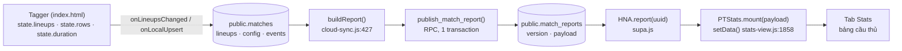

# Minutes Played — Detailed Design

**Tính số phút thi đấu của từng cầu thủ trong channel, từ dữ liệu "Submit Analysis" gửi sang.**

Trạng thái: **đã triển khai pha 1 + pha 2** (2026-08-15) — cột `Minutes Played` có trong tab Stats (cả 4
category), trong XLSX/CSV và trong PDF. Pha 3 (Data view cả mùa) vẫn chờ duyệt. Phần thuật toán bên dưới
mô tả đúng code đang chạy trong `shared.js` (`playedMinutes()`, `matchWindows()`).

Ngày: 2026-08-15 · Phạm vi: `shared.js`, `Stats/stats-view.js`, `Stats/report.js` · Không đụng tagger, không migration DB.

---

## 1. Mục tiêu và ranh giới

**Mục tiêu.** Với mỗi cầu thủ của mỗi đội trong một trận đã publish, tính **số phút có mặt trên sân**,
suy ra từ:

1. đội hình xuất phát (starting XI) analyst nhập ở Player lists,
2. mọi đội hình mới sinh ra khi **thay người**,
3. mọi đội hình mới sinh ra khi có **thẻ đỏ** (đội còn 10 người),
4. mốc thời gian trận đấu (Duration: kick-off, half-time, 2nd-half kick-off, full-time).

**Ràng buộc bắt buộc (theo yêu cầu):**

| Ràng buộc | Cách thiết kế đáp ứng |
|---|---|
| Không gây bug ở các tab khác (Overall / Dashboard / Film / Data / Tagger) | Hàm mới là **hàm thuần** (pure), chỉ đọc, không ghi state; chỉ 1 điểm render duy nhất được thêm cột ở pha 1 — xem §9, §10 |
| Không tự ý thay đổi tính năng khác | Chia 3 pha. **Chỉ pha 1** được đề xuất làm ngay; pha 2 (XLSX/PDF) và pha 3 (Data view) **chờ bạn duyệt** |
| Không đổi schema dữ liệu | `payload.schema` vẫn là `1`; **không** thêm field vào payload, **không** migration SQL |

**Kết luận quan trọng nhất của khảo sát:** mọi dữ liệu cần thiết **đã nằm sẵn** trong payload mà
`Submit Analysis` đóng băng. Số phút là **giá trị dẫn xuất (derived)**, tính tại client khi render —
nên **các báo cáo đã publish trước đây cũng tự có số phút, không cần publish lại**.

---

## 2. Dữ liệu đi từ Tagger sang channel như thế nào



`buildReport()` (`cloud-sync.js:427`) đọc lại **từ database** (không đọc localStorage) và
đóng gói đúng 6 khoá:

```js
{ schema: 1,
  meta:    { home, away, sport, homeTeamId, awayTeamId, matchId, matchCode },
  lineups: m.lineups,        // ← cả starting XI, history, subHistory
  dur:     m.config,         // ← enabled, halfLen, h1Start, h1End, h2Start, h2End
  video:   { url, frozenAt, kind } | null,
  rows:    stored.map(dbToRow) }
```

Bên channel, `setData()` (`Stats/stats-view.js:1858`) gán thẳng vào 4 biến
module: `rows`, `meta`, `lineups`, `dur`. **Đây chính là 2 đầu vào của thuật toán: `lineups` + `dur`.**

> Ghi chú: test hiện có đã khoá quy tắc "lịch sử thay người phải đi cùng đội hình"
> (`tests/submit-analysis.test.js` — *"the substitution history goes with the line-ups"*), nên
> `lineups` luôn được lấy nguyên khối, không bị bóc lẻ.

---

## 3. Cấu trúc `lineups` — nguồn sự thật

```js
lineups = {
  home: { roster:[{no,name}], xi:[{no,x,y,pos}], subs:['3','12',…], dir:'lr',
          subHistory:[{out:'7', in:'3', t:4860}] },   // t = giây của VIDEO
  away: { … },
  history: [                                          // ảnh chụp toàn phần, KHÔNG phải delta
    { t:2700, team:'home', xi:[…11 người…], subs:[…], label:'Substitution: 7▼ 3▲' },
    { t:3600, team:'home', xi:[…10 người…], subs:[…], label:'Red card: 13🟥',
      off:'13', offSpot:{x,y} },
    { t:4200, team:'away', xi:[…], subs:[…], label:'Manual @ 70:00.00' }
  ]
}
```

Ba loại snapshot, do 3 chỗ trong tagger sinh ra:

| Loại | Sinh ở | Đặc điểm | Ảnh hưởng quân số |
|---|---|---|---|
| Thay người | `applySubGroup()` `index.html:2467` | 1 snapshot cho **cả entry** (`7sub3*13sub21` → 1 snapshot, 2 cặp), kèm 1 bản ghi `subHistory` mỗi cặp | 11 → 11 |
| Thẻ đỏ | `applyRedCard()` `index.html:2571` | 1 snapshot mỗi cầu thủ, có `off` + `offSpot`; người bị đuổi **không** vào ghế dự bị | 11 → 10 |
| Thủ công | nút `fmSnapBtn` `index.html:2773` | chép nguyên đội hình đang hiệu lực để analyst chỉnh vị trí | không đổi (trừ khi analyst sửa tay) |

Quy tắc đọc — `effectiveLU(team, t)` (`index.html:2402`):

```
XI(team, t) = snapshot cuối cùng có h.team === team và h.t <= t
              (nếu không có) → lineups[team].xi        ← đội hình xuất phát
```

Tagger **đã tự chuẩn hoá** history: tag lệch thứ tự thì `applySubGroup()` mang cú thay người xuyên qua
các snapshot sau nó, `applyRedCard()` gỡ người bị đuổi khỏi mọi snapshot sau, xoá/sửa row thì
`removeSubSideEffects()` / `removeRedSideEffects()` hoàn tác đối xứng, và mảng luôn được `sort` theo `t`.
Nói cách khác: **history luôn nhất quán với bảng sự kiện và với bảng đội hình đang hiển thị.**

---

## 4. Nguyên tắc cốt lõi: minutes = tích phân của một hàm bậc thang

`XI(team, t)` là một **hàm bậc thang** theo thời gian video. Đặt

```
onPitch(no, t) = 1 nếu số áo `no` ∈ XI(team, t), ngược lại 0
```

thì

> **số phút thi đấu = tổng độ dài các khoảng `onPitch = 1`, đo bằng ĐỒNG HỒ TRẬN, cắt trong hai hiệp.**

Vì đo trên miền "đồng hồ trận" nên **giờ nghỉ giữa hiệp tự động bị loại**, không cần xử lý riêng.

### Vì sao chọn snapshot thay vì replay các row sự kiện

Phương án bị loại: duyệt `rows` lọc `substitution` / `red card` rồi tự dựng lại đội hình.

| Tiêu chí | Snapshot timeline (chọn) | Replay event rows (loại) |
|---|---|---|
| Khớp với bảng đội hình người dùng nhìn thấy | Luôn khớp — cùng một `XI(t)` mà pitch panel vẽ | Có thể lệch khi analyst sửa tay snapshot |
| Phụ thuộc chuỗi `label` (`'Substitution: …'`) | Không | Có (đổi chữ là hỏng) |
| Phụ thuộc luật ghép ±3s | Chỉ ở nhánh dự phòng (§6.3) | Phụ thuộc hoàn toàn |
| Thay người tag lệch thứ tự / sửa / xoá | Đã được tagger chuẩn hoá sẵn | Phải tự xử lý lại toàn bộ |
| Thẻ đỏ trong chuỗi `13f*yc*rc` | Không cần biết — chỉ thấy XI giảm 1 | Phải bóc chuỗi |

Hệ quả thiết kế: thuật toán **không đọc `rows` để xác định ai trên sân**. `rows` chỉ được dùng đúng một
việc phụ: tìm mốc kết thúc trận khi Duration thiếu tiếng còi hết giờ (§5).

---

## 5. Đồng hồ trận: từ giây video sang phút thi đấu

Đã có sẵn `matchTime()` (`Stats/stats-view.js:1111`, bản sinh đôi ở
`index.html:1393`):

```js
matchTime(vt) = !dur.enabled ? vt
              : vt >= h2Start && h2Start > 0 ? halfLen*60 + (vt - h2Start)
              : max(0, vt - h1Start)
```

**Cửa sổ hiệp** dùng đúng luật của `filmWindows()` (`Stats/stats-view.js:1206`) —
"một hiệp chỉ là hiệp khi **cặp** mốc hợp lệ", không bao giờ xét riêng mốc bắt đầu (vì `h1Start = 0` là
hợp lệ):

| Trạng thái `dur` | Cửa sổ H1 | Cửa sổ H2 | `exact` |
|---|---|---|---|
| `enabled`, đủ 4 mốc | `[h1Start, h1End]` | `[h2Start, h2End]` | `true` |
| `enabled`, thiếu `h2End` | `[h1Start, h1End]` | `[h2Start, lastT]` | `false` |
| `enabled`, thiếu `h1End` | `[h1Start, h2Start]` | `[h2Start, …]` | `false` |
| `enabled`, không có `h2Start` | `[h1Start, lastT]` — một hiệp dài | — | `false` |
| `enabled = false` | `[0, lastT]`, không cap | — | `false` |

`lastT` = `max(t của row cuối, t của snapshot cuối)` — cùng cách timeline ở Overall kéo dài trục đến sự
kiện cuối (`Stats/stats-view.js:1007`).

**Cap bù giờ.** Dùng đúng quy ước của `markMin()` (`Stats/stats-view.js:930`):
phút bù bị chặn theo hiệp (45+1', 90+6'). Với số phút thi đấu:

```js
clockAt(vt, w) = min( w.clock0 + (min(vt, w.end) - w.start),  w.cap )
//  w.clock0 = 0 (H1) | halfLen*60 (H2)
//  w.cap    = halfLen*60 (H1) | 2*halfLen*60 (H2)
//  → trong cửa sổ, clockAt(vt,w) === min(matchTime(vt), w.cap)  ⇒ không thể lệch với nhãn phút
```

Nhờ cap: **đá trọn trận = 90'** (không phải 96'), **thay ở giờ nghỉ = 45'** — đúng quy ước Opta/FBref mà
người xem báo cáo mong đợi.

---

## 6. Thuật toán

### 6.1 Chữ ký hàm đề xuất (đặt trong `shared.js`)

```js
/* Số phút thi đấu, theo số áo, cho MỘT đội.
   lineups  đối tượng lineups đã đóng băng (payload.lineups | state.lineups)
   dur      mốc thời gian (payload.dur | state.duration)
   team     'home' | 'away'
   rows     CHỈ dùng để tìm thời điểm cuối cùng khi Duration thiếu còi hết giờ
   → { '7': {min, sec, h1, h2, onAt, offAt, sentOff, exact}, … }
     hoặc null khi đội này không có đội hình nào (không suy ra được gì) */
function playedMinutes(lineups, dur, team, rows)
```

| Trường | Ý nghĩa |
|---|---|
| `min` | số nguyên để hiển thị (`0` chỉ dành cho người không ra sân) |
| `sec` | giây đồng hồ trận chưa làm tròn — dùng cho export/kiểm tra |
| `h1`, `h2` | tách theo hiệp (miễn phí, phục vụ bộ lọc nửa trận sau này) |
| `onAt`, `offAt` | nhãn phút vào/ra (`"64'"`, `"45+1'"`) cho tooltip; `null` = từ đầu / đến hết |
| `sentOff` | `true` nếu khoảng cuối kết thúc bằng snapshot thẻ đỏ (`h.off === no`) |
| `exact` | `false` khi Duration thiếu mốc → số phút là **xấp xỉ** |

### 6.2 Dựng các khoảng có mặt trên sân

```js
function onPitchIntervals(lineups, team) {
  const lu   = (lineups && lineups[team]) || {};
  const hist = ((lineups && lineups.history) || [])
                 .filter(h => h && h.team === team && h.xi)
                 .slice().sort((a,b) => (+a.t||0) - (+b.t||0));
  const setOf = xi => new Set((xi||[])
      .map(p => String(p && p.no == null ? '' : p.no).trim()).filter(Boolean));

  const out = {}, open = {};                  // open[no] = giây video bắt đầu khoảng
  setOf(lu.xi).forEach(no => open[no] = -Infinity);   // -Infinity = "từ tiếng còi khai cuộc"

  hist.forEach(h => {
    const t = +h.t || 0, next = setOf(h.xi);
    Object.keys(open).forEach(no => {                 // rời sân
      if (!next.has(no)) { push(out, no, open[no], t, h.off != null && numEq(h.off, no)); delete open[no]; }
    });
    next.forEach(no => { if (!(no in open)) open[no] = t; });   // vào sân
  });
  Object.keys(open).forEach(no => push(out, no, open[no], Infinity, false));
  return out;                                  // no → [{from, to, red}]
}
```

Tính chất: thuật toán **không quan tâm** snapshot đó là thay người, thẻ đỏ hay thủ công — chỉ nhìn tập số
áo thay đổi. Nhờ vậy nó đúng cho: thay 2–3 người trong một entry, thay rồi bị thay tiếp, thẻ đỏ trong
chuỗi `f*yc*rc`, hai thẻ đỏ, tag lệch thứ tự, sửa/xoá row.

### 6.3 Nhánh dự phòng `subHistory` (khi snapshot bị xoá tay)

Giữ **đúng luật ±3s** mà `squadInHalf()` (`Stats/stats-view.js:797`) và
`subSideEffects()` (`index.html:2509`) đang dùng:

```js
(lu.subHistory || []).forEach(s => {
  const t = +s.t || 0;
  if (hist.some(h => Math.abs((+h.t||0) - t) <= 3)) return;   // đã có snapshot mô tả cú thay này
  closeAt(out, String(s.out).trim(), t);                       // người ra: đóng khoảng tại t
  openAt (out, String(s.in ).trim(), t);                       // người vào: mở khoảng từ t
});
```

Có test sẵn cho tình huống này ở `tests/squad.test.js` — *"subHistory alone is enough (snapshot removed by hand)"*.

### 6.4 Quy đổi sang phút và cắt theo hiệp

```
                 h1Start      h1End   h2Start            h2End
video  ──────────┼════════════┼───────┼══════════════════┼────────►
                 │  HIỆP 1    │ nghỉ  │      HIỆP 2      │
No.7   ●═════════════════════════════════════●                       ra ở 64'
                 │            │       │      │           │
                 └── 0' ──────┘45'    └45'───┘64'        └── 90'
       → 45 (H1) + 19 (H2) = 64'

No.18  ●══════════════════════●                                      thay ở giờ nghỉ
       → 45 (H1) + 0          = 45'      (khoảng nằm trong giờ nghỉ đóng góp 0)

No.13  ●══════════════════════════════════════════════════●🟥        thẻ đỏ ở 90+3'
       → 45 + min(matchTime, 90') − 45   = 90'   (cap bù giờ)
```

```js
function measure(intervals, windows) {
  let sec = 0, h1 = 0, h2 = 0;
  windows.forEach(w => intervals.forEach(iv => {
    const from = Math.max(iv.from === -Infinity ? w.start : iv.from, w.start);
    const to   = Math.min(iv.to   ===  Infinity ? w.end   : iv.to,   w.end);
    if (to <= from) return;                       // khoảng không giao với hiệp này
    const d = clockAt(to, w) - clockAt(from, w);
    sec += d; (w.half === 2 ? h2 += d : h1 += d);
  }));
  return { sec, h1, h2 };
}
const min = sec > 0 ? Math.max(1, Math.round(sec / 60)) : 0;
```

Sàn `1` để một cầu thủ vào sân ở 90+2' không hiện `0'`.

### 6.5 Bất biến để tự kiểm tra

Với đội hình đầy đủ, Duration đủ 4 mốc, không thẻ đỏ:

```
Σ minutes(một đội) = 11 × (2 × halfLen)            // 990 với halfLen = 45
mỗi thẻ đỏ ở phút m  →  tổng giảm đúng (2 × halfLen − m)
```

Đây sẽ là một test (§11) và cũng là cách phát hiện nhanh dữ liệu Duration sai.

---

## 7. Bảng trường hợp biên

| Tình huống | Kết quả | Lý do |
|---|---|---|
| Đá trọn trận | `90'` | cap theo hiệp |
| Thay người ở phút 64 (tag trong hiệp 2) | ra `64'`, vào `26'` | `90 − 64` |
| Thay ở giờ nghỉ (t nằm giữa `h1End` và `h2Start`) | `45'` / `45'` | khoảng trong giờ nghỉ đóng góp 0 |
| Thay tag ở phút 46 (sau khi bóng lăn lại) | ra `46'`, vào `44'` | **số phút bám đúng thời điểm được tag** — khớp nhãn ở tab Overall |
| Thẻ đỏ phút 60 | `60'`; 10 người còn lại vẫn `90'` | chỉ khoảng của người bị đuổi bị đóng |
| Thẻ đỏ ở 45+2' | `45'` | cap hiệp 1 |
| Vào sân rồi lại bị thay ra | tổng 2 khoảng | nhiều khoảng/cầu thủ |
| Thẻ đỏ cho cầu thủ dự bị | không ảnh hưởng | không có snapshot (`applyRedCard` trả `false`) |
| Dự bị không vào sân | **không xuất hiện** trong bảng | `squadOnPitch()` vốn đã không liệt kê |
| Cầu thủ có sự kiện nhưng không có trong lineup | `—` (không phải `0'`) | không suy ra được, `0'` sẽ gây hiểu nhầm |
| Đội không nhập đội hình | cả cột là `—` | `playedMinutes()` trả `null` |
| `dur.enabled = false` | số phút xấp xỉ theo giây video, `exact:false` | có thể gắn dấu `~` / tooltip |
| Report cũ không có `lineups` | `—` | `setData()` đã fallback `blankLineups()` |
| Số áo `' 7 '`, trùng lặp | trim + dedupe | cùng luật `numEq`/`trim` toàn repo |
| Snapshot thủ công bị sửa tay (thêm/bớt người) | số phút đi theo bảng đội hình | **có chủ ý**: một sự thật duy nhất |

---

## 8. Ví dụ đối chiếu (trận Haiti vs Saint Lucia trong ảnh)

Đọc từ bảng thay người ở tab Overall (Haiti bên trái):

| Phút tag | Ra | Vào | Minutes (ra) | Minutes (vào) |
|---|---|---|---|---|
| 46' | 18. Sainte | 17. Jean Jacques | `46'` | `44'` |
| 64' | 10. Etienne | 11. Deedson | `64'` | `26'` |
| 80' | — | 21. Attys | — | `10'` |
| — | thủ môn / trung vệ không bị thay | — | `90'` | — |

Lưu ý cặp 46': nếu analyst tag đúng lúc bóng lăn lại hiệp 2 thì ra `46'` / vào `44'`; nếu tag trong giờ
nghỉ thì `45'` / `45'`. **Thiết kế cố ý không "làm tròn về giờ nghỉ"** — con số phải khớp với nhãn phút
mà timeline và bảng thay người đang hiển thị, nếu không hai chỗ trên cùng một màn hình sẽ mâu thuẫn.
(Đây là quyết định D5 ở §13, có thể đổi.)

---

## 9. Vị trí code và các điểm hiển thị

### Pha 1 — ✅ đã làm

| File | Thay đổi | Ghi chú |
|---|---|---|
| `shared.js` | **Thêm** `playedMinutes()` + 2 helper (`matchWindows`, `clockAt`) | Thuần, không DOM, không localStorage. **Không sửa** `STAT_HEADERS`, `statRow`, `newStat`, `computeStats`, `squadOnPitch`, `withSquad` |
| `Stats/stats-view.js` | `statTableHTML()` thêm cột cố định `Minutes Played` ngay sau `Player`, qua helper `minsCell()` | Cột **cố định**, không nhét vào `STAT_CATS` → cả 4 tab (Shooting/Distribution/Defensive/Other) đều có, mà không đụng định nghĩa cột |
| `Stats/stats-view.css` | không đổi | `table.stats th/td` đã căn giữa sẵn — cột mới hiển thị đúng mà không cần CSS |

Vì sao đặt ở `shared.js` chứ không phải `stats-view.js`: sẽ có 4 nơi tiêu thụ (bảng Stats, XLSX, PDF, Data
view). `shared.js` là file duy nhất cả 4 nơi đều đã nạp, và `report.js` lấy helper qua cơ chế `HELPERS` —
để trong `shared.js` thì không phải chạm vào cái bắt tay đó.

Vì sao **không** thêm vào `STAT_HEADERS`/`statRow`: `statRow(no, s)` chỉ nhận đối tượng thống kê, không có
`lineups`/`dur`, nên không thể tự tính phút; thêm cột vào đó sẽ phá hợp đồng đang được
`tests/squad.test.js` khoá (*"one cell per header"*). Cột `Min` cho XLSX (pha 2) sẽ được chèn tại
`statsSheet()`, nơi đã có sẵn `lineups`.

### Pha 2 — ✅ đã làm

* **XLSX + CSV** `statsSheet()`: `Minutes Played` là cột thứ 3; span của nhóm đầu tính `g[1]+2` **tại chỗ**
  (không sửa hằng `STAT_GROUPS` — `tests/report-visuals.test.js` khoá tổng span bằng `STAT_HEADERS.length`),
  thêm merge dọc `{s:{r:0,c:2},e:{r:1,c:2}}` như `No`/`Player`. Giá trị là **số trần** (`64`, không phải
  `64'`) để Excel sắp xếp/cộng được; ô trống khi không có đội hình. CSV dùng chung `buildSheets()` nên
  được luôn.
* **PDF** `teamTable()`: cột `Min` ngay sau `Player`, áp dụng cho **cả ba** trang cầu thủ
  (Attacking / Distribution / Defensive) vì cả ba đi qua đúng hàm này. Nhãn rút gọn `Min` theo đúng lối
  các cột khác của báo cáo (`Shoot Acc`, `Intercept`, `T-on Con`).

### Pha 3 — chờ duyệt

* **Data view (cả mùa giải)** trong `client/assets/app.js`: `state.reports[uuid]` đang giữ **nguyên payload**,
  nên `rep.lineups` + `rep.dur` đã có sẵn cho từng trận → cộng dồn "Apps / Minutes" cho bảng Key Players.

### Không đụng tới (0 dòng)

`index.html` (tagger) · `cloud-sync.js` · `client/assets/supa.js` · `auth.js` · `Player-Lists/` ·
mọi file trong `supabase/` · `worker/` · `.github/workflows/deploy.yml`.

---

## 10. Bảo đảm không vỡ các tab khác

| Tab / màn hình | Đọc gì | Vì sao an toàn |
|---|---|---|
| **Overall** | `scoreBarHTML`, `subsPanelHTML`, `matchSummaryHTML`, `subMarkers` | Không sửa; hàm mới không ghi vào `rows`/`lineups`/`dur` |
| **Dashboard** | các bản đồ, heatmap, `squadInHalf` | Không sửa; `squadInHalf()` giữ nguyên (thuật toán mới **không** thay thế nó) |
| **Stats** | `statTableHTML` | Điểm duy nhất thay đổi ở pha 1: thêm 1 `<th>` + 1 `<td>` mỗi hàng |
| **Film** | `filmWindows`, `filmCues` | Chỉ **đọc chung** `dur`; hàm mới nhận `dur` qua tham số, không mutate |
| **Data** | `sumTeam`, `computeStats`, `TEAM_SECTIONS` | Không đụng ở pha 1 |
| **Tagger** | toàn bộ `index.html` | 0 dòng thay đổi |
| **Player lists** | `shared.js` | Chỉ được **thêm** hàm; không đổi hàm cũ |
| **XLSX / PDF hiện tại** | `STAT_HEADERS`, `statRow` | Giữ nguyên ở pha 1 → file xuất ra không đổi một ô nào |

**Lưu ý một-file-hai-nơi:** `Stats/stats-view.js` được dùng chung bởi trang Stats của analyst **và** tab
Stats trong channel. Thêm cột ⇒ **cả hai** nơi cùng có cột — đúng chủ ý (một implementation, không thể lệch
số liệu), nhưng cần nói trước với analyst.

### Checklist bắt buộc khi triển khai (cache-bust)

Site không có build step; trình duyệt cũ sẽ giữ JS cũ nếu quên `?v=`:

1. `shared.js` `?v=18 → 19` tại **cả 3 nơi**: `Stats/index.html:62`, `Player-Lists/index.html:86`,
   `client/assets/app.js:782`.
2. `stats-view.js` `?v=12 → 13` tại **cả 2 nơi**: `Stats/index.html:63`, `client/assets/app.js:793`.
3. Nếu sửa CSS: `stats-view.css` `?v=5 → 6` tại `Stats/index.html:12` và `client/assets/app.js:790`.
4. Chạy `node tests/asset-versions.test.js --update` rồi commit `tests/asset-versions.json`.
5. Không thêm file mới ⇒ **không** cần thêm dòng `cp` vào `deploy.yml` (test *"every versioned asset is one
   the deploy actually copies"* vẫn xanh).

---

## 11. Kế hoạch test

File mới `tests/minutes-played.test.js`, dùng `loadShared()` như `tests/squad.test.js`, fixture lấy từ
`tests/substitution.test.js` (XI 1/2/4/6/7/8/11/13/14/15/17, bench 3/12/19/20/21) và
`tests/red-card.test.js`.

| Nhóm | Case |
|---|---|
| Cơ bản | đá trọn trận = 90 · thay ở 64' → 64 / 26 · vào sân rồi bị thay ra = tổng 2 khoảng |
| Giờ nghỉ | thay trong giờ nghỉ → 45 / 45 · khoảng nằm trọn trong giờ nghỉ = 0 |
| Thẻ đỏ | đỏ ở 60' → 60, mười người còn lại vẫn 90 · đỏ ở 45+2' → 45 · hai thẻ đỏ · đỏ cho cầu thủ dự bị: không đổi gì |
| Bù giờ | vào sân ở 90+2' → 1 (sàn), không phải 0 |
| Thứ tự tag | thay/đỏ tag lệch thứ tự cho cùng kết quả với tag đúng thứ tự |
| Dự phòng | chỉ có `subHistory`, snapshot bị xoá tay → vẫn đúng · có snapshot trong ±3s thì **không** cộng đôi |
| Duration | đủ 4 mốc (`exact:true`) · thiếu `h2End` · không có `h2Start` · `enabled:false` → không `NaN`, `exact:false` |
| Dữ liệu rỗng | không lineups → `null` · cầu thủ chỉ có event → không có trong map · số áo `' 7 '` → trim |
| Bất biến | Σ = 990 khi không thẻ đỏ; mỗi thẻ đỏ phút m làm giảm đúng `90 − m` |
| Không hồi quy | `statTableHTML` vẫn sinh đúng số `<td>` = 2 + 1 + số cột của category |

Toàn bộ suite hiện tại (**755 test**) phải xanh: `node tests/run.js`.

---

## 12. Rủi ro và phụ thuộc dữ liệu

1. **Thẻ vàng thứ 2 không kèm row `red card`.** `applyRedCard()` chỉ chạy với event đúng tên `red card`.
   Nếu analyst chỉ tag 2 thẻ vàng, bảng đội hình vẫn 11 người ⇒ số phút vẫn chạy tiếp. Số phút sẽ **khớp
   với bảng đội hình** (đúng theo thiết kế), nhưng **sai so với thực tế trận đấu**. Đây là vấn đề quy trình
   nhập liệu, không phải thuật toán — nếu muốn xử lý, cần đổi hành vi tagger ⇒ **cần bạn cho phép riêng**.
2. **Duration chưa cấu hình.** Số phút thành xấp xỉ theo giây video. Đề xuất: hiển thị `~64'` hoặc tooltip
   "chưa đặt mốc thời gian trận" khi `exact === false`.
3. **Report cũ không có `lineups`** (nếu có): hiện `—`, không lỗi.
4. **Analyst sửa tay snapshot** sau khi tag: số phút đi theo bảng đội hình. Có chủ ý.

---

## 13. Các quyết định đã chốt

| # | Quyết định | Đã chọn |
|---|---|---|
| D1 | Cap bù giờ: trọn trận = **90'** hay tính cả bù giờ (96')? | **90'** (quy ước Opta/FBref, khớp `markMin()`) |
| D2 | Số nguyên (`64'`) hay 1 chữ số thập phân (`64.3`)? | **Số nguyên** trên màn hình; `sec` thô vẫn có trong đối tượng trả về |
| D3 | Cột hiện ở **cả 4** category hay chỉ Shooting? | **Cả 4** — cột cố định, không đụng `STAT_CATS` |
| D4 | Có làm pha 2 (XLSX + PDF) không? | **Có** — đã làm cùng pha 1. Pha 3 (Data view cả mùa) **vẫn chờ duyệt** |
| D5 | Có "làm tròn về giờ nghỉ" cho cú thay tag ở phút 46 không? | **Không** — số phút bám đúng thời điểm được tag, khớp nhãn phút ở Overall |

Còn lại một việc chưa làm và **cần bạn cho phép riêng**: thẻ vàng thứ 2 không kèm row `red card` thì cầu
thủ vẫn được tính phút (xem §12.1) — sửa việc đó là đổi hành vi của tagger.
