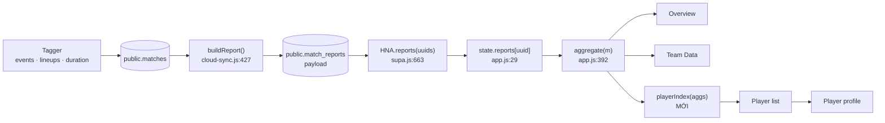
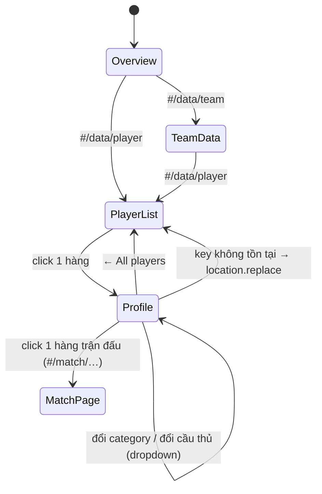

# Player Data — Detailed Design

**Thêm tab "Player Data" vào trang Data của channel: danh sách cầu thủ dựng từ dữ liệu "Submit Analysis", click vào một người thì mở profile của người đó với đúng bộ cột của tab Stats.**

Trạng thái: **đã triển khai pha 1** (2026-08-15). Pha 2 và pha 3 vẫn chờ duyệt.
Phạm vi đã làm: `client/assets/app.js`, `client/assets/app.css`, `shared.js`, `Stats/stats-view.js` (1 dòng).
Không đụng tagger (`index.html`), không đụng `cloud-sync.js`, `supa.js`, không migration DB, không thêm file runtime mới.

Test: `node tests/run.js` → **824/824 passed** (788 test cũ, không sửa một dòng nào trong số đó,
+ 36 test mới ở `tests/player-data.test.js`).

**Hai điểm lệch so với bản thiết kế ban đầu, đều nhỏ hơn thiết kế:**

1. `catTabs(cat)` được **thêm tham số `base`** (mặc định `'#/data/team/'`) thay vì viết hàm thứ hai
   `catTabs2`. Team Data gọi y như cũ, sinh ra DOM y như cũ; không test nào chạm vào hàm này.
   Một builder chip thay vì hai bản gần giống nhau.
2. `dataTabs(onTeam)` → `dataTabs(open)` nhận **key của tab đang mở** thay vì một cờ boolean —
   với 3 tab thì một boolean không còn đủ để nói tab nào đang sáng.

---

## 1. Mục tiêu và ranh giới

**Mục tiêu.** Trên trang **Data** của channel, thêm tab thứ ba **Player Data**:

1. **Danh sách cầu thủ** của CLB, dựng từ mọi report mà `Submit Analysis` đã gửi sang channel;
2. Click một cầu thủ → **profile** theo bố cục ảnh 2 (header có tên + dropdown đổi cầu thủ, dải chỉ số tóm tắt, các tab category, bảng dữ liệu theo từng trận);
3. Bảng trong profile phải **phủ đủ các cột của nút "Stats"** trong channel (ảnh 3): 4 category `Shooting / Distribution / Defensive / Other`, kèm `Minutes Played`.

**Ràng buộc bắt buộc (theo yêu cầu của bạn):**

| Ràng buộc | Cách thiết kế đáp ứng |
|---|---|
| Không gây bug ở các tab khác | Toàn bộ code mới là **hàm mới**, không sửa thân hàm cũ. Điểm chạm duy nhất vào code cũ: thêm 1 mục vào `TD_TABS`-tabs bar, thêm 1 nhánh `else if` trong `renderData()`, thêm **1 field** vào object mà `aggregate()` trả về. Xem §10 |
| Không tự ý đổi tính năng khác | Chia 3 pha. **Chỉ pha 1** đề xuất làm ngay; pha 2 và 3 **chờ bạn duyệt**. Mọi thứ "tiện tay nên làm luôn" (ví dụ: biến 3 thẻ Top Scorer thành link sang profile) đều nằm ở §14 và **không** được làm nếu bạn chưa đồng ý |
| Không đổi schema dữ liệu | `payload.schema` vẫn là `1`. **Không** thêm field vào payload, **không** SQL, **không** publish lại report cũ |
| Không tạo ra "phiên bản thứ hai" của một con số | Bộ cột cầu thủ (`STAT_CATS`) được **chuyển vào `shared.js`** và tab Stats dùng lại đúng mảng đó qua alias — một định nghĩa, hai nơi đọc. Xem §7 |

**Kết luận quan trọng nhất của khảo sát:** trang Data **đã đọc sẵn toàn bộ dữ liệu cần thiết**.
`state.reports[uuid]` đang giữ **nguyên payload** của từng trận (`rows`, `lineups`, `dur`, `meta`), và
`aggregate()` (`client/assets/app.js:392`) đã gọi `computeStats(rep.rows, m.side)` cho từng trận.
Player Data **không phát sinh thêm một request nào**, không cần payload mới, và các report đã publish
từ trước **tự có** dữ liệu cầu thủ.

---

## 2. Đọc ba tấm ảnh: cái gì làm, cái gì không

| Ảnh | Thành phần | Quyết định |
|---|---|---|
| 1 | Trang Data hiện tại: 2 tab `Overview` / `Team Data` | Thêm tab thứ 3 `Player Data`, **không đổi** 2 tab cũ |
| 2 | Header `Filippo Beaumont ▾` + avatar | ✅ Làm: tên + số áo + dropdown đổi cầu thủ (dùng lại CSS `.menu-wrap/.menu/.menu-opt` đã có ở `app.css`) |
| 2 | Tabs `Overview / Stats Table / Data Report / Bespoke Report` | ⚠️ **Gộp còn 1 trang** (tiles + bảng trên cùng một màn hình) — xem **D1**. `Data Report` / `Bespoke Report` là báo cáo PDF riêng của cầu thủ → **pha 3, chờ duyệt** |
| 2 | Selector `23/24` (mùa giải) | ❌ Không làm ở pha 1: DB không có cột mùa giải, suy từ ngày kick-off là **bịa ra một sự thật**. Xem **D5** |
| 2 | Selector `All leagues` | ⏸ Pha 2: `matches.competition` **đã có thật** trong `supa.js` (`m.competition`) → lọc theo giải là khả thi, nhưng chờ duyệt |
| 2 | `CSV Download` | ⏸ Pha 2 (builder thuần + `Blob`, không cần thư viện) |
| 2 | Cột `Rating` | ❌ Không làm. Từ điển sự kiện không sinh ra rating; bịa ra một con số ở đây sẽ là **chỉ số duy nhất trên site mà không trang nào khác kiểm chứng được** |
| 2 | Cột `vs` là **logo** đối thủ | ❌ Dùng **tên** đối thủ. Test `client-channels.test.js` — *"no monogram anywhere on the site — a club is its name"* — cấm vẽ badge cạnh tên đội. Bố cục lấy theo `Team Data` (`<b>tên</b><em>H/A</em>`) |
| 2 | Bảng theo từng trận, header gộp nhóm (`Shots` bắc cầu) | Bảng theo từng trận ✅; header **phẳng** (1 hàng) — lý do ở **D3** |
| 3 | 4 category + `Minutes Played` + mọi cột | ✅ **Đúng nguyên bộ**, dùng chung định nghĩa cột với tab Stats (§7) |
| 3 | Toggle `Haiti / Saint Lucia` (2 đội) | ❌ Chỉ **đội của channel**. Trang Data là chiến dịch của CLB; số liệu cầu thủ đối phương vẫn xem được ở tab Stats của từng trận. Xem **D6** |

---

## 3. Dữ liệu đi tới đâu rồi



`aggregate(m)` hôm nay trả về:

```js
{ m, gf, ga,
  us:      sumTeam(rep.rows, m.side),        // tổng đội mình
  them:    sumTeam(rep.rows, other),         // tổng đội bạn
  players: computeStats(rep.rows, m.side),   // ← {'7': {goals, passes, …}} — ĐÃ CÓ
  names:   squadNames(rep.lineups, m.side) } // ← {'7': 'Elva'}            — ĐÃ CÓ
```

Player Data cần đúng **một** thứ nữa: số phút. Đó là lý do §9 thêm **1 field** `mins` vào object này.

---

## 4. Kiến trúc: route, state, cây render

### 4.1 Route

Tab nào đang mở nằm trong hash (đúng quy ước sẵn có của trang Data — `#/data/team/defensive` là một link gửi được cho người khác):

| Hash | Màn hình |
|---|---|
| `#/data` , `#/data/overview` | Overview (không đổi) |
| `#/data/team[/<cat>]` | Team Data (không đổi) |
| `#/data/player` | **Danh sách cầu thủ** |
| `#/data/player/<key>` | **Profile**, category mặc định `shooting` |
| `#/data/player/<key>/<cat>` | Profile, category chỉ định |

`<key>` là định danh cầu thủ (§5), luôn đi qua `encodeURIComponent` → `#` thành `%23`, dấu cách thành `%20`,
`/` thành `%2F`, nên `hash.split('/')` không bao giờ bị vỡ.

`route()` (`app.js:124`) **không cần sửa**: `parts[0] === 'data'` vẫn sáng đèn Data trên rail, và
`renderData(view)` tự đọc phần đuôi như nó đang làm cho `team`.



### 4.2 State

Không thêm biến vào `state`. Chỉ thêm **một cache cục bộ** cạnh `reportJob`:

```js
var playerJob = null;          // {forChannel, list} — index đã dựng cho channel nào
```

Vòng đời: `dataSource()` đã đảm bảo `state.reports` đúng channel; `loadMatches()` (`app.js:72`) đã xoá
`state.reports / state.reportsFor / reportJob` khi đổi channel → **thêm đúng 1 chữ**: `playerJob = null;`
vào cùng dòng đó, để index của CLB cũ không sống sót sang CLB mới.

> Đây là dòng code cũ duy nhất bị sửa nội dung (thêm 1 phép gán). Test đang khoá dòng này là
> `data-page.test.js` — *"the reports are read once per channel"* — khớp bằng
> `/state\.reports = null; state\.reportsFor = null; reportJob = null;/`, **vẫn khớp** vì mệnh đề mới nối ở cuối.

### 4.3 Cây render

```
renderData(view)                       ← đã có, thêm 1 nhánh else-if
├── head('Data')                       ← không đổi
├── dataTabs(...)                      ← thêm 1 mục thứ 3
└── dataSource().then(...)             ← không đổi (spinner + bắt lỗi dùng chung)
    ├── renderOverview(body)           ← KHÔNG ĐỘNG VÀO
    ├── renderTeamData(body, cat)      ← KHÔNG ĐỘNG VÀO
    └── renderPlayerData(body, rest)   ← MỚI
        ├── renderPlayerList(body, index)
        └── renderPlayerProfile(body, who, index, cat)
            ├── playerHeadCard(who, index)      (tên + số + dropdown)
            ├── kpis six                        (dùng lại kpi())
            ├── catTabs2(cat, base)             (dùng lại TD_TABS + class .chip)
            └── playerMatchTable(who, cat)      (dùng lại .stbl / .stbl-wrap)
```

---

## 5. Định danh cầu thủ và "thế nào là một lần ra sân"

### 5.1 Key

Dùng **đúng luật của `playerTally()`** (`app.js:551`) — số áo đổi giữa các đợt tập trung, tên thì không:

```
key = tên có trong roster ? 'n:' + tên.toLowerCase() : '#' + số áo
```

Hiển thị: `p.name` = tên mới nhất biết được, `p.no` = **số áo gần nhất** anh ta mặc (giống `t.no = no;`).

> **Vì sao không tách chung một helper:** thân hàm `playerTally()` đang bị khoá nguyên văn bởi
> `data-page.test.js` — *"a player is tallied under his name, not his shirt number"* — bằng regex
> `/nm \? 'n:' \+ nm\.toLowerCase\(\) : '#' \+ no/`. Tách helper ⇒ test đỏ ⇒ phải sửa test của một
> tính năng khác. Nên: **viết lại đúng một biểu thức đó** trong `playerIndex()`, và **khoá bằng test mới**
> khẳng định hai chỗ giống hệt nhau (§12), để sau này sửa một chỗ mà quên chỗ kia là đỏ ngay.

### 5.2 Tập hợp lần ra sân của một trận

Với mỗi trận `a` (một phần tử của `aggregates()`), tập cầu thủ được tính:

```
appeared(a) = keys(a.mins)          // ai thực sự có mặt trên sân (XI + vào thay + snapshot)
            ∪ keys(a.players)       // ai có ít nhất một sự kiện được tag
```

* `a.mins` = `playedMinutes(lineups, dur, side, rows)` — trả về **chỉ những số áo có khoảng thời gian trên sân**,
  nên **dự bị không được vào sân KHÔNG có mặt** trong đó. Đúng ý nghĩa "appearance".
* Hợp thêm `keys(a.players)` để một trận **không có lineup** (report cũ, analyst chưa nhập đội hình)
  vẫn liệt kê được người đã tag — ô `Minutes Played` khi đó đọc `—`, **giống hệt tab Stats**
  (`minsCell()`, `Stats/stats-view.js:124`).
* Không dùng `withSquad()` ở đây, và **tuyệt đối không** gọi `withSquad(a.players, …)`:
  hàm đó **mutate** đối tượng truyền vào, mà `a.players` đang được `playerTally()` (thẻ Key Players) đọc
  → sẽ lặng lẽ đổi số liệu của một tính năng khác. Luật bất di bất dịch của phần này:
  **không bao giờ ghi vào một stat object mà mình không tự tạo ra.**

---

## 6. Mô hình dữ liệu và thuật toán

### 6.1 Hai kiểu dữ liệu

```js
PlayerMatch = {
  m:     Match,            // để vẽ Date / vs / Result / Score và để click sang #/match/…
  stat:  Stat,             // computeStats của trận đó (chỉ đọc, dùng chung object với aggregate)
  mins:  {min,sec,h1,h2,exact,sentOff} | null,
  cards: {y,r}             // xem D2
}

PlayerSeason = {
  key, name, no,           // §5.1
  matches: [PlayerMatch],  // theo thứ tự kick-off (aggregates() đã đúng thứ tự)
  apps:  int,              // = matches.length
  min:   int,              // = Σ matches[].mins.min   ← xem D4
  exact: bool,             // false nếu BẤT KỲ trận nào thiếu mốc Duration → hiển thị '~'
  total: Stat,             // sumStats(matches.map(r => r.stat))
  cards: {y,r}
}
```

### 6.2 `playerIndex(aggs)` — pseudo-code

```js
/* Mỗi cầu thủ của CLB, gộp qua mọi trận đã submit. Chỉ đọc; không ghi vào bất kỳ
   stat object nào của aggregate(). */
function playerIndex(aggs) {
  var by = {}, order = [];
  aggs.forEach(function (a) {
    var seen = {};
    var add = function (raw) {
      var no = String(raw == null ? '' : raw).trim();
      if (!no || seen[no]) return;                 // mỗi người 1 hàng / 1 trận
      seen[no] = 1;
      var nm  = a.names[no] || '';
      var key = nm ? 'n:' + nm.toLowerCase() : '#' + no;    // ← đồng nhất với playerTally()
      var p = by[key];
      if (!p) { p = by[key] = { key: key, name: nm || playerLabel(a.names, no),
                                no: no, matches: [] }; order.push(p); }
      p.no = no;                                   // số áo gần nhất
      if (nm) p.name = nm;
      p.matches.push({ m: a.m,
                       stat:  a.players[no] || window.newStat(),
                       mins:  (a.mins && a.mins[no]) || null,
                       cards: (a.cards && a.cards[no]) || { y: 0, r: 0 } });
    };
    Object.keys(a.mins || {}).forEach(add);        // ai có mặt trên sân
    Object.keys(a.players).forEach(add);           // ai được tag
  });

  order.forEach(function (p) {
    p.apps  = p.matches.length;
    p.min   = p.matches.reduce(function (n, r) { return n + (r.mins ? r.mins.min : 0); }, 0);
    p.exact = p.matches.every(function (r) { return r.mins && r.mins.exact; });
    p.total = sumStats(p.matches.map(function (r) { return r.stat; }));
    p.cards = p.matches.reduce(function (c, r) {
      return { y: c.y + r.cards.y, r: c.r + r.cards.r }; }, { y: 0, r: 0 });
  });

  return order.sort(function (x, y) {
    return y.min - x.min || y.apps - x.apps || (+x.no || 999) - (+y.no || 999);
  });
}
```

Độ phức tạp: O(số trận × số cầu thủ). Chạy **một lần cho mỗi channel**, kết quả giữ trong `playerJob`.

### 6.3 `sumStats(list)` — cộng dồn

```js
/* Cộng một dãy stat thành một. Bắt đầu từ hàng zero của shared.js, nên
   TẤT CẢ phần trăm ở PLAYER_CATS ra đúng "tỉ lệ của tổng", không phải "trung bình của tỉ lệ". */
function sumStats(list) {
  var t = window.newStat();
  list.forEach(function (s) { for (var k in t) t[k] += (s[k] || 0); });
  return t;
}
```

> **Vì sao không dùng lại `totalOf()`** (`app.js:413`): `totalOf(aggs, which)` nhận mảng *aggregate*,
> không nhận mảng *stat*. Viết lại `totalOf` để gọi `sumStats` là gọn hơn, nhưng thân nó đang bị khoá bởi
> `data-page.test.js` (`ok(/window\.newStat\(\)/.test(tot))`) — sửa nó là chạm vào Overview. 3 dòng trùng
> nhau, có chủ ý, và §12 có test khoá cả hai cùng bắt đầu từ `window.newStat()`.

### 6.4 `playerCards(rows, team)` — thẻ phạt theo cầu thủ (xem D2)

```js
/* Cùng một luật với discipline() ở Overview: thẻ vàng thứ 2 VỪA là một thẻ vàng
   VỪA là một lần bị đuổi, và thẻ đỏ tag kèm cho chính lần đuổi đó không đếm thêm. */
function playerCards(rows, team) {
  var out = {};
  window.classifyCards(rows).forEach(function (kind, row) {
    if (row.team !== team) return;
    var no = String(row.playerFrom == null ? '' : row.playerFrom).trim();
    if (!no) return;
    var c = out[no] || (out[no] = { y: 0, r: 0 });
    if (kind === 'yc') c.y++;
    else if (kind === 'y2') { c.y++; c.r++; }
    else if (kind === 'rc') c.r++;
  });
  return out;
}
```

`discipline()` (`app.js:486`) **giữ nguyên**. Gộp nó lên `playerCards()` là dọn dẹp hợp lý nhưng
**là sửa tính năng khác** → nằm ở §14, chờ bạn duyệt.

---

## 7. Bộ cột: một định nghĩa, hai nơi đọc

Bộ cột của ảnh 3 hiện nằm ở `STAT_CATS` (`Stats/stats-view.js:51`) — **bên trong closure của
`PTStats`, không export**. Trang Data chỉ nạp `shared.js`, cố tình không nạp `stats-view.js`
(test *"the Data view fetches the stat engine and nothing heavier"* khoá điều đó).

Ba lối đi, và vì sao chọn lối thứ ba:

| Lối | Vấn đề |
|---|---|
| Chép `STAT_CATS` sang `app.js` | Hai bản định nghĩa ⇒ ngày nào đó tab Stats có cột mà Player Data không có. Còn vướng test *"app.js defines no stat engine of its own"* |
| Nạp `stats-view.js` vào trang Data rồi export `STAT_CATS` | Kéo theo CSS + renderers cho một cái bảng nó không vẽ; **đỏ test** *"…and nothing heavier"* |
| ✅ **Đưa định nghĩa xuống `shared.js`, tab Stats dùng alias** | `shared.js` là file duy nhất **cả hai** nơi đều đã nạp. Một mảng, hai người đọc |

**`shared.js` — thêm (đặt ngay sau `STAT_HEADERS`/`statRow`, cạnh `TEAM_SECTIONS`):**

```js
/* Bảng cầu thủ, cắt thành 4 category — cùng một mảng cho bảng Stats của một trận
   (Stats/stats-view.js) và cho profile cầu thủ cả mùa (client/assets/app.js).
   Defensive = Defensive + Duels; Other = Set Pieces + Discipline.
   Hàm cột chỉ nhận MỘT stat object, nên nó chạy đúng như nhau trên số liệu một trận
   và trên số liệu đã cộng dồn — mọi phần trăm là tỉ lệ của tổng. */
const PLAYER_CATS = { shooting:[…], distribution:[…], defensive:[…], other:[…] };   // nguyên văn STAT_CATS
```

**`Stats/stats-view.js` — sửa đúng 1 dòng** (thay cả khối literal cũ):

```js
const STAT_CATS = PLAYER_CATS;      // định nghĩa đã xuống shared.js; tên cũ giữ lại
```

Vì sao giữ lại tên `STAT_CATS`: `tests/minutes-played.test.js:243` bốc const này ra khỏi
`Stats/stats-view.js` bằng `grabConst('STAT_CATS', …)` để dựng lại `statTableHTML()` trong sandbox.
Sandbox chạy `shared.js` **trước** các const được bốc ra, trong **cùng một script**, nên
`const STAT_CATS = PLAYER_CATS;` phân giải được và **cả 4 test category vẫn xanh** mà không phải sửa test.

`app.js` đọc bằng tên trần, đúng như nó đang đọc `pct` / `playerLabel` / `TEAM_SECTIONS`
(`const` cấp cao nhất của một classic script nằm ở global lexical scope), và có cùng lớp phòng thủ như
`sectionCols()`:

```js
function catCols(cat) {
  var C = (typeof PLAYER_CATS === 'undefined') ? null : PLAYER_CATS;
  return (C && C[cat]) || [];
}
```

---

## 8. Đặc tả UI

### 8.1 Thanh tab (sửa `dataTabs()`, `app.js:335`)

```
Overview | Team Data | Player Data
```

Chỉ thêm `['player', 'Player Data']` vào mảng literal ngay trong hàm; dòng gắn sự kiện
`location.hash = '#/data/' + t[0]` **giữ nguyên nguyên văn** (đang bị test khoá).
Điều kiện `on` hiện là `(t[0] === 'team') === !!onTeam` — với 3 tab, đổi thành so sánh với key đang mở
(`t[0] === (onPlayer ? 'player' : onTeam ? 'team' : 'overview')`).

### 8.2 Danh sách cầu thủ — `#/data/player`

Dùng lại `.stbl-wrap` / `.stbl` (đã có sticky column, đã có responsive) — không CSS mới:

| No | Player | Apps | Minutes | Goals | Assists | Key Passes |
|---|---|---|---|---|---|---|
| 14 | Elva | 4 | 342' | 3 | 2 | 5 |
| 2 | Frederick | 4 | 360' | 0 | 1 | 7 |

* `No` và `Player` là 2 cột đóng băng khi cuộn ngang — **dùng lại đúng class `c-date` / `c-opp`**?
  **Không.** Hai class đó có `width:104px` và `left:104px` gắn với ngữ nghĩa ngày/đối thủ.
  Thêm 2 class mới `.c-no` / `.c-pl` với cùng kỹ thuật sticky (§9 bảng CSS).
* Sắp xếp mặc định: **phút giảm dần → apps giảm dần → số áo tăng dần** (D7).
* Cả hàng là nút: click → `#/data/player/<key>`, một listener uỷ quyền cho cả bảng
  (đúng lối `renderTeamData` đang làm với `tr[data-go]`).
* Rỗng: *"No submitted analysis to read — these players come from what an analyst sends over with
  Submit Analysis."*

### 8.3 Profile — `#/data/player/<key>[/<cat>]`

```
┌──────────────────────────────────────────────────────────────────────────┐
│  ← All players                                                            │
│  ┌────┐                                                                   │
│  │ 14 │  Elva  ▾            ← .menu-wrap: đổi cầu thủ, không phải quay ra │
│  └────┘  4 appearances · 342' · 7 Jun 2024 → 11 Jun 2025                  │
├──────────────────────────────────────────────────────────────────────────┤
│  Appearances │ Minutes │ Goals │ Assists │ Key Passes │ Cards             │  ← .kpis.six
│      4       │  342'   │   3   │    2    │     5      │ 2Y · 0R           │
├──────────────────────────────────────────────────────────────────────────┤
│  [Shooting] [Distribution] [Defensive] [Other]                            │  ← .chip
├──────────────────────────────────────────────────────────────────────────┤
│ Date    │ vs           │ Result │ Score │ Min │ Goals │ Assists │ …       │
│ 11 Jun  │ Barbados  H  │   W    │ 2 : 1 │ 90' │   1   │    0    │ …       │
│  7 Jun  │ Curaçao   A  │   L    │ 0 : 4 │ 72' │   0   │    0    │ …       │
├──────────────────────────────────────────────────────────────────────────┤
│ TOTAL   │ 4 matches    │        │       │342' │   3   │    2    │ …       │  ← <tfoot>
└──────────────────────────────────────────────────────────────────────────┘
```

* **Cột cố định**: `Date · vs · Result · Score · Minutes Played` — chính là bộ cột của `Team Data`
  với `Possession` thay bằng `Minutes Played`. Sau đó là các cột của category (`PLAYER_CATS[cat]`).
* **Thứ tự hàng**: trận mới nhất trước (giống Team Data: `aggs.slice().reverse()`).
* **Hàng TOTAL** nằm trong `<tfoot>`, tính bằng `PLAYER_CATS[cat][i][1](who.total)` → phần trăm ở hàng tổng
  là tỉ lệ của tổng, không phải trung bình cộng các phần trăm.
* **Ô Minutes**: `90'`, `~72'` khi thiếu mốc Duration, `—` khi trận không có đội hình — **cùng quy ước
  và cùng tooltip** với `minsCell()` của tab Stats.
* Click một hàng → `#/match/<slug>` (mở đúng trận đó ở tab Analysis).
* Dropdown ▾ liệt kê mọi cầu thủ trong index, giữ nguyên category đang mở → `#/data/player/<key2>/<cat>`.
* `<key>` không tồn tại (link cũ, đổi channel) → `location.replace('#/data/player')`, **không** để trang trắng.

---

## 9. Vị trí code — chính xác từng chỗ

### Pha 1 — ✅ đã làm

| File | Thay đổi | Loại |
|---|---|---|
| `shared.js` | **Thêm** `PLAYER_CATS` (nguyên văn `STAT_CATS`). Không đụng `newStat`, `computeStats`, `STAT_HEADERS`, `statRow`, `TEAM_SECTIONS`, `playedMinutes` | thêm |
| `Stats/stats-view.js:51` | Khối literal `STAT_CATS = {…}` → `const STAT_CATS = PLAYER_CATS;` | 1 dòng |
| `client/assets/app.js:75` | `loadMatches()`: thêm `playerJob = null;` vào dòng xoá cache | +1 mệnh đề |
| `client/assets/app.js:335` | `dataTabs()`: thêm mục thứ 3 + sửa điều kiện `on` | sửa nhỏ |
| `client/assets/app.js:300` | `renderData()`: thêm `var onPlayer = rest[0] === 'player';` và nhánh `if (onPlayer) renderPlayerData(body, rest); else if (onTeam) …` | +2 dòng |
| `client/assets/app.js:392` | `aggregate()`: thêm 2 field `mins:` và `cards:` | +2 dòng |
| `client/assets/app.js` (mới) | `playerIndex`, `playerSource`, `sumStats`, `playerCards`, `catCols`, `renderPlayerData`, `renderPlayerList`, `renderPlayerProfile`, `playerHeadCard`, `playerMatchTable`, `catTabs2` | ~200 dòng mới |
| `client/assets/app.css` | `.pl-head`, `.pl-id`, `.pl-shirt`, `.pl-meta`, `table.stbl .c-no`, `table.stbl .c-pl`, `table.stbl tfoot td` | thêm cuối file |
| `client/app.html:9,81` · `client/login.html:8` · `Stats/index.html:62,63` · `Player-Lists/index.html:86` | bump `?v=` | §11 |
| `tests/player-data.test.js` | **file mới** | §12 |
| `tests/asset-versions.json` | sinh lại bằng `--update` | §11 |

### Không đụng tới (0 dòng)

`index.html` (tagger — file này thậm chí **không nạp** `shared.js`) · `cloud-sync.js` ·
`client/assets/supa.js` · `auth.js` / `auth.html` · `Stats/report.js` · `Stats/stats-view.css` ·
`Player-Lists/*` (ngoài 1 chỗ bump) · `supabase/**` · `worker/**` · `.github/workflows/deploy.yml`
(không có file runtime mới ⇒ không cần thêm dòng `cp`; `docs/` không nằm trong site).

---

## 10. Bảo đảm không vỡ chỗ khác

### 10.1 Theo màn hình

| Màn hình | Đọc gì | Vì sao an toàn |
|---|---|---|
| **Data › Overview** | `renderOverview`, `discipline`, `playerTally`, `keyPlayersRow`, `totalOf` | Không sửa một hàm nào trong số này. `aggregate()` chỉ **thêm** field — code cũ đọc theo tên field nên không thấy |
| **Data › Team Data** | `renderTeamData`, `sectionCols`, `TD_GROUP`, `TEAM_SECTIONS` | Không sửa. `PLAYER_CATS` là mảng **mới**, `TEAM_SECTIONS` nguyên vẹn |
| **Home / một trận (Analysis)** | `PTStats.mount(payload)` | Không sửa `loadStatsView()`; `stats-view.js` chỉ đổi 1 dòng thành alias — cùng object, cùng thứ tự cột |
| **Tab Stats của analyst** (`Stats/index.html`) | `statTableHTML` → `STAT_CATS` | Nhận đúng mảng cũ qua alias. Kiểm chứng bằng 4 test category sẵn có ở `minutes-played.test.js` |
| **Player lists** | `shared.js` | Chỉ được **thêm** một `const`; không đổi hàm nào |
| **XLSX / CSV / PDF** | `STAT_HEADERS`, `statRow`, `statsSheet`, `teamTable` | 0 dòng thay đổi ⇒ file xuất ra không đổi một ô |
| **Tagger** | `index.html` | 0 dòng. Và nó không nạp `shared.js` |
| **Channel / Home / auth** | — | 0 dòng |

### 10.2 Bãi mìn: những test đang khoá code sẵn có

Đây là phần quan trọng nhất của thiết kế này. Mỗi dòng dưới đây là một cách làm **nghe rất hợp lý**
nhưng sẽ làm đỏ một test của tính năng khác:

| # | Test đang khoá | Điều **không được** làm | Thiết kế né bằng cách |
|---|---|---|---|
| 1 | `data-page.test.js` — *"the four categories are shared.js-s own team sections, by name"* đếm mọi literal `['shooting'\|…, 'label', 'Title']` trong `app.js` và bắt **đúng bằng 4** | Khai báo một mảng 3 phần tử mới cho category của Player Data | Dùng lại `TD_TABS` (đã có key + nhãn); hàm chips mới chỉ đọc `t[0]`, `t[1]` |
| 2 | *"app.js defines no stat engine of its own"* — `notOk(/EVENT_INC\|newStat\(\) *=\|function computeStats/)` | Chép bảng sự kiện / định nghĩa cột vào `app.js`; viết `newStat() = …` | `PLAYER_CATS` ở `shared.js`; luôn gọi `window.newStat()` |
| 3 | *"the Data view fetches the stat engine and nothing heavier"* — `dataSource()` không được nhắc `loadStatsView\|xlsx\|stats-view` | Nạp `stats-view.js` để lấy `STAT_CATS` | §7 |
| 4 | *"Team Data is the matches and nothing else"* — `notOk(/tr\.tot/.test(APPCSS))` **quét cả file CSS** | Style hàng tổng bằng selector chứa `tr.tot` | Hàng tổng nằm trong `<tfoot>`; CSS là `table.stbl tfoot td` |
| 5 | *"Data is Overview and Team Data…"* khớp nguyên văn `if (onTeam) renderTeamData(body, cat); else renderOverview(body);` | Viết lại nhánh dispatch | Thêm `else` **phía trước**: `if (onPlayer) … else if (onTeam) renderTeamData(body, cat); else renderOverview(body);` → chuỗi cũ vẫn là chuỗi con ⇒ vẫn khớp |
| 6 | Cùng test: khớp `rest[0] === 'team'` và nguyên văn dòng fallback `TD_TABS.some(…) ? rest[1] : 'shooting'` | Sửa dòng đọc category của Team Data để dùng chung cho cả hai | Player Data đọc category ở **dòng riêng** (`rest[2]`), dòng cũ giữ nguyên |
| 7 | *"a player is tallied under his name…"* khớp biểu thức key trong thân `playerTally()` | Tách helper `playerKey()` dùng chung | Lặp lại đúng biểu thức trong `playerIndex()` + test mới khoá hai chỗ bằng nhau (§12) |
| 8 | *"the key player cards do not point at a page with nothing on it"* — `notOk(/#\/players\|addEventListener/)` trong thân `keyPlayersRow()` | Biến 3 thẻ Top Scorer / Assist / Key Pass thành link sang profile mới | **Không làm ở pha 1.** Đưa vào §14 → **D8**, chờ bạn duyệt (khi duyệt thì phải sửa cả test đó) |
| 9 | `client-channels.test.js` — `function renderX(view) {\n    if (!state.channel)` cho `renderMatches`/`renderData`/`renderPlayers` | Đổi chữ ký / đổi tên `renderPlayers` (view `#/players` cũ) | Hàm mới tên khác, nhận `(body, rest)`; `renderPlayers` **không đụng tới** |
| 10 | `minutes-played.test.js` — `grabConst('STAT_CATS', 'Stats/stats-view.js')` | Xoá hẳn `STAT_CATS` khỏi `stats-view.js` | Giữ lại làm alias (§7) |
| 11 | `data-page.test.js` — *"the reports are read once per channel"* khớp cụm 3 phép gán reset | Đổi cấu trúc dòng reset cache | Nối `playerJob = null;` **vào sau** cụm đó |
| 12 | `asset-versions.test.js` — *"a file carries the SAME version everywhere"* | Bump `app.css` ở `app.html` mà quên `login.html` | §11 liệt kê đủ 6 chỗ |

### 10.3 Một-file-hai-nơi

`Stats/stats-view.js` được dùng chung bởi trang Stats của analyst **và** tab Analysis trong channel;
`shared.js` được dùng bởi cả hai cộng thêm Player lists và trang Data. Thiết kế này **không đổi hành vi**
của bất kỳ nơi nào trong số đó — chỉ di chuyển một định nghĩa xuống chỗ thấp hơn và thêm một `const` mới.

---

## 11. Checklist cache-bust (bắt buộc)

Site không có build step; quên `?v=` là trình duyệt cũ chạy JS cũ, không lỗi, không log.

1. `shared.js` `?v=19 → 20` tại **3 chỗ**: `Stats/index.html:62`, `Player-Lists/index.html:86`,
   `client/assets/app.js:782`.
2. `Stats/stats-view.js` `?v=13 → 14` tại **2 chỗ**: `Stats/index.html:63`, `client/assets/app.js:793`.
3. `client/assets/app.js` `?v=28 → 29` tại `client/app.html:81`.
4. `client/assets/app.css` `?v=14 → 15` tại **2 chỗ**: `client/app.html:9` **và** `client/login.html:8`.
5. `node tests/asset-versions.test.js --update` rồi commit `tests/asset-versions.json`.
6. Không thêm file runtime mới ⇒ **không** phải sửa `deploy.yml`.

---

## 12. Kế hoạch test

File mới `tests/player-data.test.js`, theo đúng lối các test client sẵn có: đọc source cho phần render,
**chạy thật** trong `vm` cho phần tính toán (`playerIndex`, `sumStats`, `playerCards`), dùng
`loadShared()` + `grabFunction()` của `tests/harness.js`.

| Nhóm | Case |
|---|---|
| **Định danh** | có tên → gộp qua nhiều trận dù đổi số áo · không tên → key `#no` · biểu thức key **giống hệt** `playerTally()` (chống lệch) · `' 7 '` được trim |
| **Lần ra sân** | dự bị không vào sân → **không** có trong danh sách · vào sân không chạm bóng → **có**, stat toàn 0 · trận không lineup → vẫn liệt kê người được tag, minutes `—` · một người xuất hiện 2 lần trong một trận (mins + players) chỉ ra **1 hàng** |
| **Cộng dồn** | `total` = tổng từng cột · `Shooting Accuracy` của tổng ≠ trung bình cộng các trận (tỉ lệ của tổng) · `sumStats([])` = hàng zero |
| **Phút** | tổng phút = tổng các ô hiển thị · một trận `exact:false` → cả mùa gắn `~` · trận không lineup không cộng vào tổng |
| **Thẻ** | thẻ vàng thứ 2 = 1 vàng + 1 đỏ · thẻ đỏ tag kèm không đếm 2 lần · thẻ của đội bạn không lọt vào · **cùng kết quả với `discipline()`** khi cộng mọi cầu thủ |
| **Không mutate** | sau `playerIndex(aggs)`, `aggs[i].players` **y nguyên** (chống bẫy `withSquad`) · `playerTally(aggs)` trước và sau cho cùng kết quả |
| **Cột** | `PLAYER_CATS` có đúng 4 key · mỗi cột là `[label, fn]` · `Stats/stats-view.js` vẫn có dòng `const STAT_CATS =` · nhãn cột của Player Data **giống hệt** tab Stats (so 2 nguồn) |
| **Route** | `#/data/player` → list · `#/data/player/<key>` → profile · category lạ → `shooting` · key lạ → `location.replace('#/data/player')` · Data vẫn sáng trên rail |
| **Render** | bảng có đủ 5 cột cố định · hàng tổng ở `<tfoot>` · hàng trận có `data-go` · dropdown giữ nguyên category · không có `crest`/logo · empty state nói ai phải làm gì |
| **Không hồi quy** | chạy lại `data-page.test.js`, `minutes-played.test.js`, `stats-view.test.js`, `client-channels.test.js`, `asset-versions.test.js` |

Điều kiện hoàn thành: `node tests/run.js` xanh **toàn bộ** — 788 test cũ **+ số test mới**, không được
sửa một dòng nào trong các file test cũ (nếu buộc phải sửa ⇒ dừng lại, hỏi bạn trước).

---

## 13. Rủi ro và phụ thuộc dữ liệu

1. **Cầu thủ bị tách đôi.** Trận A có roster (có tên) → key `n:elva`; trận B analyst không nhập roster
   → key `#14`. Danh sách sẽ có 2 dòng cho một người. Đây là hành vi **đang có sẵn** ở thẻ Key Players,
   không phải lỗi mới. Cách chữa (gộp `#no` vào tên khi số áo đó chỉ ứng với đúng một người trong cả mùa)
   có rủi ro gộp nhầm khi số áo được tái sử dụng → xem **D9**.
2. **Report cũ không có `lineups`** → cột Minutes `—`, apps vẫn tính theo sự kiện được tag. Không lỗi.
3. **Duration chưa cấu hình** → phút là xấp xỉ, hiển thị `~`, đúng như tab Stats.
4. **Analyst sửa tay snapshot đội hình** → số phút đi theo bảng đội hình. Có chủ ý (đã ghi ở
   [`minutes-played-design.md`](minutes-played-design.md) §12).
5. **Channel nhiều trận** (>40): `playerIndex` chạy O(trận × cầu thủ) trên dữ liệu **đã nằm trong bộ nhớ** —
   không thêm request. Nếu sau này chậm, chỗ để tối ưu là `dataSource()`, không phải hàm này.
6. **Số áo là chuỗi.** `'10'` và `10` là hai key khác nhau trong JS — mọi chỗ đều đi qua
   `String(x).trim()`, giống `shared.js`.

---

## 14. Việc **không** làm nếu bạn chưa cho phép

| # | Việc | Vì sao phải hỏi |
|---|---|---|
| A | Biến 3 thẻ Top Scorer / Top Assist / Top Key Pass thành link sang profile | Đổi hành vi Overview; đỏ test #8 ở §10.2 |
| B | Gộp `discipline()` lên `playerCards()` | Sửa code đang chạy của Overview để không đổi kết quả — dọn dẹp, không phải yêu cầu |
| C | Bỏ view cũ `#/players` (`renderPlayers`) nay đã bị Player Data thay thế | Là xoá tính năng |
| D | Thêm `Minutes Played` vào bảng Team Data | Ngoài phạm vi yêu cầu |
| E | Cho phép xem cầu thủ **đội đối phương** | §2 (D6) |
| F | Đưa Player Data thành một mục riêng trên rail | Đổi điều hướng |

---

## 15. Các quyết định — đã chốt theo đề xuất

Pha 1 được triển khai đúng theo cột "Đề xuất" dưới đây. Đổi bất kỳ dòng nào cũng được, nói một tiếng là sửa.

| # | Câu hỏi | Đề xuất → **đã làm** |
|---|---|---|
| **D1** | Profile có tab con `Overview` / `Stats Table` như ảnh 2 không? | **Không** — gộp 1 trang (tiles + bảng). Không có Rating/heat map để lấp một tab Overview riêng; thêm một tầng tab chỉ tăng số trạng thái phải test |
| **D2** | Có ô **Cards** (2Y · 0R) trong dải chỉ số không? | **Có** — dùng `classifyCards` sẵn có. Nếu bạn bỏ, xoá luôn `playerCards()` và thay bằng ô `Fouls` (đã có trong `newStat`) |
| **D3** | Header bảng có gộp nhóm (`Shots` bắc cầu 6 cột) như ảnh 2 không? | **Không ở pha 1** — header phẳng, giống ảnh 3. Gộp nhóm đòi tách logic đang nằm trong thân `renderTeamData()` (đang bị 3 test khoá nguyên văn) |
| **D4** | Tổng phút = tổng các ô hiển thị, hay tính lại từ giây? | **Tổng các ô hiển thị** — để cột cộng đúng bằng mắt. Tính từ giây có thể lệch ±1 phút so với tổng những gì đang nhìn thấy |
| **D5** | Có selector mùa giải `23/24` không? | **Không** — DB không có cột mùa. Nếu cần, pha 2 làm **bộ lọc theo năm** từ ngày kick-off và nói rõ đó là năm, không phải mùa |
| **D6** | Có xem cầu thủ đội đối phương không? | **Không** — trang Data là chiến dịch của CLB. Số liệu đối phương vẫn có ở tab Analysis từng trận |
| **D7** | Sắp xếp mặc định của danh sách? | **Phút giảm dần → apps → số áo**. (Tuỳ chọn pha 2: click header để đổi cột sắp xếp) |
| **D8** | Có làm pha 2 (CSV + lọc theo giải + sort theo cột) ngay không? | **Chờ bạn duyệt** — pha 1 đứng độc lập được |
| **D9** | Có gộp `#số áo` vào cầu thủ cùng tên khi chỉ có một ứng viên? | **Không ở pha 1** — giữ đúng luật đang chạy của Key Players; gộp thông minh dễ gộp nhầm khi số áo được dùng lại |

---

## 16. Phân pha

| Pha | Nội dung | Trạng thái |
|---|---|---|
| **1** | Tab Player Data · danh sách · profile (tiles + 4 category + Minutes + hàng tổng) · dropdown đổi cầu thủ · CSS · test mới · bump `?v=` | ✅ **đã làm** |
| **2** | CSV Download · lọc theo giải (`m.competition`) · click header để sắp xếp | Chờ duyệt |
| **3** | PDF "Data Report" cho một cầu thủ · so sánh 2 cầu thủ · cầu thủ đội đối phương | Chờ duyệt |

Pha 2 và pha 3 không bắt đầu trước khi bạn đồng ý pha đó, và §14 vẫn nguyên: không có mục nào
trong đó được động vào.
