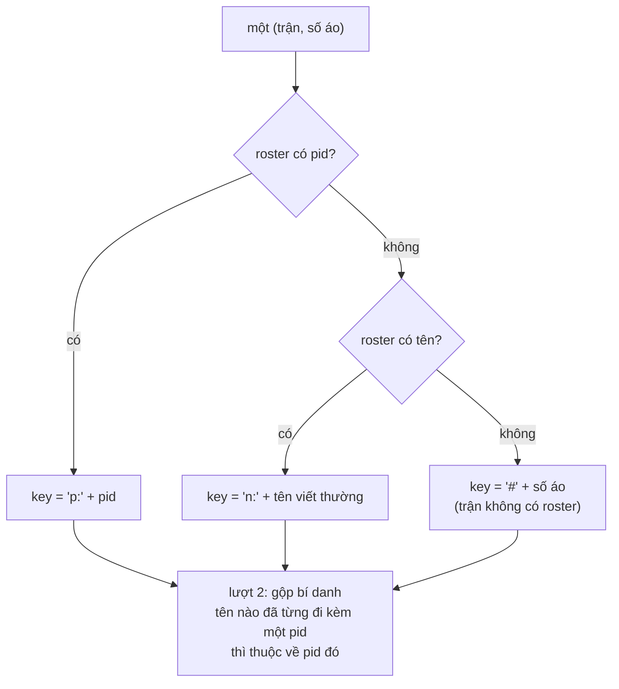

# Player Identity & Goalkeeper — Detailed Design

**Hai điều chỉnh cho tab Player Data vừa lên: (A) một cầu thủ là một *người*, không phải một số áo — số áo đổi theo trận; (B) thủ môn có bộ card riêng, xác định từ dữ liệu sau khi Submit Analysis.**

Trạng thái: **đã triển khai pha A + pha B** (2026-08-15). Pha C vẫn chờ duyệt.
Nối tiếp [`player-data-design.md`](player-data-design.md) (pha 1, commit `eb0a847`).
Phạm vi đã làm: `shared.js`, `client/assets/app.js`, `client/assets/app.css`, `tests/player-data.test.js`.
Không đụng tagger, không đụng `cloud-sync.js` / `supa.js` / `Stats/*`, **không migration DB, không đổi payload**.

Test: `node tests/run.js` → **838/838 passed** (788 test cũ của các tính năng khác, không sửa dòng nào;
50 test cho Player Data, trong đó 36 test cũ được cập nhật theo D1–D7 và ~20 test mới).

**D1 = "xóa hẳn cột số áo" — cách hiểu đã áp dụng.** Số áo biến mất khỏi **toàn bộ** Player Data:
không có cột trong danh sách, không có vòng tròn số trên profile, không có số trong dropdown, và
**cột `Shirt` từng-trận mà §4.3 đề xuất cũng không được thêm**. Lý do: "xóa hẳn" là một lệnh xoá,
còn cột từng-trận là một thứ *thêm vào* — thêm nó trong khi bạn vừa bảo xoá thì trái với lệnh.
Số áo từng trận vẫn xem được ở tab Analysis của trận đó (bảng Stats vẫn có cột `No`).
Muốn lấy lại cột đó thì đúng một dòng.

---

## 1. Mục tiêu và ranh giới

| Yêu cầu của bạn | Thiết kế đáp ứng ở |
|---|---|
| 1 cầu thủ mặc nhiều số áo khác nhau ở các trận khác nhau | §4 — số áo trở thành **thuộc tính của một lần ra sân**, không phải của con người |
| Hệ thống chắc chắn không có 2 cầu thủ trùng tên | §4.1 — điều đó khiến **tên là khoá hợp lệ**; và có `pid` thì còn chắc hơn tên |
| Điều chỉnh cột số áo | §4.3 — **D1: xoá hẳn.** Không còn số áo ở bất kỳ đâu trong Player Data |
| Điều chỉnh cách xác định cầu thủ sau Submit Analysis | §4.1, §4.4 — thang `pid → tên → #số`, kèm một lượt gộp bí danh |
| GK cần card riêng | §5.4, §5.5 — bảng danh sách riêng + dải chỉ số riêng + category `Goalkeeping` |
| Xác định GK sau Submit Analysis | §5.1 — từ ô GK trên bảng đội hình (`xi[i].pos === 'GK'`), **dính vĩnh viễn** |
| GK không bao giờ đá vị trí khác | §5.1 — quy tắc "một trận là GK ⇒ cả mùa là GK", và anh ta **chỉ** xuất hiện ở bảng Goalkeepers |
| Không gây bug ở tab khác | §7 — mọi thay đổi nằm trong Player Data (mới có hôm nay) + **thêm** hàm vào `shared.js` |
| Không đổi tính năng khác khi chưa cho phép | §11 — danh sách những thứ **cố ý không đụng**, kèm lý do |

**Kết luận khảo sát: không cần thêm gì vào payload.** Mọi thứ hai phần này cần đã nằm trong report
mà Submit Analysis đóng băng — kể cả `pid` và vị trí GK. Các report **đã publish từ trước vẫn dùng
được ngay**, không phải publish lại.

---

## 2. Vấn đề, đúng như ảnh bạn gửi

**Ảnh 1 — cột `NO`.** Bảng đang in *một* số áo cho mỗi người: số áo **gần nhất** anh ta mặc
(`p.no = no` được ghi đè mỗi trận, `app.js:783`). Với một đội tuyển quốc gia — nơi mỗi đợt tập trung
đánh số lại — con số đó nói một điều không đúng: nó trông như thuộc tính của con người, trong khi nó
là thuộc tính của **một trận**. Tệ hơn: khi một trận không có roster, cùng một người tách thành hai
dòng (`Elva` và `Player 7`) — đúng rủi ro §13.1 của thiết kế trước.

**Ảnh 2 — card của Barclett (số 1, thủ môn).** `Goals 0 · Assists 0 · Key Passes 0`, và chip đầu tiên
là `SHOOTING`. Ba ô và một tab **không bao giờ** khác 0 với một thủ môn: dải chỉ số nói đúng sự thật
nhưng không nói gì cả. Cái đáng ra phải ở đó — cứu thua, bàn thua, tỉ lệ cản phá, trận giữ sạch lưới —
đều tính được từ dữ liệu đang có mà chưa ai hỏi tới.

---

## 3. Khảo sát: dữ liệu đã có sẵn những gì

| Cần | Đã có ở đâu | Bằng chứng |
|---|---|---|
| ID cầu thủ bền vững | `lineups[team].roster[i].pid` — chính là `public.players.id` (uuid) | `Player-Lists/index.html:350` `t.roster.push(p.pid?{no,name,pid}:{no,name})` |
| Bảng `players` có cột vị trí | `public.players.position` — *"GK / CB / CM … (matches formation zones)"* | `supabase/migrations/0008_teams_players.sql:38` |
| Vị trí trong **trận** | `lineups[team].xi[i].pos`, gán bằng `zoneAt(x,y,dir)` mỗi lần con dot di chuyển | `shared.js:183`, `index.html:1074,1123,2457,2481,2610,2754`, `Player-Lists/index.html:342,425` |
| Ô GK trên lưới | `FORMATION_GRID[1][5] === 'GK'` | `shared.js:115` |
| Đã có tiền lệ đọc GK | `gkNo(team)` — tìm `xi.find(p=>p.pos==='GK')`, dự phòng bằng dot sâu nhất | `Stats/report.js:1124` |
| Cứu thua theo cầu thủ | `newStat().saves`, sự kiện `save` | `shared.js:237`, `pitchtagger_events.json` |
| Bàn thua của một đội | `teamGoals(team)` = bàn của đội đó **+ phản lưới của đối thủ** | `Stats/stats-view.js:920` |
| Card GK đã từng được thiết kế | Vòng cung tỉ lệ cản phá + Saves / Conceded / On-target faced | `Stats/report.js:1131,1141` (`gkPage()`) |

> **Lưu ý về `pid`:** chỉ có khi analyst **chọn cầu thủ từ pool** của đội trong Player lists; gõ tay
> thì chỉ có `{no,name}`. Nên `pid` là *thang trên cùng*, không phải điều kiện bắt buộc.
> Còn `position` trong DB **không** đi vào payload (roster chỉ mang `no/name/pid`), nên §5.1 xác định
> GK từ **bảng đội hình**, không từ cột DB — muốn dùng cột DB thì phải sửa payload ⇒ xem §11.

---

# PHẦN A — Định danh cầu thủ

## 4.1 Thang định danh



Ba bậc, theo đúng thứ tự "cái gì chắc hơn thì thắng":

| Bậc | Khoá | Khi nào | Vì sao chắc |
|---|---|---|---|
| 1 | `p:<uuid>` | roster có `pid` | Khoá chính của `public.players` — sống sót qua đổi số áo **và** qua sửa chính tả tên |
| 2 | `n:<tên>` | có tên, không pid | Bạn đảm bảo không có 2 cầu thủ trùng tên ⇒ tên là khoá hợp lệ |
| 3 | `#<số>` | trận không có roster | Không biết gì hơn. **Không** gộp theo số áo — chính vì số áo đổi giữa các trận, gộp theo số là gộp nhầm |

**Lượt gộp bí danh (alias pass).** Một người có thể xuất hiện với `pid` ở trận A và chỉ có tên ở trận B
(analyst gõ tay). Vì roster cho **cả `pid` lẫn `name` trên cùng một dòng**, ta dựng được ánh xạ
`tên → pid` từ mọi trận, rồi quy mọi khoá `n:` có ánh xạ về `p:` tương ứng. Kết quả: một người, một dòng.

Nếu một tên từng đi với **hai** `pid` khác nhau (không nên xảy ra theo đảm bảo của bạn, nhưng dữ liệu
là dữ liệu): **không gộp**, giữ nguyên theo `pid` và ghi một dòng cảnh báo dưới bảng. Im lặng gộp hai
người thành một là kiểu sai tệ nhất — mọi con số vẫn cộng đúng, chỉ là của nhầm người.

## 4.2 Số áo: không còn là một thuộc tính của con người

```js
// TRƯỚC:  p.no = '9'          ← số áo trận gần nhất, ghi đè mỗi trận, in cạnh tên
// SAU:    (không có)          ← p.no bị xoá khỏi mô hình dữ liệu, không chỉ khỏi màn hình
```

Số áo chỉ còn sống ở nơi nó đúng: bên trong `a.players` / `a.mins` / `a.gk` của **từng trận**, làm khoá
tra cứu để dựng nên `p.matches[i]`. Sau bước đó không ai giữ lại nó, nên **không có chỗ nào** trên
Player Data có thể lỡ in ra một con số.

## 4.3 Số áo trên màn hình — D1: xoá hẳn

| Chỗ | Trước | Sau |
|---|---|---|
| **Bảng danh sách**, cột 1 | `NO` = 1 số | **bỏ cột.** Cột đầu là `Player`, và nó là cột đóng băng (`left:0`) |
| **Avatar** trong profile | vòng tròn đỏ mang số áo | **bỏ.** Còn tên, và pill `GK` cho thủ môn — thứ duy nhất không đổi theo tuần |
| **Dòng meta** dưới tên | `4 appearances · 360' · ngày → ngày` | giữ nguyên; thủ môn được thêm `· 0Y · 0R` (xem D4) |
| **Bảng từng trận** | không có | **vẫn không có** — xem ghi chú đầu tài liệu |
| **Dropdown đổi cầu thủ** | `14 · 4 matches · 360'` | `4 matches · 360'`, kèm pill `GK` nếu là thủ môn |
| **Sắp xếp** | phút ↓ → apps ↓ → **số áo** ↑ | phút ↓ → apps ↓ → **tên** A→Z (số áo không còn là danh tính thì cũng không nên là thứ tự) |

Chú thích dưới bảng nói thẳng vì sao không có cột số áo, để người đọc không tưởng là thiếu dữ liệu:
*"Shirt numbers are not shown: they belong to a match rather than to a player, and a squad is
renumbered between windows."*

## 4.4 Thuật toán

```js
/* Một khoá cho một (trận, số áo). Ba bậc: pid, rồi tên, rồi số áo. */
function idOf(a, no) {
  var pid = (a.ids && a.ids[no]) || '';        // squadIds(): roster no -> pid
  if (pid) return 'p:' + pid;
  var nm = a.names[no] || '';
  return nm ? 'n:' + nm.toLowerCase() : '#' + no;
}

/* Lượt 1 dựng bảng bí danh tên -> pid; lượt 2 mới gán khoá cuối cùng.
   Một tên đi với hai pid thì không gộp — xem §4.1. */
function aliasMap(aggs) {
  var seen = {};                                // tên -> Set(pid)
  aggs.forEach(function (a) {
    Object.keys(a.ids || {}).forEach(function (no) {
      var nm = (a.names[no] || '').toLowerCase(), pid = a.ids[no];
      if (!nm || !pid) return;
      (seen[nm] = seen[nm] || {})[pid] = 1;
    });
  });
  var out = {};
  Object.keys(seen).forEach(function (nm) {
    var pids = Object.keys(seen[nm]);
    if (pids.length === 1) out['n:' + nm] = 'p:' + pids[0];   // một tên, một người
  });
  return out;
}
```

`playerIndex()` gọi `aliasMap(aggs)` một lần ở đầu, rồi mỗi lần `add(no)` lấy
`key = alias[idOf(a,no)] || idOf(a,no)`.

**Cần thêm vào `shared.js`:**

```js
// shirt number -> the players row this squad entry came from, where one is known.
// Twin of squadNames(): same roster, the other column.
function squadIds(lineups,team){
  const m={}, lu=(lineups&&lineups[team])||null; if(!lu)return m;
  (lu.roster||[]).forEach(p=>{const k=String(p&&p.no==null?'':p.no).trim();
    if(k&&p&&p.pid)m[k]=String(p.pid);});
  return m;
}
```

`aggregate()` thêm một field: `ids: window.squadIds(rep.lineups || {}, m.side)`.

---

# PHẦN B — Thủ môn

## 5.1 Xác định GK sau Submit Analysis

**Nguồn sự thật: ô GK trên bảng đội hình.** `xi[i].pos` được gán bằng `zoneAt(x,y,dir)` ở **mọi** chỗ
con dot di chuyển (7 điểm trong tagger, 2 trong Player lists, 1 trong `shared.js`), và `FORMATION_GRID`
đặt `'GK'` ở đúng một ô. Nên `pos === 'GK'` là *analyst đã đặt người này vào khung*, không phải suy đoán.

```js
/* Số áo nào là thủ môn trong trận này: đội hình xuất phát VÀ mọi ảnh chụp sau đó,
   nên một thủ môn vào sân từ ghế dự bị cũng được tính. */
function gkShirts(lineups,team){
  const out=new Set(), lu=(lineups&&lineups[team])||null; if(!lu)return out;
  const take=xi=>(xi||[]).forEach(p=>{if(p&&p.pos==='GK'){const k=String(p.no==null?'':p.no).trim();
    if(k)out.add(k);}});
  take(lu.xi);
  ((lineups&&lineups.history)||[]).filter(h=>h&&h.team===team).forEach(h=>take(h.xi));
  return out;
}
```

**Dính vĩnh viễn (sticky).** Bạn nói một người ở GK thì không bao giờ đá vị trí khác. Vậy:

> `isGK(người) = có **bất kỳ** trận nào mà số áo anh ta mặc nằm trong `gkShirts` của trận đó`

Hệ quả: một trận analyst quên kéo dot vào ô khung thành **không** làm anh ta rơi khỏi nhóm thủ môn.
Và anh ta **chỉ** xuất hiện ở bảng Goalkeepers, không bao giờ ở bảng Outfield.

**Không lấy dự phòng "dot sâu nhất" của `report.js:1127`.** Ở đó nó hợp lý: một trang PDF luôn phải in
một cái card, thà đoán còn hơn để trống. Ở đây thì ngược lại — đoán sai nghĩa là gán card thủ môn cho
một tiền đạo, tệ hơn hẳn việc anh ta ở bảng Outfield. Analyst kéo dot vào ô GK là sửa xong.

## 5.2 Số liệu của một thủ môn

| Ô | Công thức | Lấy từ |
|---|---|---|
| **Saves** | `s.saves` | `computeStats` — sự kiện `save`, đã có sẵn |
| **Conceded** | số bàn đối phương ghi **trong lúc anh ta ở trên sân** | §5.3 |
| **On target faced** | `saves + conceded` | dẫn xuất — đúng định nghĩa `gkPage()` đang dùng (`report.js:1146`) |
| **Save rate** | `pct(saves, saves + conceded)` | cộng dồn cả mùa là **tỉ lệ của tổng**, không phải trung bình các trận |
| **Clean sheets** | số trận anh ta ra sân mà `conceded === 0` | §5.3 |
| **Goal kicks** | `s.goalKicks` | đã có |

"Bàn thua" đếm **cả phản lưới nhà**, giống hệt `teamGoals()` (`stats-view.js:920`): bàn của đối phương
cộng với bàn phản lưới của đội mình. Một quả phản lưới vẫn là bóng trong lưới sau lưng thủ môn.

## 5.3 `onPitchAt()` — vì sao cần một hàm mới

`playedMinutes()` trả về *tổng* thời gian, không trả về các khoảng. Để hỏi "quả này vào lưới lúc anh ta
có đang bắt không", cần đọc đúng cái mà tagger đọc: **snapshot cuối cùng có `t <= t_bàn_thua`**.

```js
/* Ai đang ở trên sân của `team` tại giây `t` của video. lineups.history là danh sách
   ẢNH CHỤP toàn phần chứ không phải delta, nên câu trả lời là ảnh chụp cuối cùng trước
   thời điểm đó — cùng một cách đọc effectiveLU() trong tagger và playedMinutes() ở trên. */
function onPitchAt(lineups,team,t){
  const out=new Set(), lu=(lineups&&lineups[team])||null; if(!lu)return out;
  const hist=((lineups&&lineups.history)||[]).filter(h=>h&&h.team===team&&h.xi)
    .filter(h=>(+h.t||0)<=t).sort((a,b)=>(+a.t||0)-(+b.t||0));
  const xi=hist.length?hist[hist.length-1].xi:(lu.xi||[]);
  (xi||[]).forEach(p=>{const k=String(p&&p.no==null?'':p.no).trim(); if(k)out.add(k);});
  return out;
}
```

Đặt ở `shared.js`, ngay cạnh `playedMinutes()`. Thuần, chỉ đọc, không DOM, không localStorage.
Nó trả lời đúng ba tình huống mà cách "chia đôi theo phút" sẽ trả lời sai: thay thủ môn giữa trận,
thủ môn nhận thẻ đỏ (ảnh chụp sau đó không còn anh ta), và bàn thua tag lệch thứ tự.

Từ đó, cho mỗi trận:

```js
/* {số áo GK -> {conceded, clean, known}} cho đội của CLB */
function gkFigures(rows, lineups, team, keepers) {
  var opp = team === 'home' ? 'away' : 'home', out = {};
  keepers.forEach(function (no) { out[no] = { conceded: 0, clean: 0, known: 1 }; });
  rows.forEach(function (r) {
    var e = String(r.event == null ? '' : r.event).trim().toLowerCase();
    var against = (r.team === opp && e === 'goal') ||
                  (r.team === team && (e === 'own goal' || e === 'own-goal'));
    if (!against) return;
    var on = window.onPitchAt(lineups, team, +r.t || 0);
    keepers.forEach(function (no) { if (on.has(no)) out[no].conceded++; });
  });
  keepers.forEach(function (no) { out[no].clean = out[no].conceded === 0 ? 1 : 0; });
  return out;
}
```

`clean` là **số đếm** (0/1 mỗi trận) chứ không phải boolean, để hàng TOTAL cộng thẳng được và cột
"Clean Sheets" đọc như nhau ở cả hai hàng. `known` cũng là số đếm: trận không có đội hình thì
`known = 0`, và mọi ô suy từ đội hình in `—` thay vì `0` — cùng nguyên tắc `Minutes Played` đang theo.

## 5.4 Bảng danh sách: tách hai

```
PLAYER DATA
┌─ Outfield players ─────────────────────────────────────────────────┐
│ Shirt │ Player     │ Apps │ Minutes │ Goals │ Assists │ Key Passes │
│ 14·9  │ Elva       │  4   │  360'   │   3   │    2    │     6      │
└────────────────────────────────────────────────────────────────────┘
┌─ Goalkeepers ──────────────────────────────────────────────────────┐
│ Shirt │ Player     │ Apps │ Minutes │ Saves │ Conceded │ Save rate │ Clean sheets │
│   1   │ Barclett   │  4   │  360'   │  11   │    9     │   55.0%   │      1       │
└────────────────────────────────────────────────────────────────────┘
```

Hai bảng, mỗi bảng một bộ cột. Không có thủ môn nào thì **không vẽ** khối thứ hai (không in một
bảng rỗng). Cả hai vẫn là `.stbl` sẵn có, vẫn đóng băng 2 cột đầu, vẫn click một hàng để mở profile.

## 5.5 Profile của thủ môn

```
┌──────────────────────────────────────────────────────────────────────┐
│  ← All players                                                        │
│  ( 1 )  Barclett  [GK]                                    PLAYER ▼   │
│  4 appearances · 360' · 7 Jun 2024 → 11 Jun 2025 · 0Y · 0R           │
├──────────────────────────────────────────────────────────────────────┤
│ APPEARANCES │ MINUTES │ SAVES │ CONCEDED │ SAVE RATE │ CLEAN SHEETS  │
│      4      │  360'   │  11   │    9     │   55.0%   │      1        │
├──────────────────────────────────────────────────────────────────────┤
│ [GOALKEEPING] [DISTRIBUTION] [DEFENSIVE] [OTHER]                      │
├──────────────────────────────────────────────────────────────────────┤
│ Date │ vs │ Shirt │ Result │ Score │ Min │ Saves │ Conceded │ …      │
└──────────────────────────────────────────────────────────────────────┘
```

Khác với outfield đúng bốn chỗ, không hơn:

1. **Ba ô giữa** `Goals · Assists · Key Passes` → `Saves · Conceded · Save rate`;
   ô thứ sáu `Cards` → `Clean sheets`. Thẻ phạt của thủ môn chuyển xuống **dòng meta**
   (`… · 0Y · 0R`) để không mất — thẻ của thủ môn hiếm nhưng không phải là không có. Xem **D4**.
2. **Chip đầu tiên** `Shooting` → `Goalkeeping` (`#/data/player/<key>/goalkeeping`).
   Ba chip còn lại giữ nguyên: đường chuyền của thủ môn có ý nghĩa thật, Defensive có
   Clearances/Recoveries, Other có Goal Kicks.
3. **Một pill `GK`** cạnh tên, và avatar đổi màu (`--amber` thay `--red`) — role nhìn ra ngay
   trên cả dropdown.
4. Bảng từng trận: bộ cột `GK_COLS` thay cho `PLAYER_CATS.shooting`.

Ba chip còn lại vẽ **y hệt** outfield — cùng `PLAYER_CATS`, cùng hàm dựng bảng.

## 5.6 `GK_COLS`: vì sao không nhét vào `PLAYER_CATS`

Cột của `PLAYER_CATS` có chữ ký `(s) => …`: một stat object và không gì khác. Đó chính là điều khiến
nó chạy được như nhau trên một trận và trên cả mùa (§7 của thiết kế trước) — và cũng là điều khiến
**không thể** nhét `Conceded` vào: bàn thua không nằm trong `newStat()`, nó là chuyện của trận đấu
xung quanh cầu thủ.

Nên: một mảng **riêng**, chữ ký hai tham số, đặt trong `shared.js` cạnh `PLAYER_CATS`:

```js
/* A keeper's own columns. Two arguments, not one: everything after Saves needs the
   match around him — how many went in while he was on — and that is not something a
   stat row can carry. `g` is {conceded, clean, known}, summable, so the campaign row
   is the same functions run on the summed pair. */
const GK_COLS=[
  ['Saves',           (s,g)=>s.saves],
  ['Conceded',        (s,g)=>g.known?g.conceded:'—'],
  ['On Target Faced', (s,g)=>g.known?s.saves+g.conceded:'—'],
  ['Save Rate',       (s,g)=>g.known?pct(s.saves,s.saves+g.conceded):'—'],
  ['Clean Sheets',    (s,g)=>g.known?g.clean:'—'],
  ['Goal Kicks',      (s,g)=>s.goalKicks]
];
```

`PLAYER_CATS` **không đổi một ký tự** ⇒ tab Stats của analyst và 4 test category của nó không hề biết
chuyện gì đang xảy ra.

---

## 6. Vị trí code

| File | Thay đổi | Loại |
|---|---|---|
| `shared.js` | **Thêm** `squadIds()` (cạnh `squadNames`, dòng 419), `onPitchAt()` (cạnh `playedMinutes`, dòng 470), `gkShirts()`, `GK_COLS` (cạnh `PLAYER_CATS`). Không sửa hàm nào đang có | thêm |
| `client/assets/app.js:410` | `aggregate()`: thêm `ids:` và `gkNos:` | +2 dòng |
| `client/assets/app.js:767` | `playerIndex()`: khoá 3 bậc + alias, `shirts[]`, `isGK`, `gk` figures theo trận | viết lại thân (hàm của hôm nay) |
| `client/assets/app.js:869` | `PL_COLS` → `PL_OUT` + `PL_GK` (hai bộ cột) | sửa |
| `client/assets/app.js:877` | `renderPlayerList()`: hai khối bảng | sửa |
| `client/assets/app.js:903` | `renderPlayerProfile()`: dải ô theo role, chip theo role | sửa |
| `client/assets/app.js:931` | `playerHead()`: pill GK, shirts, thẻ trong meta | sửa |
| `client/assets/app.js:988` | `playerMatchTable()`: cột `Shirt`, nhánh `GK_COLS` | sửa |
| `client/assets/app.css` | `.pl-shirt.gk`, `.pl-role`, `.pl-sec` (tiêu đề khối bảng) | thêm |
| `tests/player-data.test.js` | Cập nhật 5 test của **chính hôm nay** (§7.2) + thêm ~20 test mới | sửa + thêm |
| `client/app.html`, `client/login.html`, `Stats/index.html`, `Player-Lists/index.html` | bump `?v=` | §8 |

**Không đụng tới (0 dòng):** `index.html` (tagger) · `cloud-sync.js` · `client/assets/supa.js` ·
`Stats/stats-view.js` · `Stats/report.js` · `Stats/stats-view.css` · `auth.*` · `supabase/**` ·
`worker/**` · `deploy.yml` · và trong `app.js`: `playerTally`, `keyPlayersRow`, `discipline`,
`renderOverview`, `renderTeamData`, `sectionCols`, `TD_GROUP`, `renderPlayers`, `renderMatches`.

---

## 7. Bảo đảm không vỡ chỗ khác

### 7.1 Theo màn hình

| Màn hình | Vì sao an toàn |
|---|---|
| **Tab Stats** (analyst + channel) | `PLAYER_CATS` không đổi; `GK_COLS` là mảng mới không ai đọc ngoài Player Data |
| **Data › Overview** | `playerTally`/`keyPlayersRow`/`discipline` không sửa. `aggregate()` chỉ **thêm** field |
| **Data › Team Data** | Không sửa. Hai cột đóng băng giữ nguyên offset (§4.3) |
| **Player lists / tagger / Formation** | `pos` chỉ được **đọc**; `gkShirts`/`onPitchAt` không ghi |
| **XLSX / CSV / PDF** | `STAT_HEADERS`, `statRow`, `gkPage()` nguyên vẹn ⇒ file xuất không đổi một ô |
| **Trang match (Analysis)** | Không sửa `loadStatsView()`, không sửa `stats-view.js` |

### 7.2 Test đang khoá code — và test của chính hôm nay sẽ phải sửa

**Vẫn phải xanh, không được sửa** (test của tính năng khác):

| Test | Ràng buộc | Cách né |
|---|---|---|
| `data-page.test.js` *"a player is tallied under his name…"* | thân `playerTally()` phải giữ nguyên biểu thức khoá cũ | Không đụng `playerTally`. **Hệ quả có thật:** thẻ Key Players vẫn gộp theo tên, còn Player Data gộp theo pid → xem §10.2 |
| `data-page.test.js` *"the four categories are…"* | đếm literal `['shooting','x','y']` trong `app.js` = **4** | Chip GK dựng bằng cách **thay phần tử đầu của `TD_TABS`**, không khai báo mảng 3-chuỗi mới |
| `data-page.test.js` *"app.js defines no stat engine of its own"* | không `EVENT_INC`/`computeStats`/`newStat() =` | `GK_COLS` ở `shared.js`; `gkFigures` chỉ đếm row, không định nghĩa chỉ số |
| `data-page.test.js` *"…nothing heavier"* | `dataSource()` không nạp `stats-view` | Không đổi |
| `data-page.test.js` *"Team Data is the matches and nothing else"* | `notOk(/tr\.tot/)` trên **cả file CSS** | Tiêu đề khối bảng dùng `.pl-sec`, hàng tổng vẫn `<tfoot>` |
| `data-page.test.js` *"the frozen columns…give way on a phone"* | chuỗi media-query 720px phải còn nguyên **đứng đầu block** | Cột `Shirt` mới **không** sticky ⇒ không đụng block đó |
| `minutes-played.test.js` (4 test category) | `grabConst('STAT_CATS')` trong `stats-view.js` | Không đụng `stats-view.js` |
| `attack-direction.test.js`, `formation-arrange.test.js` | `zoneAt`/`arrangeXI`/`pos` | Chỉ đọc `pos`, không ghi |
| `squad.test.js`, `report-visuals.test.js` | `STAT_HEADERS`, `statRow`, `gkPage` | Không đụng |

**Sẽ phải sửa — và đều là test viết hôm nay cho chính tính năng này** (`tests/player-data.test.js`),
không phải test của tính năng khác:

1. *"a player is one entry across the campaign, even when his shirt changes"* — bỏ `p.no` hẳn
2. *"a shirt no squad names is still a player, under his number"* — vẫn `#21`, thêm khẳng định không bị gộp
3. *"the key rule is written the same way here as on the Key Players cards"* — **bỏ**, thay bằng test
   mới khẳng định `playerIndex` dùng thang 3 bậc và `playerTally` **vẫn** dùng luật cũ (khoá cả hai
   phía, để việc hai bên khác nhau là *cố ý* chứ không phải trôi dạt)
4. *"most minutes first, and a tie is settled before the shirt is"* — tiebreak đổi sang tên
5. *"the five summary columns of the list are the ones a squad is read by"* — thành hai bộ cột
   (`PL_OUT` / `PL_GK`)
6. *"the shirt and the name stay put while the stats scroll"* — chỉ còn `.c-pl` đóng băng ở `left:0`,
   và khẳng định thêm rằng CSS của `.c-no` / `.pl-shirt` đã bị xoá chứ không để lại

---

## 8. Checklist cache-bust

1. `shared.js` `?v=20 → 21` tại **3 chỗ**: `Stats/index.html:62`, `Player-Lists/index.html:86`,
   `client/assets/app.js` (`loadShared`).
2. `client/assets/app.js` `?v=29 → 30` tại `client/app.html:81`.
3. `client/assets/app.css` `?v=15 → 16` tại `client/app.html:9` **và** `client/login.html:8`.
4. `Stats/stats-view.js` **không đổi** ⇒ giữ `?v=14`.
5. `node tests/asset-versions.test.js --update`, commit `tests/asset-versions.json`.
6. Không thêm file runtime ⇒ không sửa `deploy.yml`.

---

## 9. Kế hoạch test

| Nhóm | Case |
|---|---|
| **Định danh — pid** | 2 trận cùng `pid`, khác số áo, khác cả tên viết hoa/thường → 1 dòng · roster không pid → theo tên · không tên → `#no` |
| **Alias** | trận A có pid + tên, trận B chỉ tên → gộp làm một · một tên hai pid → **không** gộp, giữ 2 dòng · `#7` không bị hút vào ai |
| **Số áo** | `shirts` mới-nhất-trước, bỏ trùng · `p.no === shirts[0]` · mỗi `matches[i].no` là số của trận đó · 1 số → meta không in "shirts" |
| **Thứ tự** | phút bằng nhau → theo tên; số áo không còn ảnh hưởng thứ tự |
| **GK — nhận diện** | `pos:'GK'` trong XI → GK · chỉ có trong snapshot (vào thay) → GK · 1/4 trận có GK → vẫn GK cả mùa (sticky) · không trận nào → outfield · **không** đoán theo dot sâu nhất |
| **GK — bàn thua** | bàn đối phương lúc anh ta trên sân → +1 · lúc anh ta đã bị thay ra → 0 · phản lưới nhà tính là bàn thua · 2 thủ môn 1 trận → chia đúng theo snapshot · thẻ đỏ thủ môn → bàn sau đó không phải của anh ta · bàn tag lệch thứ tự vẫn đúng |
| **GK — chỉ số** | `faced = saves + conceded` · save rate cả mùa là tỉ lệ của tổng · clean sheet cộng dồn · trận không lineup → `—`, không phải `0`, và không kéo tỉ lệ xuống |
| **`onPitchAt`** | trước snapshot đầu → XI xuất phát · đúng biên `t` · nhiều snapshot → lấy cái cuối ≤ t · đội khác không lẫn vào |
| **Render** | 2 khối bảng, không có GK thì không vẽ khối 2 · GK không xuất hiện ở bảng outfield · chip đầu là Goalkeeping cho GK, Shooting cho outfield · pill GK · cột `Shirt` ở vị trí thứ 3 · `#/data/player/<key>/goalkeeping` mở đúng |
| **Không hồi quy** | `playerTally` trước/sau `playerIndex` không đổi · `aggs` không bị mutate · toàn bộ 824 test cũ xanh |

---

## 10. Rủi ro và phụ thuộc dữ liệu

1. **Không có `pid` trong roster** (analyst gõ tay thay vì chọn từ pool). Rơi xuống bậc tên — vẫn đúng
   theo đảm bảo của bạn. Thang pid là *phần thưởng*, không phải điều kiện.
2. **Thẻ Key Players vs Player Data có thể lệch.** Ba thẻ trên Overview vẫn gộp theo tên (thân
   `playerTally` bị test khoá). Với dữ liệu bình thường hai bên cho cùng kết quả; chỉ lệch khi cùng
   một người có tên khác nhau giữa hai trận mà lại cùng `pid`. Muốn thống nhất ⇒ **§11 mục A**.
3. **Analyst chưa kéo dot vào ô GK trong bất kỳ trận nào** → không nhận ra thủ môn, card vẫn là
   outfield như hiện nay. Không phải lỗi im lặng: mở `⛨ Formation` một lần là `arrangeXI` gán `pos`
   cho cả bảng.
4. **`save` không được tag.** Save rate sẽ đọc thấp giả tạo (conceded có, saves không). Đây là vấn đề
   quy trình nhập liệu; thiết kế không che nó đi — nếu muốn cảnh báo "trận này không có save nào được
   tag" thì đó là việc riêng, xin phép sau.
5. **Thủ môn đá vị trí khác** (trái với đảm bảo của bạn): luật sticky sẽ giữ anh ta ở bảng
   Goalkeepers. Có chủ ý, và §12/**D2** là chỗ đổi nếu bạn muốn khác.
6. **Trận không có đội hình**: không có GK, không có bàn thua quy được, `Minutes` `—`. Mọi ô suy từ
   đội hình đọc `—`.

---

## 11. Việc **không** làm nếu bạn chưa cho phép

| # | Việc | Vì sao phải hỏi |
|---|---|---|
| A | Cho `playerTally()` (thẻ Key Players) dùng chung thang định danh mới | Sửa code đang chạy của Overview + phải sửa test của tính năng khác |
| B | Thêm category `Goalkeeper Stats` vào **tab Stats** (theo ảnh 2) | Đổi màn hình mà cả analyst lẫn channel dùng chung |
| C | Đưa `position` từ `public.players` vào payload để biết GK không cần bảng đội hình | Đổi `buildReport()` ⇒ phải publish lại mọi report cũ |
| D | Dùng dự phòng "dot sâu nhất" của `report.js` để đoán GK | §5.1 — đoán sai tệ hơn không đoán |
| E | Đổi `gkPage()` trong PDF sang số liệu **từng thủ môn** (hiện là cả đội) | Đổi báo cáo đang gửi cho CLB |
| F | Gộp `#số áo` vào cầu thủ có tên | Chính bạn nói số áo đổi giữa các trận |
| G | Thêm cột `Pos` cho cầu thủ ngoài sân | Vị trí ngoài sân đổi theo trận; chỉ GK là cố định |

---

## 12. Quyết định — đã chốt

| # | Câu hỏi | Kết quả |
|---|---|---|
| **D1** | Cột đầu bảng danh sách hiện mọi số áo (`14 · 9`) hay chỉ số mới nhất + tooltip? | ❌ **Bạn chọn: xoá hẳn.** Không còn số áo ở bất kỳ đâu trong Player Data — kể cả cột từng-trận đã đề xuất |
| **D2** ✅ | Đã là GK một trận thì là GK cả mùa (sticky)? | **Có** — đúng như bạn nói, và nó cứu trường hợp analyst quên kéo dot |
| **D3** ✅ | Clean sheet: chỉ cần `conceded === 0` khi ở trên sân, hay phải đá tối thiểu 60'? | **Chỉ cần 0 bàn thua khi ở trên sân** (kèm tooltip nói rõ). Ngưỡng 60' là quy ước giải đấu, không phải sự thật của trận |
| **D4** ✅ | Thẻ phạt của GK bỏ khỏi dải ô — để ở dòng meta hay bỏ hẳn? | **Dòng meta** (`· 0Y · 0R`) — 6 ô là 6 ô, mà thẻ thì không nên mất |
| **D5** ✅ | Chip đầu của GK là `Goalkeeping` **thay** `Shooting`, hay thêm thành 5 chip? | **Thay** — cú sút của thủ môn là cột 0 vĩnh viễn |
| **D6** ✅ | Bảng Goalkeepers tách riêng, hay chung một bảng có cột `Pos`? | **Tách riêng** — đúng yêu cầu "GK cần card riêng", và cột của hai nhóm vốn khác nhau |
| **D7** ✅ | Sắp xếp khi bằng phút: theo tên hay theo số áo mới nhất? | **Theo tên** — số áo không còn là danh tính thì cũng không nên là thứ tự |

---

## 13. Phân pha

| Pha | Nội dung | Trạng thái |
|---|---|---|
| **A** | Định danh 3 bậc + alias · bỏ hẳn số áo · đổi tiebreak sang tên | ✅ **đã làm** |
| **B** | `gkShirts`/`onPitchAt`/`GK_COLS` · tách bảng Goalkeepers · dải ô + chip + pill GK cho profile | ✅ **đã làm** |
| **C** | Mọi mục trong §11 | Chờ duyệt riêng từng mục — **không mục nào được động vào** |

A và B đi cùng một lần, vì B cần biết một người từng mang số áo nào để tra ô GK của từng trận —
thông tin đó nay sống trong `matches[i]`, không hiển thị ở đâu cả.
