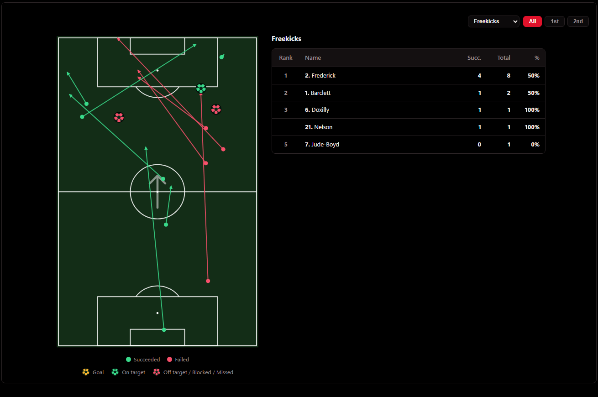
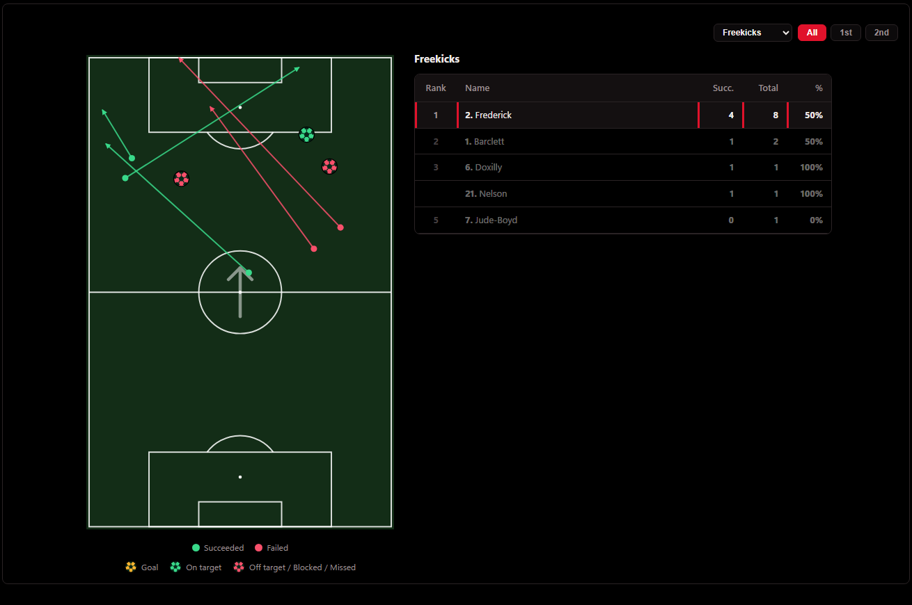
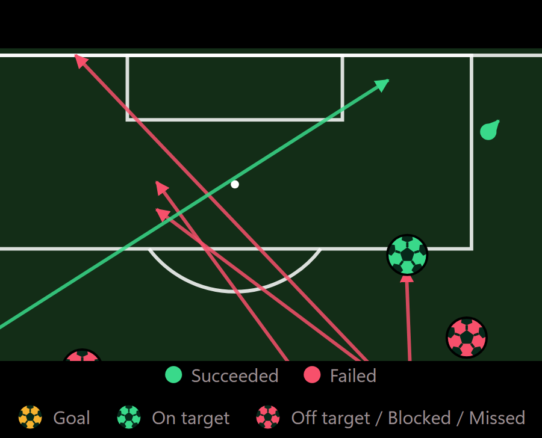
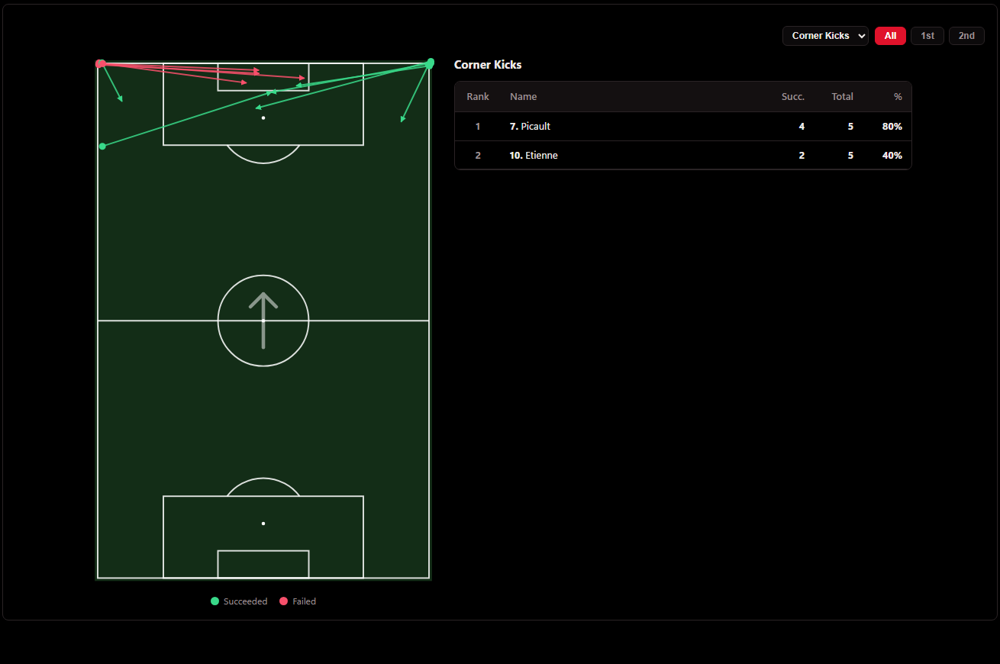
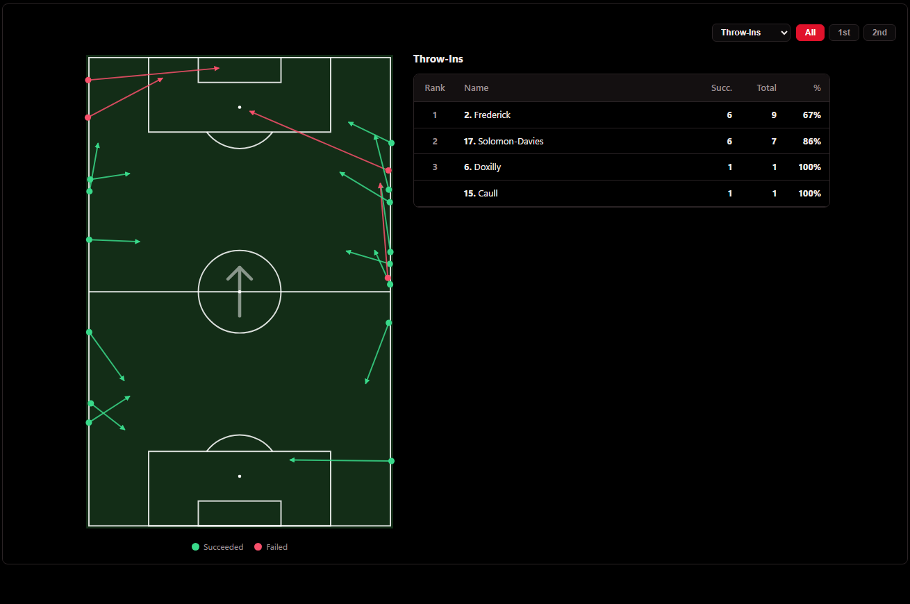
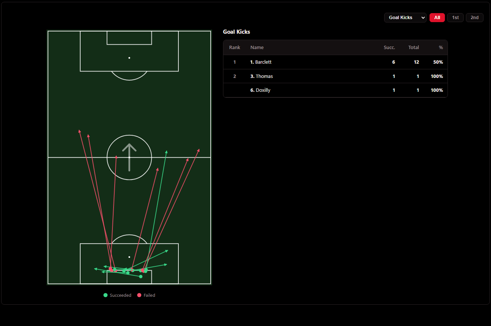
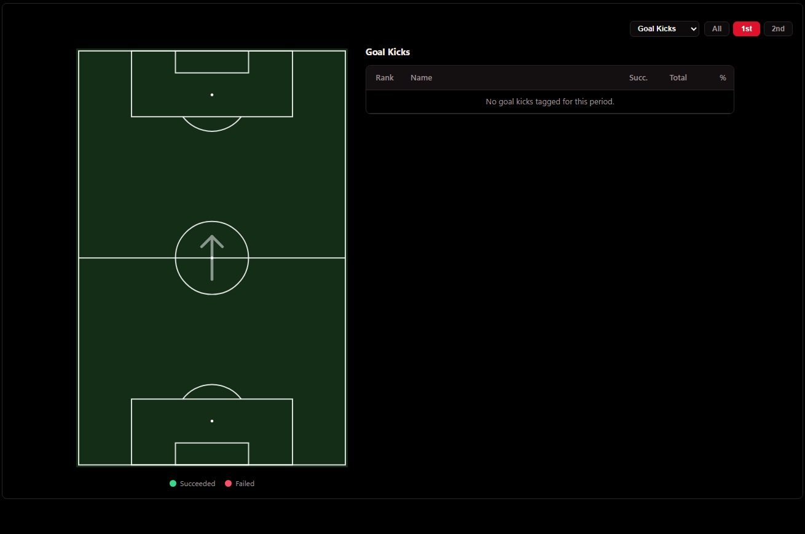

# Dashboard **Set Pieces** — Detailed Design

Tab **Dashboard › Set Pieces** hiện chỉ in một dòng: *"No dashboard for Set Pieces yet. Its
table is on the **Stats** tab."* Tài liệu này thiết kế cái đứng vào chỗ đó: **một bản đồ
có dropdown bốn loại tình huống cố định, bảng xếp hạng người thực hiện, và hover**. Hình
thức giống hệt bản đồ **Passes** của tab Distribution trong video tham chiếu.

**Trạng thái: ĐÃ TRIỂN KHAI (2026-09-23)** đúng theo bản thiết kế này, sau khi bản thiết
kế được duyệt. Kết quả kiểm chứng sau triển khai ở §7.4. Bốn câu hỏi mở đã được trả lời
ngày **2026-09-23** (§0.3), và bản thiết kế đã được **điều chỉnh lần 2** cùng ngày (§0.5).
Trước khi triển khai, thiết kế đã được **chạy thử dưới dạng prototype trên 4 trận thật**
(bản sao `stats-view.js` trong scratchpad). Mọi ảnh và con số trong tài liệu này đều đến từ
prototype đó, **sau** lần điều chỉnh 2; code đã ship render **giống hệt** prototype (§7.4).

**Baseline:** `node tests/run.js` → **1565/1565** trước; **1588/1588** sau (23 test mới).

**Phạm vi sửa khi triển khai:** chỉ `Stats/stats-view.js` (thêm code, không sửa hàm cũ nào),
cộng chuỗi bump `?v=` bắt buộc (3 dòng ở 3 file), 3 test phải cập nhật có chủ đích, và 1
file test mới. **Không** đụng `shared.js`, `Stats/report.js` (PDF), `stats-view.css`,
`index.html` (app tag), `cloud-sync.js`, database. **Không** thêm event, counter hay cột
Stats nào. §7 liệt kê từng thứ không được đụng, kèm bằng chứng.

---

## 0. Yêu cầu, và những gì đã chốt

### 0.1 Yêu cầu

> Map với dropdown **"Freekicks", "Corner Kicks", "Throw-Ins", "Goal Kicks"**. Map hiển thị
> **mũi tên (pass/cross success/fail)** và **ranking số lần thực hiện của mỗi cầu thủ** như
> trong video, **xanh = success, đỏ = fail**. Riêng map **Freekicks**: thay dot bằng **ký hiệu
> trái bóng tại vị trí cầu thủ thực hiện**, chỉ cho "Freekicks: Shots Off Target" (**bóng
> đỏ**) và "Freekicks: Shots On Target" (**bóng xanh**).
>
> Không được gây bug ở chức năng của các tab khác; không thay đổi tính năng khác khi chưa
> được phép.

### 0.2 Video tham chiếu = **Distribution › Passes** (`distMapHTML`, `stats-view.js:697`)

Bóc 61 khung hình của video, thấy đúng là bản đồ Passes đang chạy:

| Trong video | Trong code hiện tại |
|---|---|
| Sân dựng đứng, đội luôn **tấn công lên** (mũi tên giữa vòng tròn) | `attackDir()` + lật `100-x` với hiệp đá ngược |
| Mũi tên xanh/đỏ, chấm nhỏ ở điểm xuất phát | `<line marker-end>` + `<circle r="7">` |
| Bảng bên phải: **Rank · Name · Succ. · Total · %** | `.dl-rank` |
| Hover một hàng → chỉ còn mũi tên của người đó, hàng được viền đỏ | `distHover()` + `tr.sel` / `tr.dim` |
| Dropdown + **All / 1st / 2nd** ở góc trên | `select.def-sel` + `.half-toggle` |
| Dải % bên trái và dưới sân; lưới 18 ô khi rời chuột | `.dl-band`, `.dl-grid` — **không làm** (§0.3 Q3) |

### 0.3 Bốn câu hỏi đã hỏi và câu trả lời (2026-09-23)

| # | Câu hỏi | Trả lời | Hệ quả thiết kế |
|---|---|---|---|
| Q1 | Map Freekicks có vẽ bóng cho cú sút của **đồng đội** sau quả đá phạt (7 tạt, 14 đánh đầu) không? Hai cột Stats đang đếm cả loại này. | **Không — chỉ sút trực tiếp** | Bóng chỉ xuất hiện khi **chính người đá phạt sút**, tại điểm đá phạt. Màn hình **không** in dòng nào giải thích chênh lệch với cột Stats (§0.5). |
| Q2 | Cú đá phạt bị chặn (`blocked shot` / `miss shot`) — không thuộc cột nào. | **Bóng đỏ** | Đỏ = "không trúng đích": off target, blocked, missed. Số bóng đỏ **có thể lớn hơn** cột "Freekicks: Shots Off Target" — đã chấp nhận. |
| Q3 | Dải % bên trái/dưới sân tính theo điểm đầu hay điểm đến? | **Không làm dải %** — chỉ map, ranking và hover | Không `.dl-band`, không lưới 18 ô, không lề trái/dưới cho dải. |
| Q4 | Bàn thắng trực tiếp từ đá phạt: bóng màu gì? | **Vàng như tab Shooting** | `#f7b32f`. Vẫn tính là **thành công** trong ranking. |

### 0.4 Hai quyết định mặc định (đã nêu trước khi hỏi, không bị phản đối)

1. **Penalty để ngoài.** Không có trong danh sách bốn mục. Cột `Penalty Kicks` ở tab Stats
   giữ nguyên.
2. **Chỉ vẽ cú giao bóng của người thực hiện** (một mark cho mỗi quả), không vẽ các đường
   chuyền tiếp theo trong chuỗi. §2.3 giải thích vì sao.

*(Bản đầu có quyết định thứ ba — tạt vẽ nét đứt — đã được thay ở §0.5.)*

### 0.5 Điều chỉnh lần 2 (2026-09-23)

| # | Yêu cầu | Thay đổi trong thiết kế |
|---|---|---|
| 1 | Xóa note | **Bỏ hẳn dòng note dưới map Freekicks** (dòng *"… shots after a free-kick delivery are counted in the Stats tab…"* của bản đầu). Đã xác nhận phạm vi: **chỉ** dòng note đó. Dòng *"No … tagged for this period."* của bảng xếp hạng và các phần ghi chú trong tài liệu **giữ nguyên**. Chênh lệch giữa số bóng và hai cột Stats vẫn tồn tại và vẫn có test khoá (§4.6), chỉ là không in lên màn hình nữa. |
| 2 | Pass và cross đều mũi tên nét liền, không chú thích pass/cross | Cross **không còn nét đứt**: pass và cross vẽ **giống hệt nhau**. Chú giải bỏ hai mục *Pass* / *Cross*, chỉ còn *● Succeeded · ● Failed* (+ dòng trái bóng của Freekicks). |
| 3 | Bóng đỏ = shot off target / blocked shot / missed shot | Quy tắc đã như vậy từ Q2. Chú giải đổi từ *"Off target / Blocked"* thành **"Off target / Blocked / Missed"** cho khớp với cả ba. |

---

## 1. Nhìn trước — prototype trên dữ liệu thật

Mọi ảnh dưới đây là **HTML thật** do prototype render, dùng CSS thật của site khách
(`app.css` + `shared.css` + `stats-view.css`), payload thật đã publish (kênh Saint Lucia).

**Freekicks — Saint Lucia vs Barbados, Saint Lucia.** Mũi tên chuyền/tạt; 1 bóng xanh
(trúng đích), 2 bóng đỏ (1 chệch + 1 bị chặn):



**Hover số 2 (Frederick):** còn đúng 8 mark của số 2 (8 quả), hàng được chọn viền đỏ, các
hàng khác mờ — giống hệt video:



**Trái bóng, phóng 3×** (trên sân và trong chú giải):



**Corner Kicks — Haiti:** tạt và đá ngắn từ hai góc, cùng một kiểu mũi tên nét liền:



**Throw-Ins — Saint Lucia vs Barbados:**



**Goal Kicks — Haiti vs Saint Lucia, Saint Lucia:** phát dài phần lớn mất bóng (đỏ), phát
ngắn giữ được (xanh). Một câu trả lời mà bảng Stats không có:



**Trạng thái rỗng** — Haiti, Goal Kicks, hiệp 1 (quả duy nhất của họ ở hiệp 2):



---

## 2. Khảo sát dữ liệu — cái gì THỰC SỰ có

Toàn bộ `public.events` (8 trận, 10 510 row), truy vấn read-only ngày 2026-09-23.

### 2.1 590 set piece, không quả nào tag một mình, không row nào có `rXY`

| Event (chữ đúng như trong DB) | Số row | `grp = null` (tag một mình) | có `rXY` | có `pXY` |
|---|---|---|---|---|
| `free-kick` | 169 | 0 | **0** | 169 |
| `corner-kick` | 85 | 0 | **0** | 85 |
| `throw-Ins` (chữ **I hoa**) | 239 | 0 | **0** | 239 |
| `goal kick` | 92 | 0 | **0** | 92 |
| `penalty kick` *(ngoài phạm vi)* | 5 | 0 | 0 | 5 |

- **Không row set piece nào có điểm đến.** Lý do nằm ở `index.html:2519`:
  `TRANSFER_EVENTS` chỉ gồm pass/cross/substitution. Trong một nhóm phím, số áo tiếp theo
  (người nhận, kéo theo `rXY`) chỉ rơi vào event *transfer*. Vẽ mũi tên từ row set piece là
  vẽ ra **không gì cả**.
- `throw-Ins` viết chữ I hoa trên **cả 239 row**. Mọi so sánh phải đi qua `evKey`
  (`shared.js:370`), nếu không sẽ khớp con số 0 một cách im lặng.

### 2.2 Cú giao bóng: row đi kèm trong **cùng entry**, **cùng người**, **cùng chấm**

Cú pháp tag (`index.html:2509-2518`): `2k*cc` = *free-kick* của số 2 **và** *cross fail* của
số 2, cùng một chấm → hai row chung `grp`, chung `playerFrom`, chung `pXY`. Row cross/pass
mới là row có `rXY` (điểm bóng tới).

Row pass/cross/shot **đầu tiên** sau set piece trong chuỗi (xếp theo `ord`):

| Loại | Cú giao bóng | cùng người | cùng chấm | pass/cross có `rXY` |
|---|---|---|---|---|
| Free-kick (169) | pass success 100 · pass fail 35 · cross fail 15 · cross success 5 · **blocked 5 · on target 4 · off target 4 · goal 1** | 100% | 100% | 100% |
| Corner (85) | cross success 39 · cross fail 38 · pass success 8 | 100% | 100% | 100% |
| Throw-in (239) | pass success 208 · pass fail 31 | 100% | 100% | 100% |
| Goal kick (92) | pass success 75 · pass fail 17 | 100% | 100% | 100% |

*(Đã gồm 15 quả thiếu `ord` ở §2.4, tìm được bằng quy tắc cùng-người.)*

> **Kết luận:** mỗi set piece có **đúng một cú giao bóng tìm được**, và mũi tên của nó là
> `pXY → rXY` **của row giao bóng**. Không một quả nào trong 585 quả thuộc phạm vi thiếu
> cú giao bóng.

### 2.3 Sau cú giao bóng: hành động của **người khác** — không vẽ

Chuỗi thường đi tiếp sau cú giao bóng:

| Mẫu chuỗi thật | Số lần |
|---|---|
| throw-in › pass success › **pass success của người nhận** | 27 |
| free-kick › pass success › **pass success của người nhận** | 13 |
| corner › cross success › key pass › **shot off target của người khác** › head | 6 |
| goal kick › pass success › **pass fail của người nhận** | 4 |

Row đậm là **pha bóng sống của người khác**, không phải quả set piece của người thực hiện.
Vẽ chúng lên map *Throw-Ins* là vẽ 27+ mũi tên không phải quả ném biên nào. Hover người ném
biên thì chúng biến mất, còn bảng xếp hạng thì không đếm chúng. Ba thứ trên một màn hình sẽ
nói ba điều khác nhau.

→ **Một set piece = một mark = cú giao bóng của người thực hiện.** Ranking, map và hover đếm
cùng một thứ.

### 2.4 ⚠️ Cái bẫy `ord`: 15 quả cũ không có `ord`

`ord` (vị trí trong chuỗi, `index.html:2760`) chỉ có từ giữa lúc tag trận đầu tiên.
**15 set piece** (9 corner, 6 free-kick) tag trước thời điểm đó — tất cả trong **Kidsgrove
Athletic v Hanley Town** (2026-07-06), trên tổng 37 quả corner + đá phạt của trận — không
có `ord` trong DB. `dbToRow` (`cloud-sync.js:56`) đọc `a.ord ?? 0`, nên **mọi row trong
chuỗi của chúng đều có `ord = 0`**.

| Cách đọc | Kết quả trên 15 quả này |
|---|---|
| `report.js` `spChains`: lấy row có `ord > ord(set piece)` | **không row nào** → PDF không vẽ gì cho 15 quả |
| Thiết kế này: lấy row **cùng người** có `ord ≥ ord(set piece)` | tìm đủ 15/15 |

Chỉ nới lỏng `>` thành `≥` thôi thì **nguy hiểm**. Chuỗi thật `12j*c*z5d` = corner của 12,
cross của 12, key pass của 12, **shot của 5**. Khi mọi `ord` bằng 0, "row đầu tiên" có thể
là cú sút của số 5. Chính điều kiện **cùng người** giữ quả phạt góc của số 12 gắn với cú
tạt của số 12.

### 2.5 Cú sút từ đá phạt, và hai cột Stats "Freekicks: Shots On/Off Target"

Hai cột này do `setPieceFold` (`shared.js:391-414`) đếm:

- **ghi cho người SÚT**, không phải người đá phạt;
- mọi cú sút **ở bất cứ đâu** trong chuỗi có free-kick, kể cả cú đánh đầu của đồng đội;
- `shot on target` + `goal` → On; `shot off target` → Off; **`blocked shot`, `miss shot` không
  vào cột nào**.

| Cú sút trong chuỗi free-kick (8 trận) | trực tiếp (người đá phạt sút) | gián tiếp (đồng đội sút sau) |
|---|---|---|
| goal | 1 | 0 |
| shot on target | 4 | 1 |
| shot off target | 4 | 4 |
| blocked shot | 5 | 1 |

Theo Q1 + Q2 + Q4, map vẽ **14 quả trực tiếp**: 1 vàng, 4 xanh, **9 đỏ** (4 chệch + 5 bị
chặn). 6 quả gián tiếp không vẽ. Các quả gián tiếp *on/off target* có trong cột Stats nhưng
không có trên map, và màn hình không in dòng giải thích nào (§0.5). Cách đối chiếu chính
xác giữa hai bên nằm ở §4.6.

### 2.6 Site khách có đủ dữ liệu

Payload đã publish (`match_reports.payload.rows`, dựng bằng `dbToRow`, `cloud-sync.js:591`)
mang đủ `grp`, `ord`, `pXY`, `rXY`, `playerFrom`. Đã tải 4 payload công khai của kênh Saint
Lucia và chạy prototype trực tiếp trên chúng. Kết quả ở §7.2.

---

## 3. Thiết kế màn hình

### 3.1 Bố cục

```
┌──────────────────────────────────────────────────────────────────────────────┐
│                                        [ Freekicks ▾ ]  [All] [1st] [2nd]    │
│  ┌─────────────────────────┐   Freekicks                                     │
│  │        ▲ (sân dựng)     │   ┌────┬──────────────────┬──────┬──────┬─────┐ │
│  │   ↗ ↗   ⚽      ⚽      │   │Rank│ Name             │Succ. │Total │  %  │ │
│  │  ↗    ⚽                │   ├────┼──────────────────┼──────┼──────┼─────┤ │
│  │        (↑ Attacking)    │   │ 1  │ 2. Frederick     │  4   │  8   │ 50% │ │
│  │   ↗        ↖            │   │ 2  │ 1. Barclett      │  1   │  2   │ 50% │ │
│  │                         │   │ 3  │ 6. Doxilly       │  1   │  1   │100% │ │
│  └─────────────────────────┘   │    │ 21. Nelson       │  1   │  1   │100% │ │
│        ● Succeeded ● Failed    │ 5  │ 7. Jude-Boyd     │  0   │  1   │  0% │ │
│   ⚽ Goal ⚽ On target ⚽ Off target / Blocked / Missed  ← chỉ map Freekicks │
└──────────────────────────────────────────────────────────────────────────────┘
```

Trong `dashboardHTML()`: `<div class="chart-row">${spMapHTML(team)}</div>` — một hàng, một
thẻ, đúng như Distribution.

### 3.2 Dropdown và nút hiệp

| Điều khiển | Giá trị | Mặc định |
|---|---|---|
| `select.def-sel` | **Freekicks** · **Corner Kicks** · **Throw-Ins** · **Goal Kicks** (đúng chữ yêu cầu) | Freekicks |
| `.half-toggle` | All · 1st · 2nd | All |

Không lưu vào localStorage — bốn cặp biến của các map khác cũng không lưu. Được giữ khi đổi
đội và khi host gọi `update()` sang trận khác (giống `distCat`/`distHalf`).

### 3.3 Sân

- Dựng đứng 680 × 1050, **tấn công lên**. Hai hiệp chuẩn hoá bằng cùng phép lật với
  `distMapHTML` (`attackDir` theo hiệp của **quả set piece**), nên "All" là một bức tranh.
- **Không lề trái/dưới, không dải %, không lưới 18 ô** (Q3). Chỉ có 14 đơn vị "không khí"
  quanh viền (`viewBox="-14 -14 708 1078"`). Nhờ vậy chấm ở cột cờ góc và đầu mũi tên chạm
  biên không bị cắt nửa. Ảnh §1: chấm corner ở góc hiện đủ.
- Mũi tên "Attacking" giữa vòng tròn, cùng nét với Distribution.

### 3.4 Mark — mỗi set piece **một** mark

| Cú giao bóng | Hình | Màu | Kích thước |
|---|---|---|---|
| pass success / pass fail / cross success / cross fail | mũi tên **nét liền** `pXY → rXY` + chấm gốc. Pass và cross vẽ **giống hệt nhau** (§0.5) | xanh / đỏ | nét 3, chấm r=7, đầu mũi tên như Distribution |
| pass/cross **không có** `rXY` *(0 quả trên dữ liệu)* | chấm không mũi tên | xanh / đỏ | r=12 (như chấm không mũi tên của Distribution) |
| **Freekicks:** `goal` | **trái bóng** tại `pXY` | **vàng `#f7b32f`** | R=17 |
| **Freekicks:** `shot on target` | **trái bóng** | **xanh `#39d98a`** | R=17 |
| **Freekicks:** `shot off target` / `blocked shot` / `miss shot` | **trái bóng** | **đỏ `#f7506b`** | R=17 |
| Map khác, cú giao bóng là cú sút *(0 quả)* | chấm | xanh nếu trúng/bàn, đỏ nếu không | r=12 |

- **Trái bóng:** đĩa màu + ngũ giác giữa + 5 đường may + 5 mảng đen bị viền bóng cắt, như
  icon bóng in. Mực `#06281a` là màu chữ số trên mọi chấm của các map. Viền `#000` vẽ
  **sau cùng**. Ảnh phóng 3× ở §1.
- **Thứ tự vẽ:** mũi tên trước, **bóng sau**, để không mũi tên nào đè lên trái bóng.
- Không in số áo trong mark, giống video. Nhận diện người thực hiện bằng ranking + hover.
- Không có màu mới: cả ba màu đã là bảng màu của app (xanh/đỏ mọi map, vàng = bàn thắng
  ở Shooting).

### 3.5 Chú giải

- Mọi map: **● Succeeded · ● Failed**
- Thêm riêng Freekicks, dòng thứ hai: **⚽ Goal · ⚽ On target · ⚽ Off target / Blocked / Missed**

**Không có mục nào cho pass hay cross** (§0.5). Hai loại vẽ giống nhau, nên không có gì để chú
thích.

Dùng `.shotmap-legend` + `.sm-leg` + `.leg-dot` sẵn có. Điều khác duy nhất so với
Distribution là dòng thứ hai: ba trái bóng (svg 18×18), chỉ ở map Freekicks. Thêm
`style="flex-wrap:wrap"` inline, vì `.shotmap-legend` là flex **không wrap**
(`shared.css:77`) mà dòng trái bóng dài gần bằng cột map trên mobile. Inline để không phải
sửa file CSS dùng chung.

**Dưới map không có dòng chữ nào khác ngoài chú giải** (§0.5). Khi đồng đội sút sau một quả
đá phạt, map Freekicks vẽ ít bóng hơn tổng hai cột Stats. Màn hình không giải thích chênh
lệch đó; §4.6 ghi cách đối chiếu, và có test khoá.

### 3.6 Bảng xếp hạng — "số lần thực hiện của mỗi cầu thủ"

| Cột | Định nghĩa | Khớp với |
|---|---|---|
| **Total** | số set piece loại này **người đó thực hiện** trong hiệp đang chọn | **= cột Stats** `Freekicks` / `Corners` / `Throw-Ins` / `Goal Kicks` khi chọn All — đã kiểm trên 4 trận, 0 lệch (§7.2) |
| **Succ.** | số quả có cú giao bóng thành công: pass/cross success, hoặc (đá phạt) on target / goal | số mark xanh + vàng của người đó |
| **%** | `round(Succ ÷ Total × 100)` | như video |

- Chỉ liệt kê người có ≥1 quả. Sắp xếp: **Total giảm dần → Succ. giảm dần → số áo**, đúng
  như `distMapHTML`. Đồng hạng (Total và Succ. đều bằng) thì dùng chung hạng và **bỏ trống
  ô Rank**, hạng kế tiếp nhảy số. Ảnh §1: Doxilly và Nelson.
- Tên: `squadNames` + `playerLabel`, dạng **`2.` Frederick**.
- Không có ai: một hàng *"No freekicks tagged for this period."* (chữ theo từng loại:
  *corner kicks / throw-ins / goal kicks*).

### 3.7 Hover

Rê chuột vào một hàng: chỉ còn mark của người đó (`data-p` = số áo **người thực hiện**),
hàng được chọn (`sel`), hàng khác mờ (`dim`). Rời chuột: trả lại cả đội. Không render lại
— chỉ lật `style.display`, như `shotHover`/`defHover`/`distHover`. Ảnh §1: hover số 2 còn 8/13
mark, 1 hàng `sel`, 4 hàng `dim`.

### 3.8 Rỗng và ca biên

| Tình huống | Có trên dữ liệu? | Màn hình |
|---|---|---|
| Đội không có quả nào loại này trong hiệp | có (ảnh §1) | Sân trống + mũi tên Attacking + hàng *"No … tagged for this period."* Không bao giờ trả chuỗi rỗng. |
| Set piece tag một mình (`grp = null`) | 0 | Vào **Total**, không có mark |
| Chuỗi thiếu `ord` | **15** | Tìm cú giao bóng bằng quy tắc cùng-người (§2.4) |
| Chuỗi có 2 set piece | 0 | Quả có `ord` nhỏ nhất mở chuỗi, như `spChains`. Quả kia vào Total, không mark. |
| Cú giao bóng không có `pXY` | 0 | Dùng `pXY` của set piece; không có nữa thì không vẽ |
| Row thiếu số áo | 0 (app tag bắt buộc) | Vẫn vẽ (`data-p=""`), không vào ranking — như Distribution |
| Đội không có event nào | — | Nhánh sẵn có của `renderStats()`: *"No events for this team yet."* — không đụng |

### 3.9 Mobile

Map dùng lại đúng `.map-card` / `.dl-flex` / `.dl-map` / `.dl-side`. `app-mobile.css:148-149`
đã nới min-width của chính các class này dưới 720px. Nên map mới co giãn **y hệt** map
Distribution mà không cần thêm dòng CSS nào. (Preview của prototype không dùng thanh công
cụ thật của site khách, nên phép thử mobile cuối cùng phải làm trên `client/app.html` thật —
§8.3.)

---

## 4. Quy tắc dữ liệu — thuật toán chính xác

### 4.1 Loại

```js
const SP_KINDS={
  freeKicks:{label:'Freekicks',    keys:['free-kick'],            ball:true},
  corners:  {label:'Corner Kicks', keys:['corner-kick']},
  throwIns: {label:'Throw-Ins',    keys:['throw-ins','throw-in']},
  goalKicks:{label:'Goal Kicks',   keys:['goal kick']}
};
```

Key trùng tên counter của `newStat()` (`freeKicks`, `corners`, `throwIns`, `goalKicks`), nên
test đối chiếu `Total` với `computeStats` viết được trực tiếp. `keys` đã ở dạng `evKey`, và
`throw-in` đi kèm `throw-ins` giống `EVENT_INC` (`shared.js:245`).

### 4.2 Quả được thực hiện (`taken`)

Mọi row của đội này có `evKey(event) ∈ keys`, trong hiệp đang chọn (`eventHalf` của **row
set piece**). **Không** đòi `pXY`: cột Stats không đòi, và Total phải bằng cột Stats.

### 4.3 Cú giao bóng của một quả `sp`

```
chuỗi   = các row CÙNG ĐỘI có cùng grp với sp (grp ≠ null)
mở chuỗi= row set piece có ord nhỏ nhất trong chuỗi (hoà → thứ tự mảng)
nếu sp không mở chuỗi → không có cú giao bóng
giao bóng = row r trong chuỗi, r ≠ sp,
            ord(r) ≥ ord(sp),                     ← ≥, vì §2.4
            playerFrom(r) = playerFrom(sp),        ← cùng người, vì §2.4
            evKey(r.event) ∈ SP_DELIVERY
          → lấy r có ord nhỏ nhất (hoà → thứ tự mảng; sort của JS ổn định)
```

`ord` đọc bằng `+r.ord||0`, giống `report.js`.

### 4.4 Phân loại cú giao bóng (`SP_DELIVERY`)

| Event | kind | ok | goal |
|---|---|---|---|
| pass success / pass fail | pass | ✓ / ✗ | |
| cross success / cross fail | cross | ✓ / ✗ | |
| shot on target | shot | ✓ | |
| goal | shot | ✓ | ✓ |
| shot off target · blocked shot · miss shot | shot | ✗ | |

`goal` đứng cùng `shot on target` vì `EVENT_INC` đã tính nó là một cú trúng đích
(`shared.js:213`), và `SP_OUT` của `report.js` cũng đọc như vậy. Blocked/miss là thất bại,
đúng như Shooting Accuracy đọc chúng.

### 4.5 Toạ độ

`a` = `pXY` của cú giao bóng (dự phòng: `pXY` của set piece); `b` = `rXY` của cú giao bóng,
chỉ khi không phải cú sút. Chuẩn hoá bằng đúng hàm `N()` của `distMapHTML`:

```js
const flip=dir[half]==='left';  px=flip?100-x:x;  py=flip?100-y:y;
→ {x: py/100*680, y: (100-px)/100*1050}      // tấn công phải → tấn công lên
```

### 4.6 Bất biến — test sẽ khoá

```
Total (All) của TỪNG cầu thủ   == cột Stats của loại đó, cùng cầu thủ     (§7.2: 0 lệch)
số mark                        == số quả có cú giao bóng và có toạ độ
mọi mark.data-p                == playerFrom của quả set piece
bóng vàng + bóng xanh
  + đồng-đội(on)               == Σ 'Freekicks: Shots On Target'
bóng đỏ − (blocked+miss trực tiếp)
  + đồng-đội(off)              == Σ 'Freekicks: Shots Off Target'
```

`đồng-đội(on)` / `đồng-đội(off)`: số row `shot on target`+`goal` / `shot off target` có số
áo, nằm trong một chuỗi có `free-kick` (đúng định nghĩa `setPieceFold`), mà **không phải**
cú giao bóng đã vẽ. Nói cách khác: cú sút của đồng đội, được cột Stats đếm mà map không vẽ.

Hai dòng cuối là cách **đối chiếu được chính xác** giữa map và bảng Stats, dù chúng cố ý
đếm khác nhau (Q1, Q2). **Chúng không hiện trên màn hình** (§0.5); chúng là test. Đã chạy
trên 8 map Freekicks của 4 trận thật: **khớp cả 8**.

---

## 5. Chi tiết kỹ thuật

### 5.1 Các thay đổi, từng dòng

| File | Thay đổi |
|---|---|
| `Stats/stats-view.js:54` | thêm `let spKind='freeKicks', spHalf=0;` ngay dưới `distCat`/`distHalf` |
| `Stats/stats-view.js` `dashboardHTML()` | chèn nhánh `else if(statCat==='setPieces')` **trước** `else` trần. Sửa 2 comment đã lỗi thời: câu *"Set Pieces still falls through to the notice below."* (dòng 184) và phần mở đầu comment của `else` (dòng 189-190). Dòng chữ `stats-empty` và bản thân `else` **giữ nguyên**. |
| `Stats/stats-view.js` sau `setDistHalf` (dòng 811) | chèn khối mới — Phụ lục A |
| `Stats/stats-view.js:2648` | `window.setSpKind`, `window.setSpHalf`, `window.spHover`; sửa số đếm trong comment *"the ten names"* (đã sai từ khi thêm `gkHover`) |
| `Stats/index.html:68` | `stats-view.js?v=29` → `?v=30` |
| `client/assets/app.js:1926` | `Stats/stats-view.js?v=29` → `?v=30` |
| `client/app.html:85` | `assets/app.js?v=60` → `?v=61` (vì `app.js` vừa đổi) |
| `tests/asset-versions.json` | tạo lại bằng `node tests/asset-versions.test.js --update` |
| `tests/stats-tabs-split.test.js`, `tests/stats-view.test.js` | §8.1 |
| `tests/stats-setpieces.test.js` | **mới** — §8.2 |

Đúng chuỗi bump mà commit Goalkeeper dashboard (`fbe494a`) đã đi: `stats-view.js` →
`app.js` → `app.html`. `stats-view.css` **không đổi** nên không bump.

### 5.2 Tên mới — và tám tên bị cấm

Mới: `SP_KINDS`, `SP_DELIVERY`, `SP_OK`, `SP_FAIL`, `SP_GOAL`, `spKind`, `spHalf`, `spTaken`,
`spBallSVG`, `spHover`, `spMapHTML`, `setSpKind`, `setSpHalf`.

`tests/stats-tabs-split.test.js:92` cấm (theo `\b…\b`) tám tên của dashboard cũ đã gỡ:
`SP_CATS GK_CATS spHead gkHead setSpCat setGkCat spCat gkCat`. **Không tên mới nào trùng.**
Test đó giữ nguyên.

*(`report.js` có `SP_KIND` — số ít, khác file, khác closure. Không va chạm, chỉ cần đừng nhầm.)*

### 5.3 Nhánh mới trong `dashboardHTML()`

```js
  }else if(statCat==='setPieces'){
    /* Where each set piece went, one upright map per kind, beside who took them — the
       Distribution map's frame without its bands. See spMapHTML. */
    extra=`<div class="chart-row">${spMapHTML(team)}</div>`;
  }else{
    // ← else trần Ở LẠI: lưới an toàn cho category thứ bảy (stats-tabs-split.test.js:78)
```

### 5.4 CSS — **không sửa file nào**

| Tái dùng nguyên trạng | Việc |
|---|---|
| `.chart-card.map-card`, `.chart-head`, `.head-ctrls`, `select.def-sel`, `.half-toggle` | khung + điều khiển |
| `.dl-flex`, `.dl-map`, `.dl-side`, `.dl-title`, `.dl-wrap` | bố cục, **kể cả luật mobile** |
| `.dl-rank`, `.dl-r`, `.dl-c`, `.dl-no`, `.dl-empty`, `tr.sel`, `tr.dim` | bảng, viền đỏ khi hover |
| `.shotmap-legend`, `.sm-leg`, `.leg-dot` | chú giải |

Móc JS riêng (không có CSS): `.sp-card`, `.sp-mark`, `.sp-rank`. `spHover` chỉ chạm vào các
lớp `sp-*`, và `distHover` chỉ chạm `dl-dot`/`dl-band`/`.dl-card`. Map mới **không** mang
`dl-dot`, `dl-band`, `dl-grid` hay `.dl-card`, nên hai hàm hover không thể đụng nhau.

### 5.5 SVG id

Hai marker đầu mũi tên: `spmOk`, `spmFail`. Distribution dùng `dlm…`, PDF dùng `rpSp…` /
`rpGkA…`. Không trùng.

### 5.6 Ràng buộc của test harness: **mỗi hằng số một dòng**

`grabConst` (`tests/harness.js:63`) lấy hằng theo tên và **không tách được một tên ra khỏi
khai báo chung** (`const A=1, B=2;`). Prototype vấp đúng lỗi này (*"const SP_FAIL not found"*).
Vì vậy `SP_OK`, `SP_FAIL`, `SP_GOAL` nằm trên ba dòng riêng, có comment nói lý do.

### 5.7 Hiệu năng

`spTaken` dựng một `Map` theo `grp` mỗi lần render: O(số row của đội), ~750 row. Mỗi đội mỗi
loại chỉ vài chục mark. Không đáng kể so với Distribution (500+ mũi tên).

---

## 6. So với trang Set Pieces trong PDF — và vì sao **không** đụng PDF

`report.js` đã có trang *Set Pieces — Free-kicks / Corners / Goal Kicks* (`report.js:2097-2102`).

| | PDF (`spSegments`, `report.js:1603`) | Dashboard (thiết kế này) |
|---|---|---|
| Vẽ gì | **mọi** pass/cross/shot sau set piece, kể cả của đồng đội | **chỉ** cú giao bóng của người thực hiện |
| 15 quả thiếu `ord` | không vẽ gì (`ord > o` luôn sai) | vẽ đủ (§2.4) |
| Pass và cross | pass nét liền, **cross nét đứt**, có chú thích | **cùng** mũi tên nét liền, **không** chú thích (§0.5) |
| Cú sút | tam giác, đặc = trúng / rỗng = trượt | chỉ Freekicks: trái bóng vàng/xanh/đỏ |
| Hướng sân | nằm ngang; home sang phải, away sang trái | dựng đứng, luôn tấn công lên, hai hiệp chuẩn hoá |
| Loại | Free-kicks, Corners (+ trang Goal Kicks riêng) | Freekicks, Corner Kicks, Throw-Ins, Goal Kicks |

Hai cách nhìn khác nhau có chủ đích: PDF kể **chuỗi diễn biến**, dashboard trả lời **"ai thực
hiện và giao bóng tới đâu"**. Code dashboard là **hàm mới, chỉ đọc**, không gọi và không sửa
hàm nào của `report.js`. PDF **không đổi một byte**. Không thêm gì vào `HELPERS`
(`stats-view.js:2661`), vì mỗi tên thêm vào đó là một tên `report.js` có thể bắt đầu phụ
thuộc. Việc cho PDF bắt được 15 quả thiếu `ord` là một thay đổi riêng (§10).

---

## 7. An toàn hồi quy

> Trả lời trực tiếp yêu cầu *"không xảy ra bug ở các tab khác"* và *"không thay đổi tính
> năng khác khi chưa được cho phép"*.

### 7.1 Những thứ không đụng

| Không đụng | Vì sao |
|---|---|
| `distMapHTML`, `DIST_CATS`, `distHover`, `setDist*` | Map mới **chép khung**, không dùng chung hàm. Sửa Distribution để phục vụ set piece là rủi ro cho tab đang chạy. |
| `shared.js` — `setPieceFold`, `SET_PIECE_EVENTS`, `EVENT_INC`, `PLAYER_CATS` | Nuôi bảng Stats **và** trang Player Data cả mùa trên site khách. Chỉ **đọc** `SET_PIECE_EVENTS`, `evKey`. |
| `Stats/report.js` + `HELPERS` | §6. Một tên biến mất khỏi `HELPERS` = `TypeError` khi bấm ⭳ PDF trên cả hai host. |
| `stats-view.css`, `shared.css`, `app.css`, `app-mobile.css` | §5.4 — không cần. |
| `renderStats()`, `statTableHTML()`, `catPlayers()`, XLSX/CSV | Map mới chỉ sống trong nhánh `setPieces` của `dashboardHTML()`. |
| Nhánh `else` trần của `dashboardHTML()` | Lưới an toàn cho category thêm sau, có test khoá. |
| `index.html` (app tag), `cloud-sync.js`, database | Không thêm event, counter, cột, migration. |

### 7.2 Bằng chứng: prototype trên 4 trận thật

**(a) Không màn hình cũ nào đổi — so từng byte.** Render mọi màn hình với file
`stats-view.js` hiện tại và với prototype, trên 4 payload thật, qua DOM stub:
Overall; 6 bảng Stats; 5 dashboard cũ; **mọi mục dropdown × All/1st/2nd** của Defensive
(10 × 3) và Distribution (4 × 3); 3 mục Fouls. Tất cả × 2 đội × 4 trận:

```
456 màn hình giống nhau TỪNG BYTE   (nhỏ nhất 101 ký tự, trung vị 7 KB, 0 màn rỗng)
  8 màn khác = đúng 8 màn Dashboard › Set Pieces (4 trận × 2 đội) — dòng chữ cũ → map mới
```

**(b) Không lỗi JS.** Chrome headless trên trang thật: `errs=0` ở mọi loại, mọi đội, khi
hover, và ở tab Distribution/Goalkeeper cạnh đó. Markup của map **không** còn chữ note nào,
**không** có `stroke-dasharray` nào, và **không** có mục *Pass*/*Cross* trong chú giải
(kiểm trên cả 32 map: 4 trận × 2 đội × 4 loại).

**(c) Số liệu khớp bảng Stats:**

| Trận | Đội | FK | Corner | Throw-in | Goal kick | Bóng FK | Sút FK của đồng đội (có trong cột Stats, không vẽ) |
|---|---|---|---|---|---|---|---|
| Haiti v Saint Lucia | Haiti | 10 | 10 | 19 | 1 | 3 đỏ | — |
| | Saint Lucia | 17 | 3 | 12 | 14 | — | — |
| Saint Lucia v Barbados | Saint Lucia | 13 | 7 | 18 | 6 | 1 xanh, 2 đỏ | — |
| | Barbados | 13 | 2 | 20 | 6 | 1 đỏ | — |
| Saint Lucia v Aruba | Saint Lucia | 13 | 4 | 16 | 4 | — | — |
| | Aruba | 17 | 4 | 20 | 10 | 1 xanh | — |
| Curaçao v Saint Lucia | Curaçao | 6 | 8 | 14 | 3 | — | — |
| | Saint Lucia | 15 | 2 | 9 | 10 | — | 2 chệch |

`Total` của ranking **= cột Stats cho mọi cầu thủ, mọi đội, mọi loại, cả 4 trận**. Không
quả nào thiếu cú giao bóng. Mọi bóng đỏ vượt cột "Off Target" đều là cú bị chặn (Q2). Bất
biến đối chiếu §4.6 **khớp trên cả 8 map Freekicks**.

### 7.3 Bộ test trên bản sao sạch

`git archive HEAD` → scratchpad, thay `Stats/stats-view.js` bằng prototype, chạy
`node tests/run.js`: **1562/1565**. Ba test đỏ **đúng là ba chỗ §8.1 phải sửa**, không hơn.
*(Phải chép thêm `restore_macros.js` vào bản sao — xem ghi chú dưới.)*

> Phát hiện phụ, **ngoài phạm vi**: `tests/gk-events-duel-split.test.js:342,356` đọc
> `restore_macros.js`, file này **chưa được commit** (`?? restore_macros.js`). Trên một bản
> clone sạch, hai test T14/T15 đỏ vì thiếu file. Máy này không bị vì file có sẵn trên đĩa.
> Không liên quan thiết kế này, không sửa ở đây.

### 7.4 Sau khi triển khai (2026-09-23)

Chạy lại trên **file thật đã sửa**, cùng 4 payload thật:

| Kiểm | Kết quả |
|---|---|
| `node tests/run.js` | **1588/1588** (1565 cũ + 23 mới); chỉ 3 test cũ được sửa, đúng §8.1 |
| HEAD ↔ bản mới, mọi màn hình (§7.2a) | **456 giống nhau từng byte**; 8 khác = đúng 8 màn Dashboard › Set Pieces |
| HEAD ↔ bản mới, file xuất | **CSV, XLSX và toàn bộ trang PDF giống hệt** (4/4 trận, ~630 KB PDF mỗi trận) |
| Bản mới ↔ prototype đã duyệt | **560/560 màn hình giống hệt**, gồm 96 màn Set Pieces (4 loại × 3 hiệp × 2 đội × 4 trận) |
| Mutation test: 11 lỗi cố ý cài vào code | **11/11 bị test mới bắt**, mỗi lỗi bởi đúng test dành cho nó |
| Site khách thật (`client/app.html`, kênh public Saint Lucia, dữ liệu Supabase thật) | 4 loại × 3 hiệp, dropdown, nút hiệp và hover đều chạy qua control thật; 26 màn (Overall, Film, 6 tab Dashboard + 6 tab Stats × 2 đội) render, **0 lỗi JS**; mobile 375px không cuộn ngang |
| Trang Stats của app tag | Sau màn đăng nhập nên không mở bằng trình duyệt; dùng đúng file `stats-view.js` đó, được kiểm qua bộ test và sandbox dựng đúng khung của trang |

---

## 8. Test

### 8.1 Ba test cũ phải sửa — có chủ đích, không phải nới lỏng

**(a) `tests/stats-tabs-split.test.js:68` — *"the Dashboard can never render a blank page"*.**
Dòng 84-85 đang khẳng định `setPieces` **không** có nhánh (*"has no chart branch yet, by
design"*). Thiết kế này chính là nhánh đó.
→ Chuyển `'setPieces'` vào danh sách `ok(...)` ở dòng 81 (6/6 category có nhánh riêng), xoá
khối `notOk`, sửa comment dòng 73-76. **Giữ nguyên** hai khẳng định `}else{` và `stats-empty`.

**(b) `tests/stats-view.test.js:148` — whitelist `window`:** thêm `'setSpKind','setSpHalf',
'spHover'`. Test này khoá cả hai chiều: tên mà markup gọi phải có trên `window` (nếu không
thì nút chết, không báo lỗi), và không tên thừa.

**(c) `tests/asset-versions.json`:** tạo lại sau khi bump (§5.1).

**Không sửa** `tests/stats-tabs-split.test.js:88-96` (tám tên bị cấm). Nếu nó đỏ thì sửa
**tên**, không sửa test.

### 8.2 Test mới — `tests/stats-setpieces.test.js`

Theo khuôn `tests/stats-distribution.test.js` (`loadStats` của harness, `globals:{spKind,
spHalf}`), dùng fixture dựng từ **mẫu chuỗi thật** §2:

**Cái gì lên map**
1. Mũi tên lấy từ row **giao bóng** (`2k*cc`), không từ row set piece (row đó không có `rXY`)
2. Pass và cross vẽ **giống hệt nhau**: mũi tên nét liền, **không** `stroke-dasharray` nào; success xanh, fail đỏ
3. Pha tiếp theo của **người khác** (`throw-in › pass › pass của người nhận`) **không** vẽ
4. `throw-Ins`, `THROW-INS`, `throw-in` đều vào Throw-Ins (evKey)
5. Mỗi loại chỉ lên đúng mục dropdown của nó; đội kia không bao giờ xuất hiện
6. Chuẩn hoá hai hiệp: cùng toạ độ, hiệp 2 bị lật

**Cái bẫy `ord`**
7. Chuỗi mọi `ord = 0` (`12j*c*z5d`) → cú giao bóng là **cross của 12**, không phải shot của 5
8. Set piece gõ **sau** cú giao bóng (`ord` nhỏ hơn) → không nhận cú đó
9. Chuỗi 2 set piece → quả mở chuỗi nhận, quả kia vào Total nhưng không mark
10. `grp = null` → vào Total, không mark

**Trái bóng (Q1, Q2, Q4)**
11. FK: `goal` → bóng vàng; `shot on target` → xanh; `shot off target`/`blocked shot`/`miss shot` → đỏ; tại `pXY`, không mũi tên
12. Cú sút của **đồng đội** trong chuỗi FK → **không** bóng, và **không** có dòng chữ nào dưới map (không `sm-sub`, không câu *"shots after a free-kick"*)
13. Chú giải: *Succeeded* · *Failed*; map Freekicks thêm *Goal* · *On target* · *Off target / Blocked / Missed*; **không** có mục *Pass* hay *Cross* ở map nào
14. Corner có cú sút trực tiếp → chấm, **không** bóng (bóng chỉ ở Freekicks)
15. Bóng vẽ **sau** mũi tên trong markup

**Ranking**
16. `Total` từng cầu thủ **=** `computeStats(...)[no][kind]` (§4.6)
17. `Succ.`, `%`, thứ tự (Total → Succ. → số áo), đồng hạng bỏ trống ô Rank
18. Lọc hiệp: Total chỉ đếm hiệp đang chọn
19. Rỗng → sân vẫn vẽ + *"No throw-ins tagged for this period."*

**Hover và an toàn**
20. Mọi mark có `data-p` = người thực hiện; hàng ranking gọi `spHover('…')`
21. Số áo và tên qua `esc` / `jsArg` (số áo `7'"<` không phá markup)
22. Đối chiếu §4.6: vàng + xanh + đồng-đội(on) = Σ `fkShotsOn`; đỏ − (chặn + miss trực tiếp) + đồng-đội(off) = Σ `fkShotsOff`

### 8.3 Kiểm tra bằng mắt khi triển khai

| Việc | Host |
|---|---|
| 4 loại × 3 hiệp × 2 đội, hover từng người | trang Stats (app tag) **và** `client/app.html` |
| Mobile 390px (thanh công cụ thật của site khách) | `client/app.html` |
| 5 tab dashboard cũ + Stats + Overall + Film mở bình thường | cả hai |
| ⭳ PDF xuất bình thường, trang Set Pieces của PDF không đổi | cả hai |
| ⭳ XLSX / CSV không đổi | cả hai |
| Chạy lại phép so 456 màn hình (§7.2a) với file thật đã sửa | Node |

---

## 9. Thứ tự triển khai

Mỗi bước xong thì test xanh rồi mới sang bước sau.

| # | Việc | Kiểm |
|---|---|---|
| 1 | Khối mới (Phụ lục A) + state + **3 tên `window`**, **chưa nối** vào `dashboardHTML` → màn hình chưa đổi gì | test mới 1-22, §8.1 (b) |
| 2 | Nối nhánh `setPieces` | §8.1 (a) |
| 3 | Bump `?v=` theo chuỗi + tạo lại manifest | §8.1 (c) → toàn bộ xanh |
| 4 | Phép so 456 màn hình với file thật | §7.2a |
| 5 | Kiểm bằng mắt | §8.3 |

⚠️ Ba tên `window` **phải** đi cùng bước 1, không thể để sang bước 2. Test whitelist
(`tests/stats-view.test.js:136-146`) quét **source** tìm `onchange="…("` /
`onmouseenter="…("`, bất kể nhánh đã được nối hay chưa. Khối mới vừa vào file là test đòi
ngay `window.setSpKind`.

---

## 10. Ngoài phạm vi — ghi lại để quyết sau

1. **Penalty** — thêm mục thứ năm (5 quả trên toàn bộ dữ liệu).
2. **Map Corner cắt còn nửa sân tấn công**, như Shooting (`shotMapHTML`). Mọi mũi tên corner
   nằm trong 15% trên cùng của sân (ảnh §1), cắt đi thì phóng to gấp đôi. Lệch khỏi "như
   video", nên chưa làm.
3. **PDF bắt được 15 quả thiếu `ord`** — dùng cùng quy tắc cùng-người ở `spChains`. Sửa
   `report.js`, phải bump và test riêng.
4. **Công tắc hiện cú sút gián tiếp** trên map Freekicks, nếu sau này cần (Q1).
5. **Hàng rào T14/T15** (`restore_macros.js` chưa commit) — §7.3.

---

## 11. Ghi chú cho người đọc sau

Sáu chỗ trông **giống bug** mà không phải bug:

1. **Mũi tên không vẽ từ row set piece.** Row đó không bao giờ có `rXY` (§2.1). Mũi tên là
   của row pass/cross đi kèm.
2. **`ord ≥` chứ không `>`**, và **phải cùng người.** Bỏ một trong hai thì 15 quả thiếu `ord`
   hoặc biến mất, hoặc gắn nhầm vào cú sút của người khác (§2.4).
3. **Số bóng trên map Freekicks ≠ hai cột Stats, và màn hình không giải thích.** Cố ý: map
   chỉ vẽ cú sút trực tiếp (Q1), bóng đỏ gồm cả bị chặn và missed (Q2), và dòng note giải
   thích đã được bỏ theo yêu cầu (§0.5). Đừng thêm lại note; §4.6 là cách đối chiếu, có test.
4. **Map không vẽ đường chuyền tiếp theo của người nhận**, dù PDF vẽ (§2.3, §6).
5. **`SP_OK` / `SP_FAIL` / `SP_GOAL` ba dòng riêng.** Gộp lại thì harness không lấy được (§5.6).
6. **Cross vẽ nét liền, giống pass**, dù PDF vẽ cross nét đứt. Theo yêu cầu (§0.5). Đừng
   "sửa" cho giống PDF.

---

## Phụ lục A — Code prototype (đã chạy trên 4 trận thật)

Chèn nguyên khối sau `setDistHalf` (`stats-view.js:811`). Cùng với nó: dòng state §5.1,
nhánh §5.3, ba dòng `window`.

```js
// Stats/stats-view.js:54 — state, beside distCat/distHalf
let spKind='freeKicks', spHalf=0;   // the set-piece map: which kind, and which half

// Stats/stats-view.js:2648 — the three names the new markup calls
window.setSpKind=setSpKind; window.setSpHalf=setSpHalf;
window.spHover=spHover;
```

Khối chính:

```js
/* ---- Set Pieces: ONE upright map per kind of restart, beside who took them ----
   The Distribution map's frame, which is what this tab was asked to look like: the
   dropdown picks the kind, All / 1st / 2nd pick the period, both halves are normalised so
   the team always attacks UP, and hovering a taker in the ranking isolates that player's
   marks. No bands down the side and no 18-cell grid — the map, the ranking and the hover
   only, by request (docs/setpiece-dashboard-design.md).

   ONE mark per set piece, and it is the TAKER'S DELIVERY — the pass, cross or shot it was
   struck with — never the set-piece row itself. No set-piece event is one of
   TRANSFER_EVENTS (index.html:2519), so a set-piece row never carries an rXY: not one of
   the 590 on file does. The row that says where the ball went is the pass or cross typed
   beside it in the same entry ("2k*cc" = free-kick by 2 + cross fail by 2), which shares its
   grp, its player and its dot. What happened AFTER the delivery — the receiver's next pass,
   a header — is somebody else's action and is not drawn here.

   Free-kicks only: a delivery that is a SHOT is drawn as a ball where it was struck, in the
   colour of what came of it. */
const SP_KINDS={
  freeKicks:{label:'Freekicks',    keys:['free-kick'],            ball:true},
  corners:  {label:'Corner Kicks', keys:['corner-kick']},
  throwIns: {label:'Throw-Ins',    keys:['throw-ins','throw-in']},
  goalKicks:{label:'Goal Kicks',   keys:['goal kick']}
};
/* What a delivery was, and whether it came off. `goal` sits with `shot on target` because
   EVENT_INC already counts it as one (report.js's SP_OUT reads it the same way); a blocked
   or missed shot is a failure, as Shooting Accuracy reads it. */
const SP_DELIVERY={
  'pass success':{kind:'pass',ok:true},    'pass fail':{kind:'pass',ok:false},
  'cross success':{kind:'cross',ok:true},  'cross fail':{kind:'cross',ok:false},
  'shot on target':{kind:'shot',ok:true},  'goal':{kind:'shot',ok:true,goal:true},
  'shot off target':{kind:'shot',ok:false},'blocked shot':{kind:'shot',ok:false},
  'miss shot':{kind:'shot',ok:false}
};
/* One line each, not one line for all three: the test harness lifts a const by name, and
   cannot pick one name out of a shared declaration. */
const SP_OK='#39d98a';     // it came off — the green every map uses for it
const SP_FAIL='#f7506b';   // it did not
const SP_GOAL='#f7b32f';   // a free-kick in the net: Shooting's gold
/* Every set piece of `kind` this team took in the period, each with the delivery it was
   struck with, or null.
     - the delivery is the first row of the SAME entry (grp), by the SAME player, at or after
       the set piece's position in it (ord), that is a pass, a cross or a shot;
     - "at or after", not "after": the 15 set pieces tagged before `ord` existed (all in
       Kidsgrove v Hanley) read ord 0 on every row of their entry (dbToRow's `a.ord ?? 0`),
       so their delivery TIES with them. report.js's spChains asks `ord > o` and finds
       nothing for those. The same-player rule is what keeps "12j*c*z5d" — corner by 12,
       cross by 12, a shot by 5 — from handing 12's corner to 5's shot when ord cannot say;
     - an entry holding two set pieces is opened by the first, as spChains reads it; the
       second still counts as taken, with no delivery. There are none on file.
   A set piece with no delivery — typed alone, so grp is null — is still taken: the
   ranking's Total is the Stats tab's column. It is simply not on the map. */
function spTaken(team,kind,half){
  const keys=new Set(SP_KINDS[kind].keys);   // already in evKey's shape
  const mine=rows.filter(r=>r.team===team), byGrp=new Map();
  mine.forEach(r=>{if(r.grp!=null){
    const g=byGrp.get(r.grp); if(g)g.push(r); else byGrp.set(r.grp,[r]);}});
  const ordOf=r=>+r.ord||0, who=r=>String(r.playerFrom||'').trim();
  return mine.filter(r=>keys.has(evKey(r.event))&&(!half||eventHalf(r)===half)).map(sp=>{
    const list=sp.grp!=null?(byGrp.get(sp.grp)||[]):[];
    const first=list.filter(r=>SET_PIECE_EVENTS.has(evKey(r.event))).sort((a,b)=>ordOf(a)-ordOf(b))[0];
    const del=first!==sp?null:(list.filter(r=>r!==sp&&ordOf(r)>=ordOf(sp)&&who(r)===who(sp)
      &&SP_DELIVERY[evKey(r.event)]).sort((a,b)=>ordOf(a)-ordOf(b))[0]||null);
    return {sp, no:who(sp), del, out:del?SP_DELIVERY[evKey(del.event)]:null};
  });
}
/* The ball a direct free-kick shot is drawn as: a disc in the outcome's colour with a
   football's panels over it — the centre pentagon, a seam out of each of its corners, and
   the five panels those seams reach, cut off by the edge of the ball the way the printed
   icon draws them — in the dark ink every marker's number uses. The outline goes on last,
   so the panels at the edge sit under it. */
function spBallSVG(x,y,c){
  const R=17, INK='#06281a';
  const P=(r,a)=>(x+r*Math.cos(a)).toFixed(1)+' '+(y+r*Math.sin(a)).toFixed(1);
  const cx=x.toFixed(1), cy=y.toFixed(1);
  let centre='', panels='', seams='';
  for(let k=0;k<5;k++){
    const a=-Math.PI/2+k*2*Math.PI/5;
    centre+=(k?'L':'M')+P(R*0.38,a);
    seams+='M'+P(R*0.38,a)+'L'+P(R*0.62,a);
    panels+='M'+P(R*0.62,a)+'L'+P(R*0.8,a-0.36)+'L'+P(R,a-0.25)
      +`A${R} ${R} 0 0 1 `+P(R,a+0.25)+'L'+P(R*0.8,a+0.36)+'Z';
  }
  return `<circle cx="${cx}" cy="${cy}" r="${R}" fill="${c}"/>`
    +`<path d="${centre}Z${panels}" fill="${INK}"/>`
    +`<path d="${seams}" stroke="${INK}" stroke-width="2" fill="none"/>`
    +`<circle cx="${cx}" cy="${cy}" r="${R}" fill="none" stroke="#000000" stroke-width="2"/>`;
}
/* hover a taker to isolate their set pieces. Nothing is re-rendered: every mark is drawn
   already, so this only flips display, the way shotHover / defHover / distHover do. */
function spHover(p){
  document.querySelectorAll('.sp-mark').forEach(g=>{g.style.display=(!p||g.dataset.p===p)?'':'none';});
  document.querySelectorAll('.sp-rank tbody tr').forEach(tr=>{
    tr.classList.toggle('sel',!!p&&tr.dataset.p===p);
    tr.classList.toggle('dim',!!p&&tr.dataset.p!==p);
  });
}
function spMapHTML(team){
  const kind=SP_KINDS[spKind]?spKind:'freeKicks', cat=SP_KINDS[kind];
  const opts=Object.entries(SP_KINDS).map(([k,c])=>`<option value="${k}"${k===kind?' selected':''}>${c.label}</option>`).join('');
  const head=`<div class="chart-head"><div></div>`
    +`<div class="head-ctrls"><select class="def-sel" onchange="setSpKind(this.value)">${opts}</select>`
    +`<div class="half-toggle"><button class="${spHalf===0?'on':''}" onclick="setSpHalf(0)">All</button>`
    +`<button class="${spHalf===1?'on':''}" onclick="setSpHalf(1)">1st</button>`
    +`<button class="${spHalf===2?'on':''}" onclick="setSpHalf(2)">2nd</button></div></div></div>`;
  // the pitch on end with no margins, since there are no bands to put in them — only a
  // few units of air round the edge, so a corner's dot and an arrowhead on the line show whole
  const d=PITCH_DIMS.football, PW=d.h, PH=d.w, PAD=14;
  const dir={1:attackDir(team,1),2:attackDir(team,2)};
  const N=(xy,h)=>{const flip=dir[h]==='left';
    const px=flip?100-xy.x:xy.x, py=flip?100-xy.y:xy.y;
    return {x:py/100*PW, y:(100-px)/100*PH};};   // attacking right -> attacking up
  const taken=spTaken(team,kind,spHalf);
  const marks=taken.map(t=>{
    const from=t.del&&(t.del.pXY||t.sp.pXY); if(!from)return null;
    const h=eventHalf(t.sp), rx=t.del.rXY;
    return {no:t.no, kind:t.out.kind, ok:t.out.ok, goal:!!t.out.goal, a:N(from,h),
      b:(t.out.kind!=='shot'&&rx&&rx.x!=null)?N(rx,h):null};
  }).filter(Boolean)
    .sort((a,b)=>(a.kind==='shot')-(b.kind==='shot'));   // balls over arrows, never under
  // the ranking: everyone who took one, ordered on TOTAL, ties sharing a rank
  const cnt={}, won={};
  taken.forEach(t=>{if(!t.no)return;
    cnt[t.no]=(cnt[t.no]||0)+1; if(t.out&&t.out.ok)won[t.no]=(won[t.no]||0)+1;});
  const order=Object.keys(cnt).sort((a,b)=>cnt[b]-cnt[a]||(won[b]||0)-(won[a]||0)
    ||((isNaN(+a)||isNaN(+b))?String(a).localeCompare(String(b)):+a-+b));
  // two arrowheads, because there are two outcomes; ids of their own, not the dlm* ones
  const defs='<defs>'+[['spmOk',SP_OK],['spmFail',SP_FAIL]].map(([id,c])=>
    `<marker id="${id}" viewBox="0 0 10 10" refX="9" refY="5" markerWidth="4" markerHeight="4"`
    +` orient="auto-start-reverse"><path d="M0 0L10 5L0 10z" fill="${c}"/></marker>`).join('')+'</defs>';
  const svgMarks=marks.map(m=>{
    const g=`<g class="sp-mark" data-p="${esc(m.no)}">`, ax=m.a.x.toFixed(1), ay=m.a.y.toFixed(1);
    if(m.kind==='shot'&&cat.ball)return g+spBallSVG(m.a.x,m.a.y,m.goal?SP_GOAL:m.ok?SP_OK:SP_FAIL)+'</g>';
    // a pass and a cross are drawn alike, one solid arrow: colour says whether it came off,
    // and nothing on this map says which of the two it was
    const c=m.ok?SP_OK:SP_FAIL;
    if(m.b)return g+`<line x1="${ax}" y1="${ay}" x2="${m.b.x.toFixed(1)}" y2="${m.b.y.toFixed(1)}"`
      +` stroke="${c}" stroke-width="3" stroke-opacity="0.85" marker-end="url(#${m.ok?'spmOk':'spmFail'})"/>`
      +`<circle cx="${ax}" cy="${ay}" r="7" fill="${c}"/></g>`;
    return g+`<circle cx="${ax}" cy="${ay}" r="12" fill="${c}" fill-opacity="0.92" stroke="#000000" stroke-width="1.5"/></g>`;
  }).join('');
  const ax=PW/2, ay=PH/2;
  const arrow=`<g opacity="0.5" stroke="#fff" fill="none" stroke-width="7" stroke-linecap="round" stroke-linejoin="round">`
    +`<line x1="${ax}" y1="${ay+54}" x2="${ax}" y2="${ay-54}"/>`
    +`<polyline points="${ax-26},${ay-28} ${ax},${ay-54} ${ax+26},${ay-28}"/></g>`;
  const pitch=`<rect width="${PW}" height="${PH}" fill="rgba(26,62,32,0.72)"/>`
    +`<g transform="translate(0 ${PH}) rotate(-90)"><g fill="none" stroke="${PITCH_LINE}" stroke-width="3">${pitchFootball(PH,PW,false)}</g></g>`
    +arrow+svgMarks;
  /* The key: outcome only. No line under the map explains how the balls compare with the
     Stats tab's two Freekicks columns (a team-mate's shot is counted there and not drawn
     here) — by request, the map carries no notes. See docs/setpiece-dashboard-design.md. */
  const leg=(mark,l)=>`<span class="sm-leg">${mark}${l}</span>`;
  const dot=c=>`<span class="leg-dot" style="background:${c}"></span>`;
  const ball=c=>`<svg width="18" height="18" viewBox="-19 -19 38 38" aria-hidden="true">${spBallSVG(0,0,c)}</svg>`;
  const legend=`<div class="shotmap-legend" style="flex-wrap:wrap">`
      +leg(dot(SP_OK),'Succeeded')+leg(dot(SP_FAIL),'Failed')+`</div>`
    +(cat.ball?`<div class="shotmap-legend" style="flex-wrap:wrap">`
      +leg(ball(SP_GOAL),'Goal')+leg(ball(SP_OK),'On target')
      +leg(ball(SP_FAIL),'Off target / Blocked / Missed')+`</div>`:'');
  const names=squadNames(lineups,team);
  let prevK=null;
  const rankRows=order.map((no,i)=>{
    const c=cnt[no], s=won[no]||0, k=c+'/'+s;   // tied when both figures match
    const rk=k===prevK?'':String(i+1); prevK=k;
    return `<tr data-p="${esc(no)}" onmouseenter="spHover('${jsArg(no)}')" onmouseleave="spHover('')">`
      +`<td class="dl-r">${rk}</td>`
      +`<td><b class="dl-no">${esc(no)}.</b> ${esc(playerLabel(names,no))}</td>`
      +`<td class="dl-c">${s}</td><td class="dl-c">${c}</td>`
      +`<td class="dl-c">${Math.round(s/c*100)}%</td></tr>`;
  }).join('');
  return `<div class="chart-card map-card sp-card">${head}<div class="dl-flex">`
    +`<div class="dl-map"><svg viewBox="${-PAD} ${-PAD} ${PW+2*PAD} ${PH+2*PAD}" preserveAspectRatio="xMidYMid meet" style="width:100%;height:auto;display:block">`
    +`${defs}${pitch}</svg>${legend}</div>`
    +`<div class="dl-side"><div class="dl-title">${esc(cat.label)}</div>`
    +`<div class="dl-wrap"><table class="dl-rank sp-rank">`
    +`<thead><tr><th class="dl-r">Rank</th><th>Name</th><th class="dl-c">Succ.</th>`
    +`<th class="dl-c">Total</th><th class="dl-c">%</th></tr></thead><tbody>`
    +(rankRows||`<tr><td colspan="5" class="dl-empty">No ${esc(cat.label.toLowerCase())} tagged for this period.</td></tr>`)
    +`</tbody></table></div></div></div></div>`;
}
function setSpKind(v){spKind=v;renderStats();}
function setSpHalf(h){spHalf=h;renderStats();}
```
