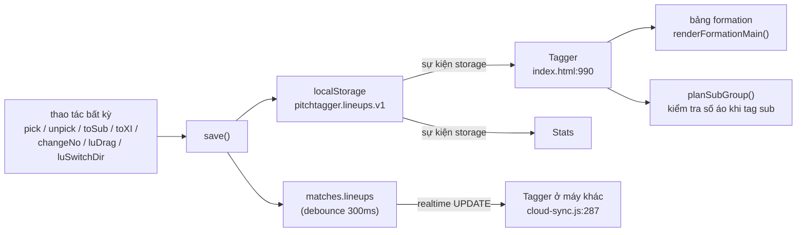
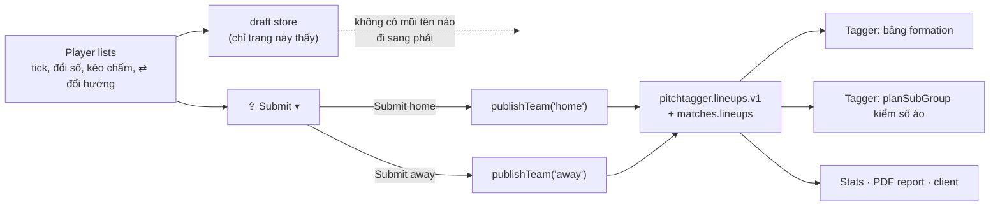

# Submit Lineup — Detailed Design

**Tab Player lists thôi gửi đội hình sang Tagger theo thời gian thực. Trên thanh header có một
dropdown `⇪ Submit ▾` với đúng hai mục — `Submit home` và `Submit away` — và chỉ khi bấm thì
đội hình (Starting XI + Substitutes) cùng formation của bên đó mới hiện lên Tagger.**

Trạng thái: **đã triển khai** (2026-08-15). Chốt phương án **A cho cả Q1, Q2, Q3** (§14).
Nối tiếp [`player-identity-and-gk-design.md`](player-identity-and-gk-design.md).

Phạm vi đã làm: **`Player-Lists/index.html`** (toàn bộ logic mới), `shared.css` (chỉ *thêm*
class cho dropdown), `tests/submit-lineup.test.js` (mới, 19 test).
Cache-bust kèm theo: `shared.css` v13→v14 (`Player-Lists/index.html`, `Stats/index.html`,
`client/assets/app.js`), và `client/assets/app.js` v30→v31 (`client/app.html`) vì chính nó
bị sửa — `asset-versions.test.js` bắt được và chỉ đích danh.
**`index.html` = 0 dòng. `cloud-sync.js` = 0 dòng. `shared.js` = 0 dòng. `Stats/stats-view.js`
= 0 dòng. Không migration DB, không đổi schema, không đổi payload Submit Analysis.**
Vì sao được 0 dòng ở những chỗ đó: §9.3.

Test: `node tests/run.js` → **857/857 passed**. Trong đó **838 test cũ của mọi tính năng khác
pass mà không sửa một dòng nào** (đúng con số của lần trước), cộng 19 test mới.
`attack-direction.test.js` — bộ test khoá Hướng Tấn Công — pass nguyên vẹn, không sửa gì.

> **Một hành vi thật, đã kiểm chứng:** mở trang trên một trận có board **chưa được dọn**
> (dữ liệu cũ, dot không nằm đúng tâm ô) sẽ thấy ngay dấu "not sent". Lý do: `renderLuPitch()`
> gọi `arrangeXI()` dọn ô rồi `save()`, và nay `save()` chỉ ghi vào nháp ⇒ nháp khác bản live
> đúng ở chỗ vừa dọn. Đó là sự thật, không phải báo động giả, và một lần Submit là hết.
> Board đã dọn sẵn (mọi thứ app hiện tại lưu ra) mở lên là `✓ both sides match the tagging tab`.

> **Ràng buộc ngôn ngữ:** `tests/auth-gate.test.js:407` khoá `Player-Lists/index.html` **không
> được có tiếng Việt** — kể cả trong comment. Mọi nhãn nút, dòng trạng thái và chú thích code
> ở §6 và §4 đều viết bằng tiếng Anh. Tài liệu này (trong `docs/`) không nằm trong danh sách đó.

---

## 1. Mục tiêu và ranh giới

| Yêu cầu của bạn | Thiết kế đáp ứng ở |
|---|---|
| Thêm dropdown 2 nút `Submit home` / `Submit away` trên thanh ngang trên cùng | §6 — markup, CSS, hành vi menu |
| Gửi **Starting XI + Substitution + formation** sang Tagger | §4.4 — `publishTeam()` gửi `roster`/`xi`/`subs`/`dir` của **một** bên |
| Bỏ realtime: sắp xếp trên Player List không hiện ngay lên Tagger | §4.1–4.3 — tách **bản nháp** (draft) khỏi **bản đã phát** (published); `save()` đổi đích |
| Submit home hiện home, submit away hiện away | §4.4 — publish **theo từng bên**, bên kia giữ nguyên từng byte |
| **"Hướng Tấn Công" không bị lỗi** | §5 — cả một mục riêng: bất biến, 4 truy vết, idempotence, và vì sao bản nháp **không** mang `history` |
| Không gây bug ở các tab khác | §9 — soát theo từng màn hình và theo từng file test đang khoá code |
| Không đổi tính năng khác khi chưa cho phép | §13 — danh sách những thứ **cố ý không đụng**, kèm lý do; §14 — 3 câu hỏi cần bạn chốt |

**Kết luận khảo sát: không cần đụng vào Tagger.** Cơ chế đồng bộ hiện tại của Tagger là "nghe
sự kiện `storage` trên key `pitchtagger.lineups.v1`" (`index.html:990`). Nếu Player lists **chỉ
ghi vào key đó lúc bấm Submit**, thì "realtime" tự nhiên biến mất mà Tagger không hề biết là
có gì thay đổi. Toàn bộ tính năng nằm gọn trong một file.

---

## 2. Hiện trạng: vì sao mọi thứ hiện lên Tagger ngay lập tức

Mỗi thao tác trên Player lists — tick một cầu thủ, đổi số áo, kéo một chấm, bấm ⇄ đổi hướng —
đều kết thúc bằng đúng một lời gọi `save()` (`Player-Lists/index.html:118`). Và `save()` làm
hai việc, cả hai đều lộ ra ngoài ngay:



Đó chính là chỗ phải cắt. **Một dòng đổi đích của `save()` là đủ để chặn toàn bộ 5 mũi tên
phía dưới nó** — không phải sửa từng mutator, không phải sửa Tagger.

---

## 3. Khảo sát: ai sở hữu trường nào trong `lineups`

Đây là phát hiện quan trọng nhất của cả thiết kế. Object `lineups` **không** thuộc về một
mình Player lists — nó là một object **hai chủ**:

| Trường | Chủ sở hữu | Ghi ở đâu | Bằng chứng |
|---|---|---|---|
| `[team].roster` | **Player lists** | `pick()`, `changeNo()`, `addPlayer()` | `Player-Lists/index.html:350,374,394` |
| `[team].xi` | **Player lists** | `addToLineup()`, `luDrag()`, `arrangeXI()` | `Player-Lists/index.html:342,423,407` |
| `[team].subs` | **Player lists** | `toSub()`, `toXI()` | `Player-Lists/index.html:363,367` |
| `[team].dir` | **cả hai — nhưng là dữ kiện của *trận đấu*, không của một đội** | `faceTeam()` ở cả hai file | `Player-Lists/index.html:450`, `index.html:1164` |
| `[team].subHistory` | **Tagger** | mỗi lần tag một quả thay người | `index.html:2482` |
| `history` (mảng ở cấp cao nhất) | **Tagger** | snapshot formation của thay người / thẻ đỏ / sửa tay | `index.html:2488,2579,2776` |

Hai dòng cuối là lý do vì sao **không được** publish nguyên cả object nháp đè lên bản live.
Trong lúc bạn đang sắp xếp Player lists, người tag có thể đã ghi một quả thay người vào
`history` và `subHistory`. Nếu Submit ghi đè cả object, quả thay người đó **biến mất** — cùng
với số phút thi đấu và cả trang formation-by-time.

> **May mắn nằm ở chỗ này:** `applySubGroup()` (`index.html:2464`) ghi rõ trong comment —
> *"The starting lineup stays untouched — Player lists keeps showing the original XI."*
> Thay người **không** đụng vào `lu.xi` / `lu.subs`; nó chỉ **thêm** một snapshot vào
> `history`. Nghĩa là quyền sở hữu tách rất sạch, và §4.4 chỉ cần chép đúng 4 trường
> mà Player lists sở hữu, để nguyên phần còn lại.

**Phần đang nguy hiểm là `dir`** — nó bị cả hai bên đọc, nó ràng buộc `xi`, nó ràng buộc
`history`, và nó là dữ kiện của *cặp đấu* chứ không của một đội. Toàn bộ §5 dành cho nó.

---

## 4. Thiết kế

### 4.1 Hai bản: nháp và đã phát

| | Biến | Kho | Ai đọc |
|---|---|---|---|
| **Bản nháp (draft)** | `lineups` — **giữ nguyên tên biến** | `pitchtagger.lineups.draft.v1` + dấu trận | **chỉ trang này** |
| **Bản đã phát (published)** | `published` — biến mới | `pitchtagger.lineups.v1` + `…lineups.match.v1` (không đổi) + `matches.lineups` | Tagger, Stats, report, client |

**Vì sao bản nháp vẫn mang tên `lineups`?** Vì `teamLU()`, `pick()`, `unpick()`, `toSub()`,
`toXI()`, `changeNo()`, `addToLineup()`, `renderPool()`, `renderFinal()`, `renderLuPitch()`,
`luDrag()`, `turnXI()`, `faceTeam()`, `luSwitchDir()` — **13 hàm** — đều đọc/ghi qua cái tên
đó. Giữ tên ⇒ **13 hàm không sửa một ký tự nào**. Quan trọng hơn nữa: `tests/attack-direction.test.js:283`
so từng ký tự `turnXI` / `faceTeam` / `luSwitchDir` giữa hai file. Đổi tên biến là gãy test đó.

### 4.2 Kho nháp: khoá, dấu trận, vòng đời

Bản nháp cũng thuộc về **đúng một trận**, và localStorage thì dùng chung cho mọi trận trình
duyệt này từng mở — đúng bài toán mà dấu trận (`stamp`) đã giải cho bản live (`shared.js:27-53`).
Nên bản nháp dùng lại y hệt khuôn đó:

```js
/* ---- the DRAFT: what this page is editing, and what nobody else can see yet ----
   `lineups` (the variable every editor function below already uses) IS the draft now;
   `published` is the copy the tagging tab, Stats and the report read. The published copy
   only ever changes when Submit home / Submit away is pressed.
   Same stamp rule as the published store: a draft belongs to exactly ONE match, and
   localStorage is shared by every match this browser has ever opened. */
const LU_DRAFT='pitchtagger.lineups.draft.v1';
const LU_DRAFT_MATCH='pitchtagger.lineups.draft.match.v1';
const draftStamp=()=>{try{const s=localStorage.getItem(LU_DRAFT_MATCH);return s==null?null:String(s);}catch(e){return null;}};
const draftIsFor=id=>!!id&&draftStamp()===String(id);
function loadDraft(){try{const s=localStorage.getItem(LU_DRAFT);
  if(s){const o=JSON.parse(s); if(o&&o.home&&o.away)return o;}}catch(e){} return null;}

const clone=v=>JSON.parse(JSON.stringify(v||null));
/* A draft carries the two sides and NOTHING else. `history` (the formation snapshots a
   substitution or a red card leaves behind) and `subHistory` belong to the tagging tab:
   a draft holding a copy of them would hand a stale one back on submit, and would let
   faceTeam() turn snapshots this page does not own. See the design note in §5.4. */
const teamDraft=t=>({roster:clone((t&&t.roster)||[]),xi:clone((t&&t.xi)||[]),
                     subs:clone((t&&t.subs)||[]),dir:(t&&t.dir)||'lr'});
const draftOf=l=>({home:teamDraft(l&&l.home),away:teamDraft(l&&l.away)});

// Stamp FIRST, then the draft — the same order, and for the same reason, as saveLineupsLS().
function saveDraftLS(){
  const id=String(meta.matchId||''); if(!id)return false;
  try{localStorage.setItem(LU_DRAFT_MATCH,id);localStorage.setItem(LU_DRAFT,JSON.stringify(lineups));}catch(e){}
  return true;
}
```

**Vòng đời:**

| Lúc | Bản nháp |
|---|---|
| Mở trang, trận đã có nháp đúng dấu | dùng lại đúng bản nháp đó — bạn quay lại chỗ đang làm dở |
| Mở trang, trận chưa có nháp | `draftOf(published)` — **bắt đầu từ đúng cái Tagger đang hiện**, không phải từ trắng |
| Đổi sang trận khác (Tagger mở trận mới) | nạp nháp của trận mới, hoặc seed lại từ published của trận mới |
| Bấm Submit | bản nháp **không đổi**; bản published được cập nhật ⇒ dấu chấm "chưa gửi" tắt |
| Tagger tag một quả thay người | bản nháp **không đổi** (đúng ý đồ); `published` được cập nhật ngầm |

### 4.3 `save()` đổi đích — và vì sao không hàm nào khác phải sửa

```js
// BEFORE — Player-Lists/index.html:117-131
let pushTimer=null;
function save(){
  const id=meta.matchId;
  if(!luReady||!id||id!==luMatchId)return;
  saveLineupsLS(lineups,id);                       // ← seen by the tagging tab at once
  if(sb){ clearTimeout(pushTimer); pushTimer=setTimeout(async()=>{ … }, 300); }   // ← and by every other browser
}

// AFTER
/* Every edit on this page lands here, and from here it goes into the DRAFT only. Nothing
   reaches the tagging tab, the Stats page or the match row until ⇪ Submit is pressed —
   that is the whole feature, and it is this one line that makes it true. */
function save(){
  const id=meta.matchId;
  if(!luReady||!id||id!==luMatchId)return;
  saveDraftLS();
  renderSubmitState();
}
```

Cái guard `if(!luReady||!id||id!==luMatchId)return;` **giữ nguyên**: trước khi biết chắc bản
này thuộc trận nào thì không ghi gì cả — lý do y như cũ.

**13 hàm gọi `save()` không sửa gì.** Đây là bảng đối chiếu để bạn tự kiểm:

| Hàm | Dòng | Sau thay đổi |
|---|---|---|
| `pick` / `unpick` | 352, 359 | ghi nháp |
| `toSub` / `toXI` | 364, 369 | ghi nháp |
| `changeNo` | 377 | ghi nháp |
| `addPlayer` (nhánh offline) | 396 | ghi nháp |
| `luDrag` (thả chấm) | 427 | ghi nháp |
| `renderLuPitch` → `arrangeXI` | 407 | ghi nháp |
| `renderLineup` (dọn nhóm thứ ba cũ) | 483 | ghi nháp |
| `luSwitchDir` | 464 | ghi nháp — xem §5 |
| `poolAll` (xoá cả đội) | 499 | ghi nháp |

> **`addPlayer()` nhánh có database vẫn ghi thẳng vào `public.players` ngay** (`:385`) —
> **cố ý**. Đó là hồ sơ cầu thủ của **đội**, không phải đội hình của **trận**. Nó không đi
> qua `save()`, không nằm trong phạm vi "gửi sang Tagger", và biến nó thành nháp sẽ phá
> Player Data (`client/assets/app.js`) mà bạn chưa cho phép đụng. Xem §13.

### 4.4 `publishTeam()` — thuật toán gửi một đội

```js
/* Send ONE side's squad and board to the tagging tab (and to the match row).
   Everything the tagging tab owns survives untouched: the other side, `history` — the
   formation snapshots substitutions and red cards leave behind — and each side's
   `subHistory` (minutes played).
   The published copy is re-read HERE, not remembered from load: a substitution tagged
   while this page was being edited has already changed it, and publishing a remembered
   copy would hand that change back undone. */
async function publishTeam(team){
  const id=meta.matchId;
  if(!luReady||!id||id!==luMatchId){
    setSaveStatus('⚠ this match’s squad is still loading — try again in a moment',true); return; }

  const P=lineupsAreFor(id)?loadLineups():blankLineups();   // ← fresh, every time

  /* 1. Attacking direction is ONE fact about the fixture, not two facts about two teams,
        so it lands on both sides at once — each side's own dots and its own snapshots
        turned with it. faceTeam() does nothing at all to a side already facing that way,
        so a submit that does not change the direction moves not one dot. §5. */
  const dir=lineups[team].dir||'lr';
  faceTeam(P,team,dir);
  faceTeam(P,team==='home'?'away':'home',dir==='lr'?'rl':'lr');

  /* 2. this side's squad and board, copied out of the draft. Object.assign keeps whatever
        else that side is carrying — subHistory above all — exactly where it was. */
  const src=lineups[team];
  P[team]=Object.assign({},P[team],
    {roster:clone(src.roster),xi:clone(src.xi),subs:clone(src.subs),dir});

  /* 3. one write to the shared store (the tagging tab and Stats wake on it), one to the
        match row (every other browser wakes on that). */
  if(!saveLineupsLS(P,id)){setSaveStatus('⚠ could not save the squad',true);return;}
  published=P; renderSubmitState();
  await pushPublished(P,id,team);
}

// the cloud half of a publish, also used by the offline-adoption path in loadMatchLineups()
async function pushPublished(P,id,team){
  const who=team?(team==='home'?meta.home:meta.away):'The squad';
  if(!sb){setSaveStatus('⇪ '+who+' sent to the tagging tab (this browser only — offline)',true);return;}
  const {error}=await sb.from('matches').update({lineups:P}).eq('id',id);
  if(error)console.warn('lineups publish:',error.message);
  setSaveStatus(error?'⚠ cloud save failed: '+error.message:'⇪ '+who+' sent to the tagging tab',!!error);
}
```

Thứ tự bước 1 → bước 2 là **bắt buộc**. `faceTeam(P,team,dir)` xoay `P[team].xi` (vô ích, vì
bước 2 ghi đè) **nhưng cũng xoay các snapshot `history` của bên đó** — và đó mới là việc phải
làm. Đảo thứ tự thì snapshot bị bỏ lại ở hướng cũ: đúng con bug "thủ môn đứng trong vòng cấm
đối phương" mà `tests/attack-direction.test.js` sinh ra để chặn.

### 4.5 `loadMatchLineups()` — nạp bản published, seed bản nháp

```js
async function loadMatchLineups(){
  const id=meta.matchId||null;
  luMatchId=id; luReady=false;
  published=lineupsAreFor(id)?loadLineups():blankLineups();
  lineups=(draftIsFor(id)&&loadDraft())||draftOf(published);   // usable straight away
  renderLineup();
  if(!id)return;
  if(!sb){
    luReady=lineupsAreFor(id);
    if(!luReady)setSaveStatus('⚠ '+(dbErr||'offline')+' — open this match in the tagging tab first',true);
    renderLineup(); return;
  }
  const {data,error}=await sb.from('matches').select('lineups').eq('id',id).maybeSingle();
  if(meta.matchId!==id)return;
  if(error){setSaveStatus('⚠ could not load this match’s squad: '+error.message,true);
    console.warn('lineups load:',error.message); return;}
  const cloud=data&&data.lineups;
  const hadLocal=lineupsAreFor(id)&&!lineupsEmpty(published);
  if(cloud&&cloud.home&&cloud.away){published=cloud;saveLineupsLS(published,id);}
  else if(!hadLocal)published=blankLineups();
  luReady=true;
  // first visit to this match on this browser: the draft starts as what the tagging tab
  // is already showing, so nothing looks blanked and nothing is lost by opening the page
  if(!draftIsFor(id)){lineups=draftOf(published);saveDraftLS();}
  // the match has nothing saved yet but this browser does (entered while offline) — that
  // copy is the only one there is, so it still goes up. It is a PUBLISHED copy, not a
  // draft, so it goes up whole. (Was `save()`; save() no longer reaches the cloud.)
  if(!(cloud&&cloud.home&&cloud.away)&&hadLocal)pushPublished(published,id,null);
  renderLineup();
}
```

Dòng cuối là chỗ **rất dễ mất** nếu chỉ đổi `save()` mà không rà: đường cứu hộ "nhập đội hình
lúc offline" (`:159`) đang dựa vào việc `save()` có đẩy lên cloud. Nay `save()` không đẩy nữa,
nên nó phải gọi thẳng `pushPublished()`.

### 4.6 Sự kiện `storage`: bản published đổi thì bản nháp **không** đổi

```js
window.addEventListener('storage',e=>{
  if(e.key===PT_KEYS.meta){
    const prev=meta.matchId; meta=loadMeta(); loadDbPlayers();
    if(meta.matchId!==prev)loadMatchLineups(); else renderLineup();
  }
  else if(e.key===PT_KEYS.lineups){
    if(!lineupsAreFor(meta.matchId))return;      // another match's copy — not ours to show
    /* The live copy moved: a substitution or a red card was tagged, or somebody else
       submitted. The DRAFT is deliberately left alone — this page is the one place where
       an unfinished board is allowed to sit. All that changes is whether the ⇪ Submit dot
       is lit, which is what renderSubmitState() decides. */
    published=loadLineups(); luMatchId=meta.matchId; luReady=true;
    renderSubmitState();
  }
});
```

---

## 5. Hướng Tấn Công — mục quan trọng nhất

Bạn nêu đích danh chỗ này, và đúng là nó nguy hiểm nhất. Đây là phần soát kỹ nhất của tài liệu.

### 5.1 Vì sao `dir` không thể là tài sản riêng của một đội

`tests/attack-direction.test.js` mở đầu bằng đúng một câu: *hai đội không thể cùng tấn công
một khung thành*. Nên `home.dir` và `away.dir` **luôn ngược nhau** — đó là bất biến, và
`luSwitchDir()` giữ nó bằng cách xoay **cả hai bên** trong một lần bấm (`:460-465`).

Nếu publish theo từng bên mà `dir` đi kèm từng bên, thì có ngay đường sinh ra trạng thái
bất khả thi:

```
nháp:      home rl   away lr        ← ⇄ đã bấm, nháp vẫn ngược nhau (đúng)
published: home lr   away rl
Submit home, nếu chỉ chép dir của home:
published: home rl   away rl        ← HAI ĐỘI CÙNG TẤN CÔNG MỘT ĐẦU
```

Và hậu quả không dừng ở cái mũi tên: `renderFormationMain()` (`index.html:1198`) lấy `t.dir`
để vẽ nhãn hướng; `zoneAt()` lấy `dir` để đặt tên vị trí; Stats và PDF report đọc lại vị trí
qua `dir` **hiện tại** của bên đó. Một `dir` sai làm hậu vệ phải thành hậu vệ trái ở mọi màn hình.

### 5.2 Quy tắc: publish luôn xoay cả hai bên

Đúng một quy tắc, và nó đã có sẵn hàm để thực thi:

> **Mỗi lần publish, gọi `faceTeam()` cho *cả hai* bên trên bản published, trước khi chép
> đội hình của bên được submit.**

`faceTeam()` (`Player-Lists/index.html:450`) đã được test rất kỹ và có hai tính chất khiến
nó dùng được nguyên si ở đây:

1. **Nó tự thoát khi không cần làm gì** — `if(!t||t.dir===dir)return;` (`:452`). Submit mà
   hướng không đổi ⇒ **không một chấm nào, không một snapshot nào bị đụng**.
2. **Nó xoay trọn gói** — `dir`, `xi`, mọi snapshot `history` của **riêng** bên đó, và cả
   `offSpot` của thẻ đỏ (`:454-458`). Đúng ba lời hứa mà `attack-direction.test.js:21` liệt kê.

### 5.3 Bốn truy vết

Ký hiệu: `P` = published, `D` = draft. Trạng thái đầu: `P.home=lr, P.away=rl`, `D` = bản sao của `P`.

| # | Kịch bản | Diễn biến | Kết quả |
|---|---|---|---|
| **1** | Không đụng hướng, Submit home | `faceTeam(P,'home','lr')` → thoát ngay (đã lr). `faceTeam(P,'away','rl')` → thoát ngay. Chép `D.home` vào `P.home` | `P.away` **giống hệt từng byte**; `history` nguyên vẹn. Chỉ home đổi ✓ |
| **2** | Bấm ⇄ rồi Submit **home** | `D` thành `home rl / away lr` (cả hai chấm của nháp đều đã xoay). Publish: `faceTeam(P,'home','rl')` xoay `P.home.xi` + snapshot của home; `faceTeam(P,'away','lr')` xoay `P.away.xi` + snapshot của away; rồi chép `D.home` | `P.home = D.home` ✓. `P.away` = away cũ đã xoay = `D.away` ✓. Hai bên vẫn ngược nhau ✓ |
| **3** | Kịch bản 2, sau đó Submit **away** | `faceTeam(P,'away','lr')` → thoát ngay (đã lr). `faceTeam(P,'home','rl')` → thoát ngay. Chép `D.away` | **Không xoay hai lần.** Không snapshot nào bị đụng lần nữa ✓ |
| **4** | Bấm ⇄ rồi Submit **away** trước | `faceTeam(P,'away','lr')` + `faceTeam(P,'home','rl')` xoay cả hai bên và cả hai bộ snapshot; chép `D.away`. `P.home` = home cũ đã xoay = `D.home` ✓ | Submit home sau đó là thao tác rỗng về hướng ✓ |

**Hệ quả phải nói thẳng:** ở kịch bản 2 và 4, bảng của **bên chưa submit cũng xoay** trên
Tagger. Đó không phải bug — đó là vật lý: bên kia không thể ở nguyên hướng cũ khi bên này
đã đổi. Và nó **không** làm lộ đội hình chưa submit: chỉ có toạ độ của bản đã publish trước
đó bị xoay, không có cầu thủ mới nào, không có vị trí mới nào từ bản nháp lọt sang.

**Kịch bản thứ 5 — dữ liệu đã hỏng sẵn.** Nếu bản published từ trước đã có `home.dir === away.dir`
(dữ liệu cũ, trước khi `faceTeam` được sửa), thì lần Submit đầu tiên **tự sửa lại**: hai lời
gọi `faceTeam` ép hai bên về hai hướng ngược nhau. Publish vừa là gửi, vừa là vá.

### 5.4 Bản nháp **không** mang `history` — và vì sao đó là điều kiện sống còn

`luSwitchDir()` gọi `faceTeam(lineups, …)`, mà `faceTeam` xoay `(lu.history||[])`.

- Nếu bản nháp **có** `history`: bấm ⇄ trên trang nháp sẽ xoay bản sao snapshot của Tagger.
  Bản sao đó **cũ** (Tagger có thể đã thêm quả thay người mới). Đến lúc Submit, hoặc ta bỏ
  qua nó — thì công xoay vứt đi và bản thật chưa xoay — hoặc ta ghi đè — thì mất quả thay
  người vừa tag. Cả hai đều sai.
- Vì bản nháp **không có** `history`, `(lu.history||[])` cho mảng rỗng ⇒ `luSwitchDir` trên
  nháp chỉ xoay `xi` của hai bên. Việc xoay snapshot được hoãn lại đến lúc publish, nơi
  `faceTeam` chạy trên **bản thật, vừa đọc lại**.

Đây là lý do `teamDraft()` ở §4.2 chép **đúng bốn trường** và `draftOf()` chỉ dựng
`{home, away}`. Không phải tiết kiệm — là đúng đắn. **Sẽ có một test khoá riêng chuyện này**
(§11, T11).

### 5.5 Bất biến để tự kiểm

Sau **mọi** lần `publishTeam()` chạy xong:

| # | Bất biến |
|---|---|
| I1 | `P.home.dir !== P.away.dir` |
| I2 | `P[team]` có `roster`/`xi`/`subs`/`dir` bằng đúng `D[team]` |
| I3 | `P[other].roster`/`subs` không đổi; `P[other].xi` chỉ đổi khi và chỉ khi `P[other].dir` đổi, và khi đó mỗi chấm đi từ `(x,y)` sang `(100-x,100-y)` |
| I4 | Số phần tử `P.history` không đổi; mỗi snapshot giữ nguyên `t`, `team`, `label`, `subs`, và danh sách số áo trong `xi` |
| I5 | `P[t].subHistory` không đổi với cả hai `t` |
| I6 | Với mọi chấm ở mọi bảng: `x.pos === zoneAt(x.x, x.y, P[chủ].dir)` |
| I7 | Publish hai lần liên tiếp cùng một bên, không sửa gì ở giữa ⇒ lần hai không đổi một byte nào (idempotent) |

### 5.6 Vì sao `luSwitchDir` / `faceTeam` / `turnXI` **không đổi một ký tự**

`tests/attack-direction.test.js:283` so từng ký tự ba hàm này giữa `Player-Lists/index.html`
và `index.html` (sau khi chuẩn hoá `state.lineups`→`lineups`, `saveLineups()`→`save()`).
Nút `⇄ Switch Attacking Direction` cũng bị khoá bằng regex ở `:293`.

Thiết kế này **không chạm** vào ba hàm đó, cũng không đổi tên biến `lineups`, cũng không đổi
`$('luDir').onclick=luSwitchDir`. Toàn bộ hành vi mới nằm trong `save()` (thân hàm bị test
stub, nội dung không bị so) và trong `publishTeam()` (hàm mới). **`tests/attack-direction.test.js`
chạy qua không cần sửa một dòng** — và đó là bằng chứng mạnh nhất rằng Hướng Tấn Công không vỡ.

---

## 6. UI: dropdown trên thanh header

### 6.1 Markup — `Player-Lists/index.html:13-20`

```html
<header>
  <h1>Hoang<span>Nam</span></h1>
  <div class="stats-toggle" style="margin-left:14px">
    <button id="luHomeBtn"></button>
    <button id="luAwayBtn"></button>
  </div>
  <!-- Send a side's board to the tagging tab. Nothing this page edits crosses over until
       one of these is pressed — see the draft/published split in the script below. -->
  <div class="lu-submit">
    <button id="luSubmitBtn" aria-haspopup="true" aria-expanded="false"
            title="Send a side's starting XI, substitutes and formation to the tagging tab">⇪ Submit ▾</button>
    <div class="lu-submit-menu" id="luSubmitMenu" role="menu">
      <button class="lu-submit-item" id="luSubmitHome" role="menuitem">
        <span class="who">Submit home</span><span class="mark" id="luMarkHome"></span></button>
      <button class="lu-submit-item" id="luSubmitAway" role="menuitem">
        <span class="who">Submit away</span><span class="mark" id="luMarkAway"></span></button>
    </div>
  </div>
  <span id="saveStatus" style="margin-left:12px;font-size:11px;color:var(--mut)"></span>
</header>
```

Nhãn để **cố định** là `Submit home` / `Submit away` (đúng chữ bạn yêu cầu) chứ không thay
bằng tên đội — vừa khớp yêu cầu, vừa tránh việc tên đội tiếng Việt lọt vào source và làm gãy
`auth-gate.test.js:407`.

Id đặt tiền tố `lu…` vì `submitBtn` đã bị `index.html:394` (Submit Analysis) dùng — khác trang
nên không đụng nhau thật, nhưng trùng tên là mồi cho nhầm lẫn về sau.

### 6.2 CSS — thêm vào cuối cụm `.lu-*` của `shared.css` (sau dòng 162)

Chỉ **thêm** selector mới, không sửa selector nào đang có ⇒ không thể làm xô lệch trang nào
khác. (Cả họ `.lu-*` hiện chỉ có Player-Lists dùng — đã kiểm: `Stats/*` và `client/*` = 0 lượt.)

```css
/* ⇪ Submit — the two-item menu on the Player lists header. Nothing this page edits reaches
   the tagging tab until one of them is pressed. Same shape as the ▾ Other menu on the
   tagging tab; that one is styled inside index.html, which no other page reads. */
.lu-submit{position:relative}
.lu-submit>button{background:var(--panel2);border:1px solid var(--line);color:var(--ink);
  border-radius:6px;padding:5px 12px;cursor:pointer;font-size:12px;font-weight:600}
.lu-submit>button:hover:not(:disabled){border-color:var(--accent);color:var(--accent)}
.lu-submit>button:disabled{color:var(--mut);cursor:not-allowed}
.lu-submit>button.dirty::after{content:"●";color:var(--accent);margin-left:7px;font-size:9px;vertical-align:1px}
.lu-submit-menu{position:absolute;top:calc(100% + 6px);left:0;min-width:220px;z-index:60;display:none;
  background:var(--panel2);border:1px solid var(--line);border-radius:8px;padding:6px;
  box-shadow:0 10px 24px rgba(0,0,0,.45)}
.lu-submit-menu.show{display:block}
.lu-submit-item{display:flex;align-items:center;justify-content:space-between;gap:14px;width:100%;
  background:none;border:0;color:var(--ink);text-align:left;padding:7px 10px;border-radius:6px;
  cursor:pointer;font-size:12px;font-weight:600}
.lu-submit-item:hover{background:var(--panel)}
.lu-submit-item .mark{color:var(--mut);font-weight:400;font-size:11px;white-space:nowrap}
.lu-submit-item.dirty .mark{color:var(--accent)}
```

### 6.3 Trạng thái "có thay đổi chưa gửi"

```js
/* Does this side's draft differ from the board the tagging tab is showing? Compared on
   the four things a submit sends, in a stable order, so re-sorting a table is not a change
   while moving a dot is. Coordinates are compared to 1/100 of a percent: arrangeXI() lands
   dots by arithmetic, and float noise is not an edit. */
const teamSig=t=>JSON.stringify({
  roster:((t&&t.roster)||[]).map(p=>[String(p.no),p.name||'',p.pid||'']).sort(),
  xi:((t&&t.xi)||[]).map(x=>[String(x.no),Math.round(x.x*100),Math.round(x.y*100),x.pos||'']).sort(),
  subs:((t&&t.subs)||[]).map(String).sort(),
  dir:(t&&t.dir)||'lr'});
const teamDirty=team=>teamSig(lineups[team])!==teamSig(published&&published[team]);
const dirtyTeams=()=>['home','away'].filter(teamDirty);

/* The dot means one thing in both places: this side's board is not the one the tagging tab
   has. The tally beside each item is what WOULD be sent, so you can see an incomplete XI
   before you send it rather than after. */
function renderSubmitState(){
  const open=!!meta.matchId, dirty=open?dirtyTeams():[];
  const btn=$('luSubmitBtn');
  btn.disabled=!open||!luReady;
  btn.classList.toggle('dirty',!!dirty.length);
  [['home','luSubmitHome','luMarkHome'],['away','luSubmitAway','luMarkAway']].forEach(([team,id,markId])=>{
    const t=lineups[team], d=dirty.includes(team);
    $(id).classList.toggle('dirty',d);
    $(markId).textContent=t.xi.length+'/'+maxXI()+' · '+t.subs.length+' subs'+(d?' · not sent':'');
  });
  if(open&&luReady&&!dirty.length)setSaveStatus('✓ both sides match the tagging tab');
  else if(open&&luReady)setSaveStatus('✎ draft — '+dirty.join(' + ')+' not sent to the tagging tab yet');
}
```

Gọi `renderSubmitState()` ở cuối `renderLineup()` (`:484`), trong `save()`, trong nhánh
`storage` của `PT_KEYS.lineups`, và cuối `publishTeam()`.

**Không chặn khi XI chưa đủ 11.** Tagger vốn chịu được XI thiếu (`planSubGroup` chỉ cần
`onPitch.length` khác 0, `index.html:2426`), và chặn tay là thêm một luật mới bạn chưa yêu cầu.
Con số `8/11` hiện ngay trong menu là đủ để thấy trước khi bấm.

### 6.4 Hành vi menu

```js
function setSubmitOpen(on){
  $('luSubmitMenu').classList.toggle('show',!!on);
  $('luSubmitBtn').setAttribute('aria-expanded',on?'true':'false');
}
$('luSubmitBtn').onclick=e=>{e.stopPropagation();
  setSubmitOpen(!$('luSubmitMenu').classList.contains('show'));};
// a click anywhere else shuts it, including inside the menu's own non-actions
document.addEventListener('click',e=>{
  if($('luSubmitMenu').classList.contains('show')&&!$('luSubmitMenu').contains(e.target))setSubmitOpen(false);});
document.addEventListener('keydown',e=>{if(e.key==='Escape')setSubmitOpen(false);});
$('luSubmitHome').onclick=()=>{setSubmitOpen(false);publishTeam('home');};
$('luSubmitAway').onclick=()=>{setSubmitOpen(false);publishTeam('away');};
```

Đúng khuôn `▾ Other` của Tagger (`index.html:3477-3486`) để hai trang hành xử giống nhau.

### 6.5 Quy trình làm việc mới của analyst



**Một hệ quả phải nói với người dùng:** tag thay người cho một đội **chỉ chạy sau khi đã Submit**
đội đó. Trước đó `planSubGroup` không có XI để đối chiếu và trả về đúng câu đang có sẵn —
*"No starting XI for this team yet — the event is saved, the formation is unchanged"*
(`index.html:2427`). Sự kiện vẫn được ghi, chỉ formation là chưa. Đây là hành vi cũ, không phải
lỗi mới — nhưng nay nó gặp thường hơn, nên §14-Q3 hỏi bạn có muốn thêm một câu nhắc không.

---

## 7. Bảng trường hợp biên

| # | Tình huống | Xử lý |
|---|---|---|
| 1 | Chưa mở trận nào | Editor đã ẩn sẵn (`:470`); nút Submit `disabled`. Nháp không ghi (`saveDraftLS` thoát khi không có `matchId`) |
| 2 | Tagger mở **trận khác** trong lúc đang sửa | `storage`/`meta` → `loadMatchLineups()` → nạp nháp của trận mới (hoặc seed từ published mới). Nháp trận cũ **vẫn còn** trong kho, đúng dấu của nó — quay lại trận cũ là thấy lại |
| 3 | Bấm Submit khi `luReady === false` | Từ chối, hiện dòng "still loading". Không bao giờ ghi đè bản mình chưa đọc được |
| 4 | Bấm Submit lúc mất mạng | localStorage vẫn ghi ⇒ Tagger **cùng máy** nhận ngay. Dòng trạng thái nói rõ "(this browser only — offline)" |
| 5 | Submit hai lần liên tiếp, không sửa gì | Lần hai không đổi một byte (I7). `faceTeam` thoát sớm, `Object.assign` chép lại đúng thứ đang có |
| 6 | Tagger tag thay người **giữa lúc** đang sửa nháp | `publishTeam` đọc lại `P` ngay tại thời điểm bấm ⇒ snapshot mới còn nguyên (§4.4 bước 0) |
| 7 | Đội hình được nhập ở máy khác rồi Submit ở đó | `matches.lineups` đổi → realtime → Tagger máy này `applyCloudLineups` → ghi localStorage → trang này cập nhật `published`, **nháp giữ nguyên**, chấm "chưa gửi" sáng lên |
| 8 | Xoá cả đội bằng ô tick ở header (`poolAll`) | Chỉ xoá trong nháp. Tagger giữ nguyên cho tới khi Submit — **an toàn hơn hiện tại**, nơi một cú bấm nhầm bay ngay lên cloud |
| 9 | Bản nháp cũ (trận khác) còn trong localStorage | `draftIsFor()` chặn; seed lại từ `published`. Cùng khuôn với bản live |
| 10 | Người dùng xoá cache trình duyệt khi đang có nháp | **Mất nháp.** Rủi ro R1 ở §12 — cần bạn chốt ở §14-Q2 |
| 11 | Hai tab Player lists cùng mở | Cùng đọc/ghi một kho nháp. Tab kia không tự vẽ lại (không nghe key nháp) — nạp lại trang là đồng bộ. Cùng mức như hiện tại |
| 12 | `published` rỗng (trận mới) + Submit home | `blankLineups()` cho `home lr / away rl`; hai `faceTeam` thoát sớm; home được ghi. Away vẫn rỗng ⇒ Tagger hiện sân trống cho away, đúng ý đồ |

---

## 8. Vị trí code

| File | Việc |
|---|---|
| `Player-Lists/index.html:13-20` | thêm khối `.lu-submit` vào `<header>` (§6.1) |
| `Player-Lists/index.html:96-97` | thêm biến `published`; `lineups` giữ nguyên tên, đổi nghĩa thành nháp |
| `Player-Lists/index.html` (mới, sau `:97`) | khối kho nháp §4.2 (`LU_DRAFT`, `draftIsFor`, `loadDraft`, `teamDraft`, `draftOf`, `saveDraftLS`, `clone`) |
| `Player-Lists/index.html:117-131` | `save()` đổi đích; **xoá** `pushTimer` (§4.3) |
| `Player-Lists/index.html:135-161` | `loadMatchLineups()` theo §4.5; thêm `pushPublished()` |
| `Player-Lists/index.html` (mới) | `publishTeam()` §4.4, `teamSig`/`teamDirty`/`dirtyTeams`/`renderSubmitState` §6.3, nối dây menu §6.4 |
| `Player-Lists/index.html:484` | `renderLineup()` gọi thêm `renderSubmitState()` |
| `Player-Lists/index.html:519-522` | nhánh `storage` cho `PT_KEYS.lineups` theo §4.6 |
| `shared.css` (sau `:162`) | thêm cụm `.lu-submit*` §6.2 |
| `tests/submit-lineup.test.js` | mới, §11 |
| `tests/asset-versions.json` | `node tests/asset-versions.test.js --update` sau khi bump |

**Không sửa:** `turnXI`, `faceTeam`, `luSwitchDir`, `renderLuPitch`, `luDrag`, `pick`,
`unpick`, `toSub`, `toXI`, `changeNo`, `addToLineup`, `addPlayer`, `renderPool`, `renderFinal`,
`askNo`, `poolRows`, `posOf`, `sortRows` — **18 hàm, 0 ký tự**.

---

## 9. Bảo đảm không vỡ chỗ khác

### 9.1 Theo màn hình

| Màn hình | Đọc gì | Ảnh hưởng |
|---|---|---|
| **Tagger — bảng formation** (`renderFormationMain`) | `state.lineups` từ key live | Không đổi cách đọc. Chỉ đổi **thời điểm** dữ liệu tới: lúc Submit thay vì tức thì |
| **Tagger — Hướng Tấn Công** | `t.dir` + `halfSel` | §5. Bất biến "hai bên ngược nhau" được publish giữ. `faceTeam`/`luSwitchDir` không đổi ký tự nào |
| **Tagger — tag thay người** (`planSubGroup`) | XI của bản live | Cần Submit trước. Câu thông báo khi chưa có XI **đã có sẵn** (`:2427`), không phải viết mới |
| **Tagger — thẻ đỏ** | `history`, `xi` live | Không đụng. Publish giữ nguyên `history` (I4) |
| **Tagger — Formation by time** (`fmModal`) | `state.lineups.history` | Không đụng (I4). Sửa tay trong modal vẫn ghi thẳng như cũ |
| **Stats** | `ourLineups()` — key live + dấu trận | Không đổi một dòng. Nay đọc bản đã submit, đúng ý đồ |
| **PDF report** (`Stats/report.js`) | `lineups` từ payload | Không đụng |
| **Minutes played** (`playedMinutes`, `shared.js:514`) | `history` + `subHistory` | Không đụng (I4, I5) |
| **Submit Analysis → client** | payload đóng băng lúc submit analysis | Không đụng. `roster.pid` vẫn đi kèm như cũ |
| **Player Data** (`client/assets/app.js`) | payload đã publish | Không đụng |
| **Cloud sync / realtime** | `matches.lineups` | Không đụng. Nay bị ghi **thưa hơn nhiều** (1 lần/Submit thay vì 1 lần/300ms/thao tác) — nhẹ hơn cho DB |

### 9.2 Theo test đang khoá code

| File test | Vì sao không gãy |
|---|---|
| `attack-direction.test.js` (16 test × 2 editor) | `turnXI`/`faceTeam`/`luSwitchDir` không đổi ký tự; test twin `:283` so hai file — cả hai vẫn y nguyên; regex nút `luDir` `:293` vẫn khớp |
| `formation-arrange.test.js` | Khoá chuỗi `if(arrangeXI(t.xi,t.dir))save()` trong `renderLuPitch` `:155` và `benchSpot(lineupTeam,t.dir)` `:148` — cả hai giữ nguyên |
| `lineup-store.test.js` | Chỉ về dấu trận trên key live + `saveLineups`/`applyCloudLineups`/`resetLineups` của `index.html` — không đụng |
| `no-match-tabs.test.js` | Về Stats + cổng nút ở Tagger — không đụng |
| `squad.test.js`, `minutes-played.test.js`, `substitution.test.js`, `player-data.test.js` | Chỉ đọc `shared.js` / `index.html` — 0 dòng đổi |
| `auth-gate.test.js:407` | **Rủi ro thật:** mọi chữ mới trong `Player-Lists/index.html` phải là tiếng Anh, kể cả comment. Mọi đoạn code ở §4/§6 đã viết tiếng Anh sẵn |
| `asset-versions.test.js` | Sửa `shared.css` ⇒ **bắt buộc** bump. Test tự nói ra page nào phải sửa. §10 |
| `stats-view.test.js:270-275` | So version `shared-page.css` giữa Stats và Player-Lists — không sửa file đó ⇒ không đụng |
| `shooting-goal-map.test.js:255` | So version `shared.js` giữa Stats và Player-Lists — không sửa `shared.js` ⇒ không đụng |

### 9.3 Vì sao `index.html` và `cloud-sync.js` được 0 dòng

- **Tagger** đồng bộ bằng cách *nghe* key `pitchtagger.lineups.v1` (`:990`). Nó không quan tâm
  ai ghi, cũng không quan tâm ghi lúc nào. Ta chỉ ghi thưa đi ⇒ nó tự hết realtime.
- **`cloud-sync.js:361 onLineupsChanged`** vẫn được Tagger gọi khi nó nhận relay, và vẫn giữ
  nguyên guard dấu trận. Ta cũng ghi thẳng `matches.lineups` từ Player lists như hiện tại
  (`:126`) — chỉ đổi thời điểm.
- **Editor cũ trong Tagger** (`lineupModal`, `:744-772`) là **code chết**: không chỗ nào gọi
  `$('lineupModal').classList.add('show')`, và `lineupBtn` mở trang Player-Lists chứ không mở
  modal (`:1360`). Nó vẫn ghi realtime — không sao, vì không ai mở được nó. Nó được giữ sống
  chỉ bởi test twin `attack-direction.test.js:283`. Xoá nó là việc **khác**, cần bạn cho phép
  riêng (§13).

---

## 10. Checklist cache-bust

Chỉ cần khi chọn phương án CSS **A** (`shared.css`) ở §14-Q1. `Player-Lists/index.html` là
*trang*, không có `?v=` — sửa nó không cần bump.

- [ ] `shared.css` v13 → **v14** ở **tất cả** nơi tham chiếu: `index.html`, `auth.html`,
      `Stats/index.html`, `Player-Lists/index.html`, `client/index.html`, `client/app.html`,
      `client/login.html`, và các ref phát sinh lúc chạy trong `client/assets/app.js`
- [ ] `node tests/asset-versions.test.js --update` để cập nhật manifest
- [ ] `node tests/run.js` — asset-versions sẽ **chỉ đích danh** page nào còn sót

Chọn phương án **B** (`<style>` trong Player-Lists) ⇒ checklist này **rỗng**.

---

## 11. Kế hoạch test — `tests/submit-lineup.test.js`

Dựng theo đúng khuôn `attack-direction.test.js`: `vm` + `grabFunction` để nhấc các hàm ra khỏi
`Player-Lists/index.html` và chạy trên localStorage giả (`tests/harness.js:212`).

| # | Test | Khoá điều gì |
|---|---|---|
| T1 | `save()` chỉ ghi kho nháp, **không** ghi `pitchtagger.lineups.v1` | trái tim của tính năng |
| T2 | Không đường nào ngoài `publishTeam` + nhánh cứu hộ offline ghi vào key live (soát source) | không có rò rỉ realtime nào sót lại |
| T3 | `publishTeam('home')` chép đúng `roster`/`xi`/`subs`/`dir` sang bản live | I2 |
| T4 | `publishTeam('home')` để `away` **y nguyên từng byte** khi hướng không đổi | I3 · truy vết 1 |
| T5 | `history` và `subHistory` của **cả hai** bên sống sót qua publish | I4, I5 — chống mất quả thay người |
| T6 | Một snapshot được thêm **sau khi trang đã load** vẫn còn sau publish | §4.4 "đọc lại `P` tại chỗ" |
| T7 | Sau mọi publish, `home.dir !== away.dir` (chạy 5 lần xen kẽ hai bên) | I1 · §5.2 |
| T8 | ⇄ rồi Submit home ⇒ away và snapshot của away xoay **đúng một lần**; mọi `pos` khớp `zoneAt` | truy vết 2 · I6 |
| T9 | Submit hai lần liên tiếp = không đổi byte nào | I7 · truy vết 3 |
| T10 | Bản live đã hỏng (`home.dir === away.dir`) được publish **sửa lại** | kịch bản 5 |
| T11 | Bản nháp **không có** key `history`; và `luSwitchDir` trên nháp không đụng `history` của bản live | §5.4 |
| T12 | Nháp mang dấu trận; nháp của trận khác không được nhận, mà seed lại từ `published` | biên 2, 9 |
| T13 | `teamDirty` bật khi kéo một chấm, tắt sau khi Submit; nhiễu float không làm bật | §6.3 |
| T14 | Hai mục menu tồn tại và nối đúng `publishTeam('home'|'away')` (soát source) | chống nút chết |
| T15 | Nhánh cứu hộ offline vẫn đẩy bản live lên cloud sau khi `save()` thôi đẩy | §4.5 dòng cuối |

Chạy: `node tests/run.js` — kỳ vọng **toàn bộ test cũ pass không sửa một dòng**, cộng 15 test mới.

---

## 12. Rủi ro

| # | Rủi ro | Mức | Giảm thiểu |
|---|---|---|---|
| **R1** | **Nháp chỉ nằm ở localStorage.** Sắp xong cả hai đội mà chưa Submit rồi xoá cache / đổi máy ⇒ mất. Hiện tại mọi thao tác đều lên cloud ngay nên không có rủi ro này | **Cao** | Phase 1: dấu chấm "chưa gửi" luôn hiện + dòng trạng thái. Phase 2 (§14-Q2): cột `matches.lineups_draft` |
| R2 | Người dùng tưởng đã lưu vì "trước giờ nó tự lưu" | Trung bình | Nhãn `⇪ Submit ▾` có chấm đỏ khi lệch; `saveStatus` nói thẳng `✎ draft — home not sent…` |
| R3 | Tag thay người trước khi Submit ⇒ formation không đổi | Trung bình | Thông báo đã có sẵn (`index.html:2427`). §14-Q3 hỏi có thêm nhắc không |
| R4 | Bên chưa submit bị xoay theo khi đổi hướng | Thấp — **đúng đắn** | §5.3. Là vật lý, không phải rò rỉ dữ liệu |
| R5 | Quên bump `shared.css` ⇒ menu không có style trên máy khách cũ | Thấp | `asset-versions.test.js` bắt được và chỉ đích danh; hoặc chọn phương án B |
| R6 | Chữ tiếng Việt lọt vào `Player-Lists/index.html` | Thấp | `auth-gate.test.js:407` bắt, chỉ rõ số dòng |
| R7 | Đua ghi với máy khác lúc Submit (ghi đè cả object) | Thấp — **không phải mới** | Y hệt hiện tại (`:126` cũng ghi cả object), mà còn thưa hơn. Muốn chắc hơn: §14-Q2b read-merge-write |

---

## 13. Việc **không** làm nếu bạn chưa cho phép

1. **Không** đụng `index.html` (Tagger) — kể cả xoá `lineupModal` chết.
2. **Không** đụng `cloud-sync.js`, `shared.js`, `Stats/*`, `client/*`.
3. **Không** đổi schema, không thêm cột, không migration.
4. **Không** biến `addPlayer()` (ghi `public.players`) thành nháp — đó là hồ sơ cầu thủ của đội.
5. **Không** thêm mục thứ ba vào dropdown (`Submit both`, `Revert draft`, `Reload from tagger`) —
   bạn nói **hai** nút.
6. **Không** chặn Submit khi XI chưa đủ 11 — chỉ hiện `8/11`.
7. **Không** đổi cách Tagger hiện formation, không đụng `halfSel`, không đụng nhãn hướng.
8. **Không** thêm `beforeunload` cảnh báo rời trang khi còn nháp — dễ gây khó chịu, cần bạn duyệt.
9. **Không** đổi tên/ý nghĩa key `pitchtagger.lineups.v1` — mọi trang khác đang đọc nó.

---

## 14. Ba câu hỏi — đã chốt **A** cho cả ba (2026-08-15)

> **Q1 → A:** CSS vào `shared.css`, bump `?v=14`. **Q2 → A:** nháp chỉ ở localStorage, không
> migration — rủi ro R1 được chấp nhận, đổi lại chỉ báo "not sent" luôn hiện.
> **Q3 → A:** không sửa `index.html`; câu `No starting XI for this team yet…` giữ nguyên.

**Q1 — CSS của dropdown để đâu?**
- **A (đề xuất):** thêm vào `shared.css` — đúng nếp nhà, cả họ `.lu-*` đang ở đó. Giá: bump
  `?v=14` ở 7 trang + `app.js`, có test chỉ đích danh nên máy móc, khó sai.
- **B:** một khối `<style>` ngay trong `Player-Lists/index.html` — bán kính ảnh hưởng **bằng 0**,
  không bump gì. Giá: lệch nếp nhà một chút.

**Q2 — Bản nháp có cần sống sót qua đổi máy / xoá cache không?** (R1)
- **A (đề xuất cho Phase 1):** không — localStorage là đủ, kèm chỉ báo rõ ràng.
- **B:** thêm cột `matches.lineups_draft` (Phase 2) ⇒ cần migration + RLS + bump `cloud-sync.js`.
- **B2:** thêm read-merge-write ở `publishTeam` (đọc lại `matches.lineups` trước khi ghi) để bịt R7.

**Q3 — Có thêm câu nhắc khi tag thay người mà đội đó chưa Submit không?** (R3)
- **A (đề xuất):** không — câu `No starting XI for this team yet…` đã có sẵn và đúng nghĩa.
- **B:** đổi câu đó thành lời nhắc đi Submit ⇒ **phải sửa `index.html`**, phá cam kết "0 dòng".

---

## 15. Phân pha

| Pha | Nội dung | Điều kiện |
|---|---|---|
| **1** | §4 (draft/published) + §6 (dropdown) + §11 (15 test) | chốt Q1, Q3 — làm được ngay |
| **2** | Nháp lên cloud (`matches.lineups_draft`) + read-merge-write | chỉ khi Q2 chọn B/B2 |
| **3** | `Submit both`, `Revert draft to what the tagger has`, cảnh báo rời trang | chỉ khi bạn yêu cầu |

---

## 16. Chốt lại một câu

Tính năng này nằm gọn trong **một câu lệnh**: `save()` thôi ghi vào kho chung, chuyển sang ghi
kho nháp. Mọi thứ còn lại của thiết kế chỉ để trả lời một câu hỏi duy nhất — *cái gì đi kèm
đội hình khi nó được gửi đi, và cái gì phải ở lại* — và câu trả lời là §3: gửi bốn trường mà
Player lists sở hữu, để nguyên `history` và `subHistory` của Tagger, còn **hướng tấn công thì
luôn đi thành cặp**, vì hai đội không thể cùng tấn công một khung thành.
